# CoderWiki Config System Technical Overview

## Overview

This document provides a comprehensive technical overview of the CoderWiki Config system architecture. The system employs a hierarchical configuration model with environment-specific settings and inheritance mechanisms.

## System Architecture

### Configuration System Components

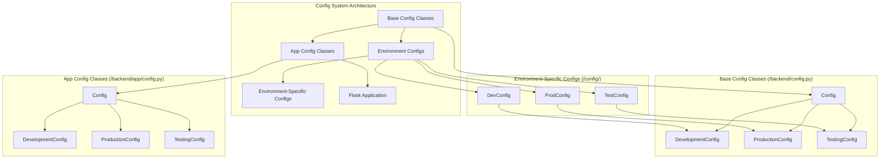

## Configuration Class Hierarchy

### Primary Config System (/backend/config.py)

```mermaid
classDiagram
    class Config {
        +SECRET_KEY
        +SQLALCHEMY_DATABASE_URI
        +SQLALCHEMY_TRACK_MODIFICATIONS
        +SQLALCHEMY_ENGINE_OPTIONS
        +FLASK_APP
        +FLASK_ENV
        +TEMPLATE_FOLDER
        +STATIC_FOLDER
        +PERMANENT_SESSION_LIFETIME
        +MAX_CONTENT_LENGTH
        +UPLOAD_FOLDER
        +LLM_API_KEY
        +LLM_BASE_URL
        +LLM_MODEL
        +LLM_PROVIDER
        +MCP_SERVER_URL
        +MCP_SERVER_PORT
        +MCP_ENABLED
        +CLAUDE_CODE_ENABLED
        +BMAD_DOCS_PATH
        +GIT_REPOS_PATH
        +LOG_LEVEL
        +LOG_FILE
        +WTF_CSRF_ENABLED
        +WTF_CSRF_SECRET_KEY
        +init_app(app)
    }
    
    class DevelopmentConfig {
        +DEBUG = True
        +FLASK_ENV = 'development'
        +SQLALCHEMY_DATABASE_URI
        +LLM_MODEL
        +LOG_LEVEL = 'DEBUG'
    }
    
    class ProductionConfig {
        +DEBUG = False
        +FLASK_ENV = 'production'
        +SQLALCHEMY_DATABASE_URI
        +LOG_LEVEL = 'WARNING'
    }
    
    class TestingConfig {
        +TESTING = True
        +DEBUG = True
        +SQLALCHEMY_DATABASE_URI
        +SQLALCHEMY_ENGINE_OPTIONS = {}
        +LOG_LEVEL = 'DEBUG'
    }
    
    Config <|-- DevelopmentConfig
    Config <|-- ProductionConfig
    Config <|-- TestingConfig
```

### Environment-Specific Configuration Extensions

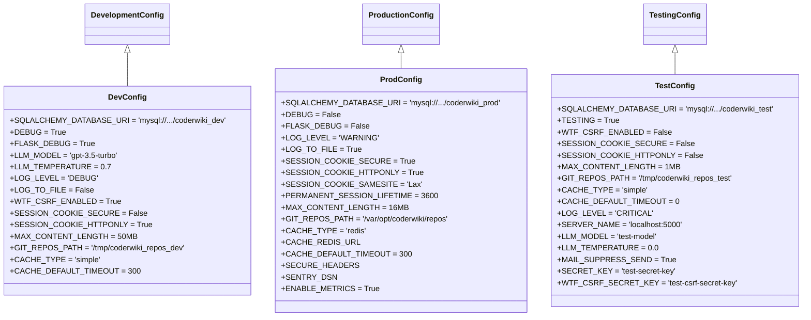

## Configuration Loading Flow

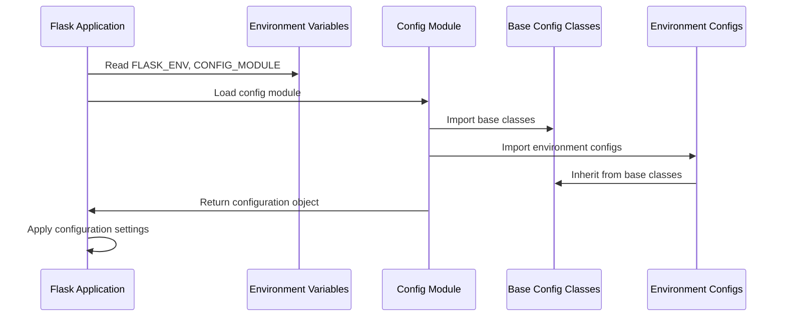

## Database Configuration Architecture

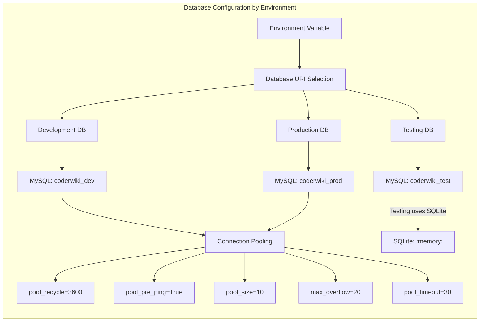

## LLM Service Configuration

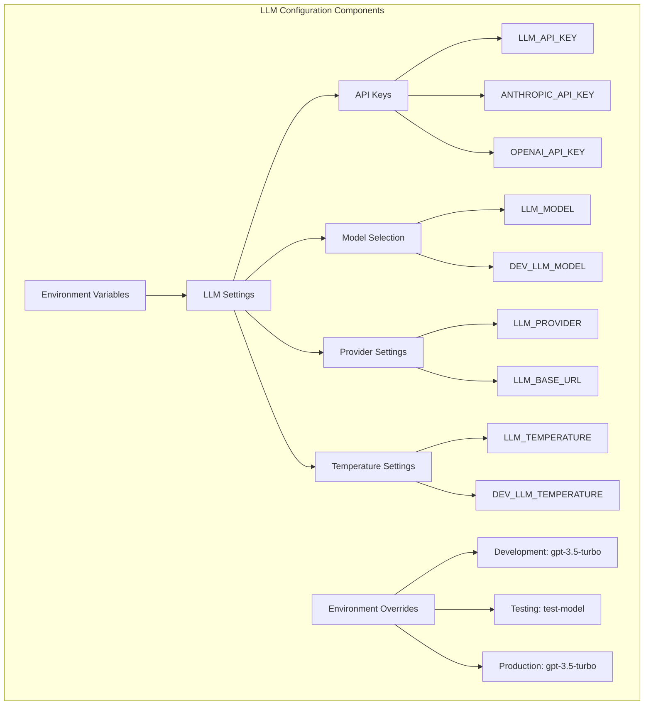

## MCP Service Integration

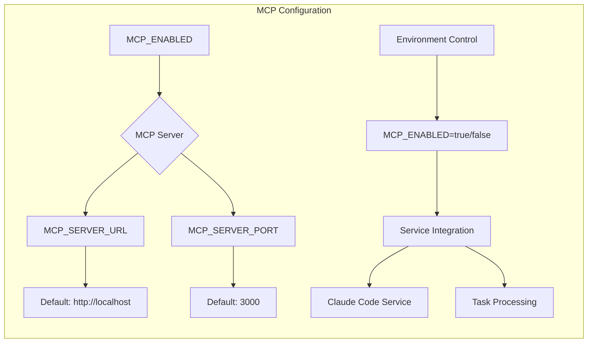

## Security Configuration Matrix

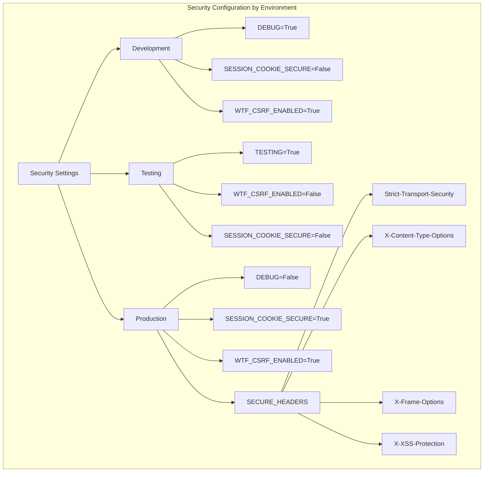

## File System and Storage Configuration

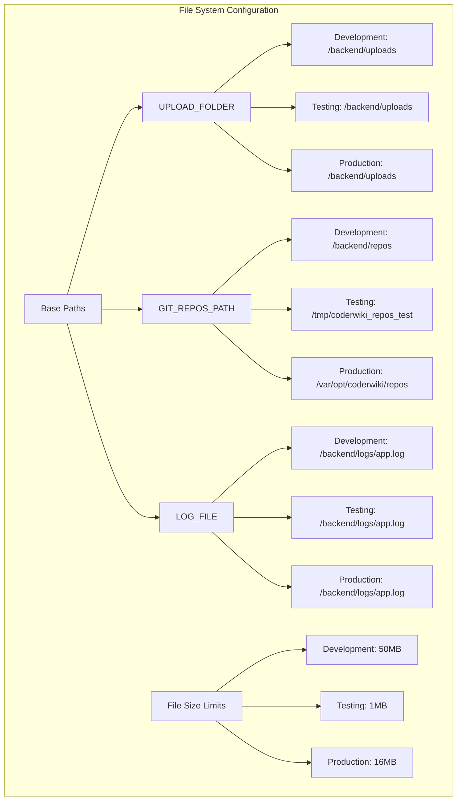

## Caching Strategy Configuration

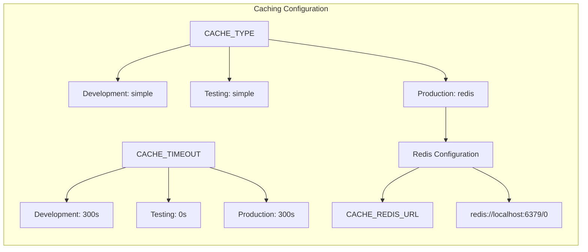

## Configuration Initialization Process

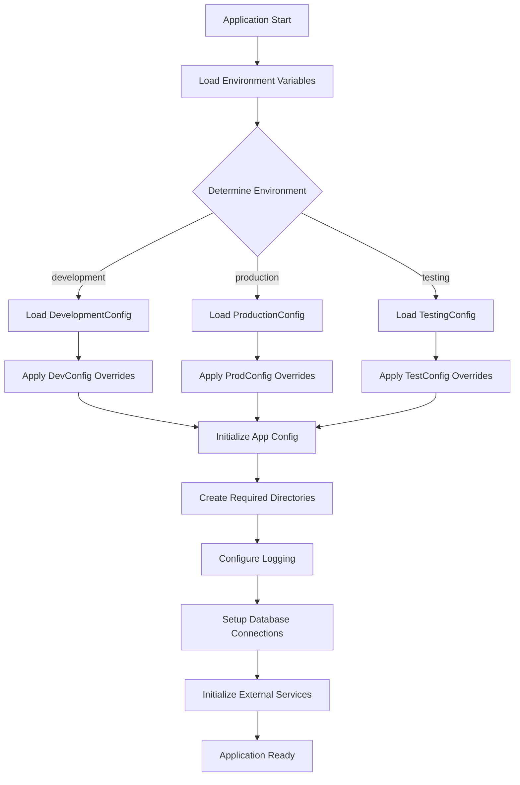

## Configuration Access Patterns

```mermaid
graph TB
    subgraph "Configuration Access Methods"
        A[Direct Access] --> B[app.config['SETTING_NAME']]
        
        C[Environment Variable] --> D[os.environ.get('VAR_NAME')]
        
        E[Config Class Method] --> F[Config.init_app(app)]
        
        G[Runtime Configuration] --> H[Dynamic Setting Override]
        
        I[Configuration Validation] --> J[Setting Existence Check]
        I --> K[Type Validation]
        I --> L[Range Validation]
    end
```

## Configuration Best Practices and Patterns

### 1. **Hierarchical Inheritance**
- Base configuration provides common settings
- Environment-specific configs extend base classes
- Environment variables override hardcoded values

### 2. **Environment Isolation**
- Separate databases for each environment
- Different security settings per environment
- Environment-specific file paths and limits

### 3. **Security Considerations**
- Production environment has strict security settings
- Development environment has relaxed security for debugging
- Testing environment disables CSRF for automated testing

### 4. **Performance Optimization**
- Production uses Redis for caching
- Development uses simple in-memory caching
- Testing has minimal caching to avoid interference

### 5. **Logging Configuration**
- Development: DEBUG level for detailed debugging
- Production: WARNING level to reduce noise
- Testing: CRITICAL level to minimize output

## Configuration File Locations

```
coderwiki/
├── config/
│   ├── development.py          # Development environment overrides
│   ├── production.py           # Production environment overrides
│   └── testing.py              # Testing environment overrides
├── backend/
│   ├── config.py               # Primary configuration system
│   └── app/
│       └── config.py           # Secondary configuration system
└── env.example                # Environment variables template
```

## Environment Variables Reference

### Core Configuration
- `FLASK_ENV`: Application environment (development/production/testing)
- `SECRET_KEY`: Application secret key
- `DATABASE_URL`: Database connection string

### LLM Configuration
- `LLM_API_KEY`: LLM service API key
- `LLM_MODEL`: Default LLM model
- `LLM_PROVIDER`: LLM service provider

### MCP Configuration
- `MCP_ENABLED`: Enable MCP service (true/false)
- `MCP_SERVER_URL`: MCP server URL
- `MCP_SERVER_PORT`: MCP server port

### Claude Code Integration
- `CLAUDE_CODE_ENABLED`: Enable Claude Code integration
- `BMAD_DOCS_PATH`: BMAD documentation generator path

## Configuration Validation and Error Handling

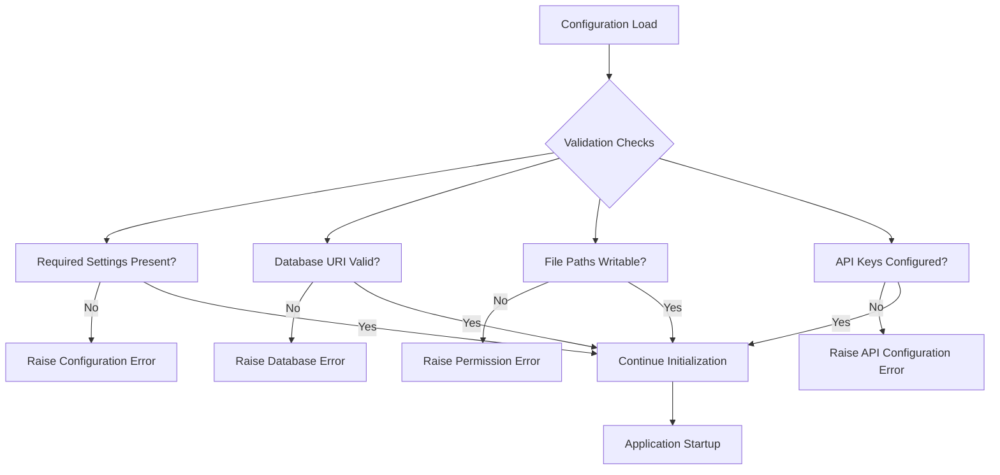

## Configuration Migration Strategy

```mermaid
graph LR
    subgraph "Configuration Migration Path"
        A[Legacy Config] --> B[Current Config]
        B --> C[Future Config]
        
        A --> D[/backend/app/config.py]
        B --> E[/backend/config.py]
        C --> F[Unified Config System]
        
        G[Migration Steps] --> H[Deprecate Legacy Config]
        G --> I[Standardize Environment Variables]
        G --> J[Implement Configuration Validation]
        G --> K[Add Configuration Documentation]
    end
```

## Conclusion

The CoderWiki Config system implements a robust, hierarchical configuration architecture that provides:

1. **Environment Isolation**: Separate configurations for development, testing, and production
2. **Security Hardening**: Progressive security measures from development to production
3. **Flexibility**: Environment variable overrides and modular design
4. **Maintainability**: Clear inheritance hierarchy and documentation
5. **Scalability**: Support for multiple services and external integrations

The system follows Flask configuration best practices while providing extensions for LLM services, MCP integration, and Claude Code functionality. The dual-config system (legacy and current) provides backward compatibility during migration phases.

---

*Generated by Claude Code SDK - Config System Technical Overview*