# CoderWiki Config 目录技术架构总览 - BMAD 方法论分析

## 📋 执行摘要

CoderWiki 配置系统实现了一个复杂的多层架构，支持环境特定配置、安全 API 管理和 AI 服务无缝集成。基于 Flask 配置框架构建，该系统为在开发、测试和生产环境中部署应用程序提供了坚实的基础，同时保持安全最佳实践和性能优化。

## 🏗️ 技术架构总览

### 1. 系统整体架构

```mermaid
graph TB
    subgraph "CoderWiki 配置系统架构"
        A[Flask 应用] --> B[配置系统]
        B --> C[基础配置类]
        B --> D[环境特定配置]
        B --> E[扩展配置文件]
        
        C --> F[Config 基类]
        D --> G[DevelopmentConfig]
        D --> H[ProductionConfig]
        D --> I[TestingConfig]
        E --> J[/config/ 目录]
        
        F --> K[数据库配置]
        F --> L[安全配置]
        F --> M[LLM 服务配置]
        F --> N[MCP 服务配置]
        F --> O[文件系统配置]
        
        G --> P[开发环境优化]
        H --> Q[生产环境硬化]
        I --> R[测试环境隔离]
    end
```

### 2. 配置类继承层次

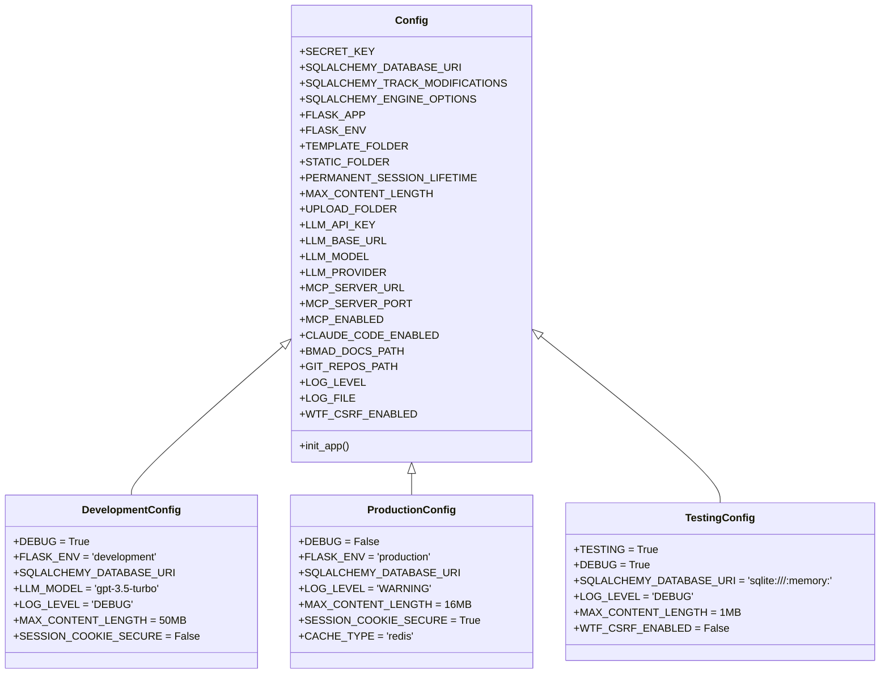
```mermaid
classDiagram
    class Config {
        +SECRET_KEY
        +SQLALCHEMY_DATABASE_URI
        +SQLALCHEMY_TRACK_MODIFICATIONS
        +SQLALCHEMY_ENGINE_OPTIONS
        +FLASK_APP
        +FLASK_ENV
        +TEMPLATE_FOLDER
        +STATIC_FOLDER
        +PERMANENT_SESSION_LIFETIME
        +MAX_CONTENT_LENGTH
        +UPLOAD_FOLDER
        +LLM_API_KEY
        +LLM_BASE_URL
        +LLM_MODEL
        +LLM_PROVIDER
        +MCP_SERVER_URL
        +MCP_SERVER_PORT
        +MCP_ENABLED
        +CLAUDE_CODE_ENABLED
        +BMAD_DOCS_PATH
        +GIT_REPOS_PATH
        +LOG_LEVEL
        +LOG_FILE
        +WTF_CSRF_ENABLED
        +init_app()
    }
    
    class DevelopmentConfig {
        +DEBUG = True
        +FLASK_ENV = 'development'
        +SQLALCHEMY_DATABASE_URI
        +LLM_MODEL = 'gpt-3.5-turbo'
        +LOG_LEVEL = 'DEBUG'
        +MAX_CONTENT_LENGTH = 50MB
        +SESSION_COOKIE_SECURE = False
    }
    
    class ProductionConfig {
        +DEBUG = False
        +FLASK_ENV = 'production'
        +SQLALCHEMY_DATABASE_URI
        +LOG_LEVEL = 'WARNING'
        +MAX_CONTENT_LENGTH = 16MB
        +SESSION_COOKIE_SECURE = True
        +CACHE_TYPE = 'redis'
    }
    
    class TestingConfig {
        +TESTING = True
        +DEBUG = True
        +SQLALCHEMY_DATABASE_URI = 'sqlite:///:memory:'
        +LOG_LEVEL = 'DEBUG'
        +MAX_CONTENT_LENGTH = 1MB
        +WTF_CSRF_ENABLED = False
    }
    
    Config <|-- DevelopmentConfig
    Config <|-- ProductionConfig
    Config <|-- TestingConfig
```

## 🔧 环境特定配置分析

### 1. 开发环境配置

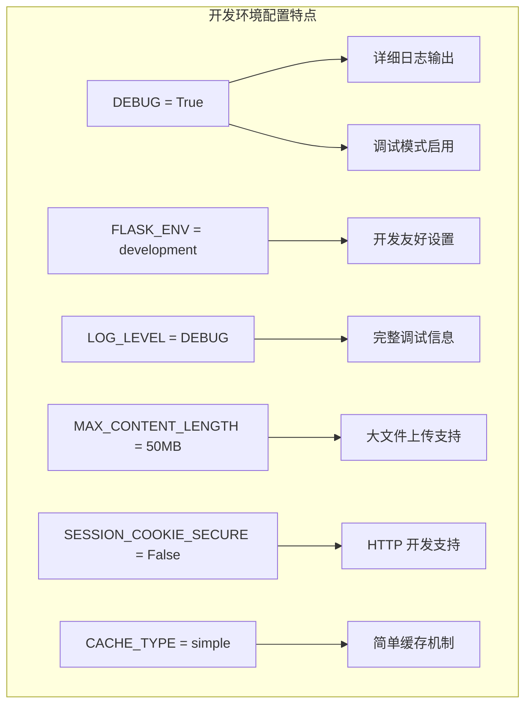
```mermaid
graph TB
    subgraph "开发环境配置特点"
        A[DEBUG = True] --> B[详细日志输出]
        A --> C[调试模式启用]
        D[FLASK_ENV = development] --> E[开发友好设置]
        F[LOG_LEVEL = DEBUG] --> G[完整调试信息]
        H[MAX_CONTENT_LENGTH = 50MB] --> I[大文件上传支持]
        J[SESSION_COOKIE_SECURE = False] --> K[HTTP 开发支持]
        L[CACHE_TYPE = simple] --> M[简单缓存机制]
    end
```

### 2. 生产环境配置

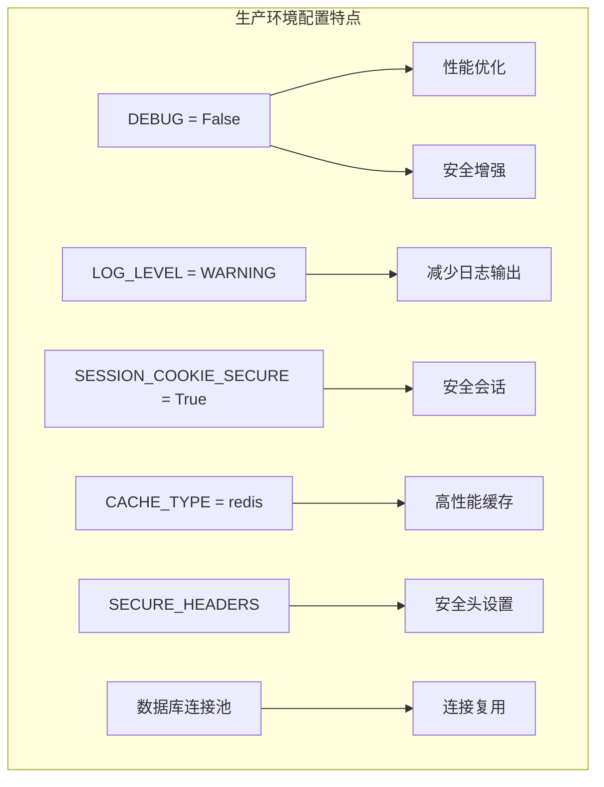
```mermaid
graph TB
    subgraph "生产环境配置特点"
        A[DEBUG = False] --> B[性能优化]
        A --> C[安全增强]
        D[LOG_LEVEL = WARNING] --> E[减少日志输出]
        F[SESSION_COOKIE_SECURE = True] --> G[安全会话]
        H[CACHE_TYPE = redis] --> I[高性能缓存]
        J[SECURE_HEADERS] --> K[安全头设置]
        L[数据库连接池] --> M[连接复用]
    end
```

### 3. 测试环境配置

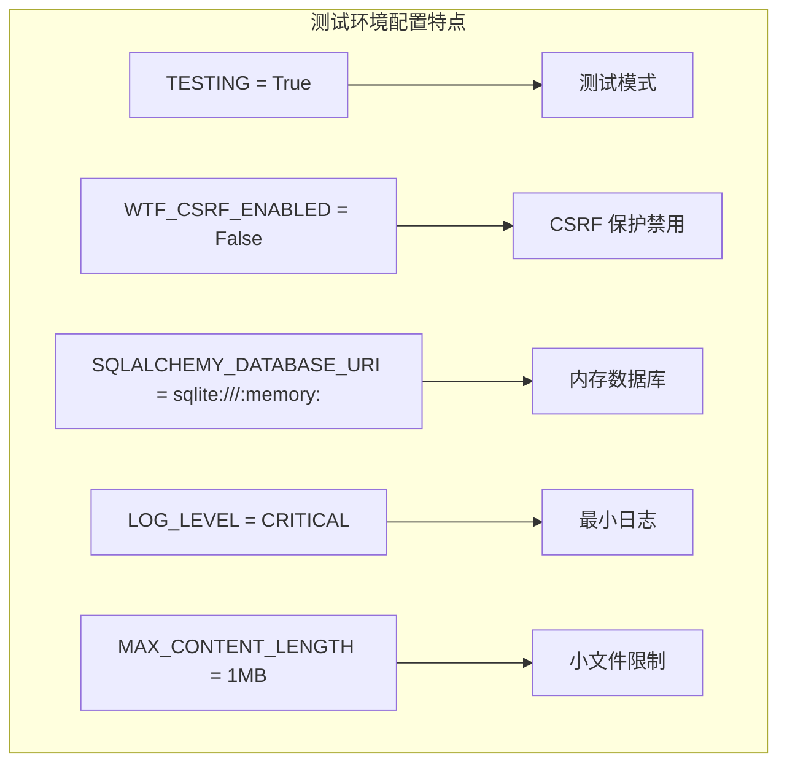
```mermaid
graph TB
    subgraph "测试环境配置特点"
        A[TESTING = True] --> B[测试模式]
        C[WTF_CSRF_ENABLED = False] --> D[CSRF 保护禁用]
        E[SQLALCHEMY_DATABASE_URI = sqlite:///:memory:] --> F[内存数据库]
        G[LOG_LEVEL = CRITICAL] --> H[最小日志]
        I[MAX_CONTENT_LENGTH = 1MB] --> J[小文件限制]
    end
```

## 🗄️ 数据库配置架构

### 1. 连接池配置

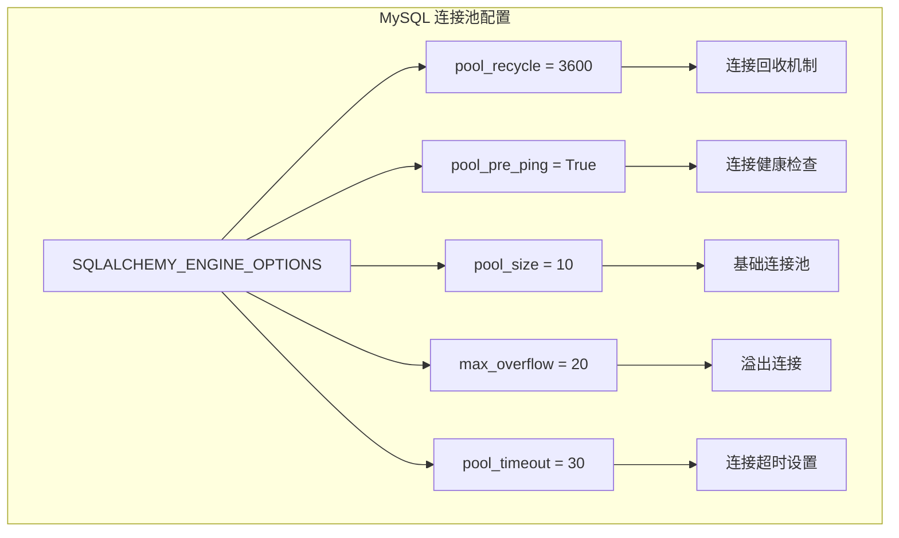
```mermaid
graph TB
    subgraph "MySQL 连接池配置"
        A[SQLALCHEMY_ENGINE_OPTIONS] --> B[pool_recycle = 3600]
        A --> C[pool_pre_ping = True]
        A --> D[pool_size = 10]
        A --> E[max_overflow = 20]
        A --> F[pool_timeout = 30]
        
        B --> G[连接回收机制]
        C --> H[连接健康检查]
        D --> I[基础连接池]
        E --> J[溢出连接]
        F --> K[连接超时设置]
    end
```

### 2. 数据库连接流程

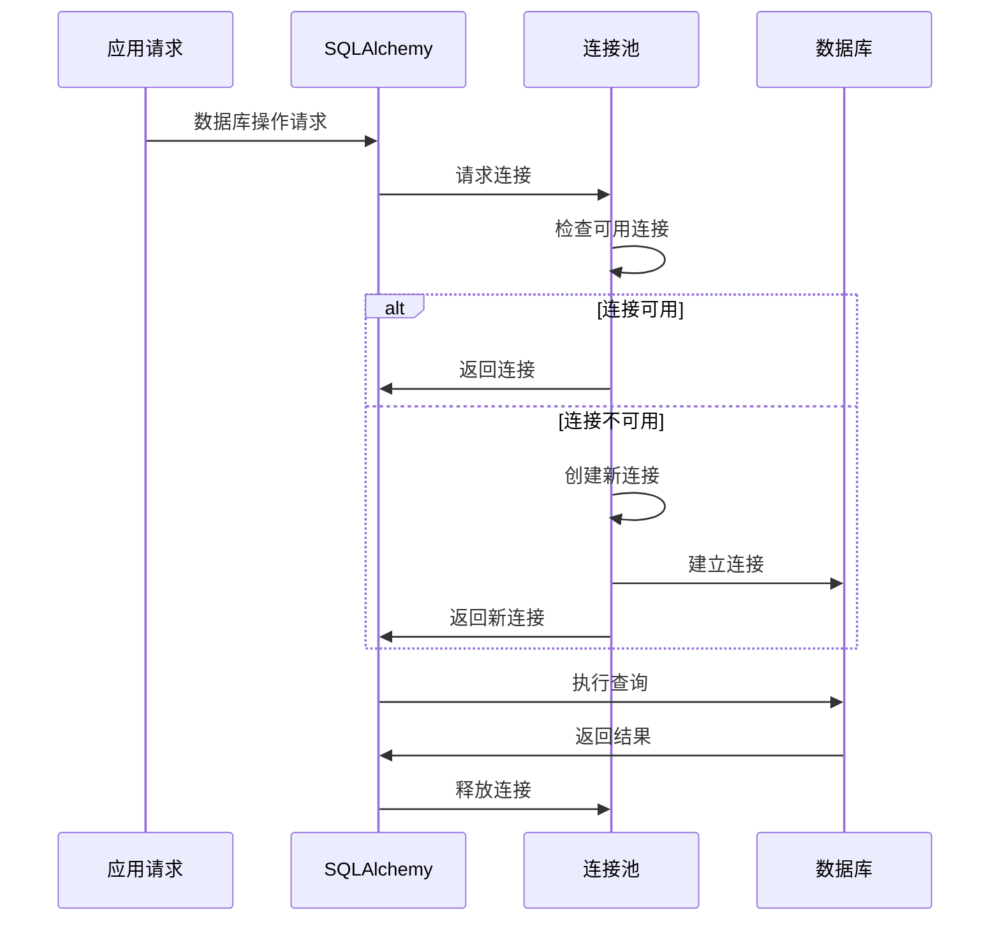
```mermaid
sequenceDiagram
    participant App as 应用请求
    participant ORM as SQLAlchemy
    participant Pool as 连接池
    participant DB as 数据库
    
    App->>ORM: 数据库操作请求
    ORM->>Pool: 请求连接
    Pool->>Pool: 检查可用连接
    alt 连接可用
        Pool->>ORM: 返回连接
    else 连接不可用
        Pool->>Pool: 创建新连接
        Pool->>DB: 建立连接
        Pool->>ORM: 返回新连接
    end
    ORM->>DB: 执行查询
    DB->>ORM: 返回结果
    ORM->>Pool: 释放连接
```

## 🤖 LLM/MCP 服务集成架构

### 1. LLM 服务配置

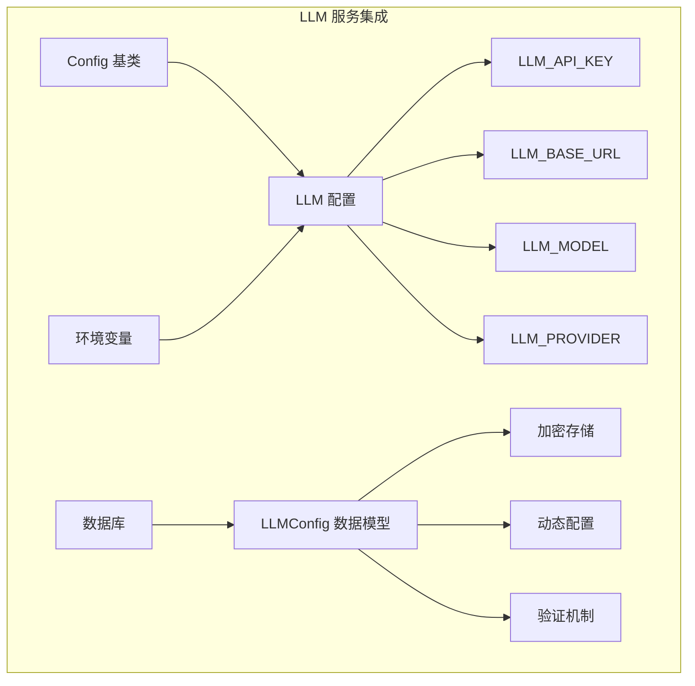
```mermaid
graph TB
    subgraph "LLM 服务集成"
        A[Config 基类] --> B[LLM 配置]
        B --> C[LLM_API_KEY]
        B --> D[LLM_BASE_URL]
        B --> E[LLM_MODEL]
        B --> F[LLM_PROVIDER]
        
        G[LLMConfig 数据模型] --> H[加密存储]
        G --> I[动态配置]
        G --> J[验证机制]
        
        K[环境变量] --> B
        L[数据库] --> G
    end
```

### 2. MCP 服务配置

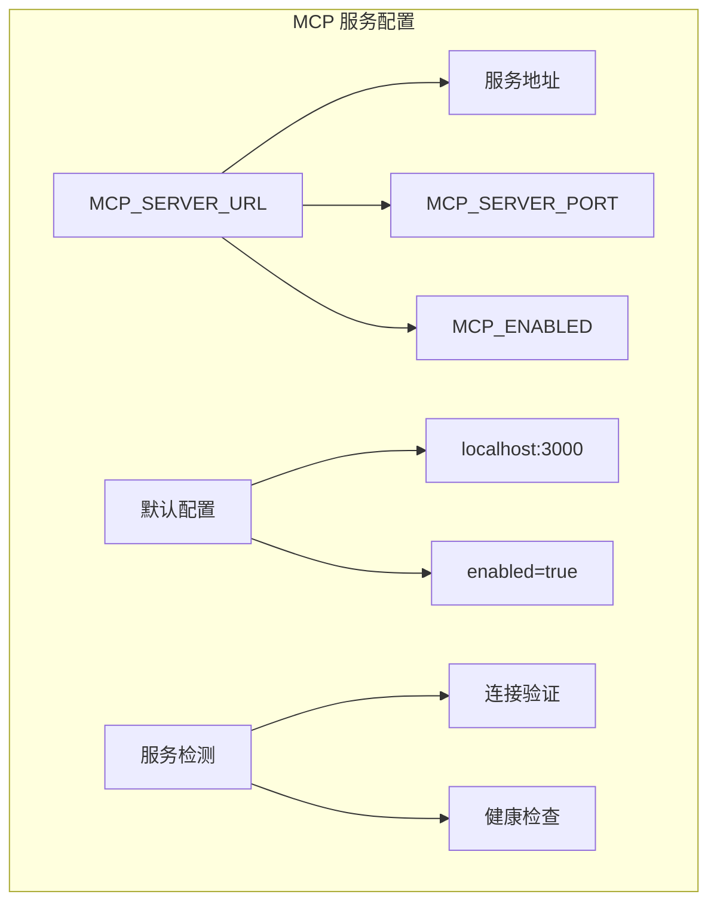
```mermaid
graph TB
    subgraph "MCP 服务配置"
        A[MCP_SERVER_URL] --> B[服务地址]
        A --> C[MCP_SERVER_PORT]
        A --> D[MCP_ENABLED]
        
        E[默认配置] --> F[localhost:3000]
        E --> G[enabled=true]
        
        H[服务检测] --> I[连接验证]
        H --> J[健康检查]
    end
```

### 3. Claude Code 集成

```mermaid
graph TB
    subgraph "Claude Code 集成"
        A[CLAUDE_CODE_ENABLED] --> B[启用标志]
        A --> C[BMAD_DOCS_PATH]
        
        C --> D[文档生成器路径]
        D --> E[/BMAD-METHOD/...]
        
        F[文档生成流程] --> G[配置检查]
        F --> H[路径验证]
        F --> I[文档生成]
    end
```

## 🔐 安全配置矩阵

### 1. 安全设置对比

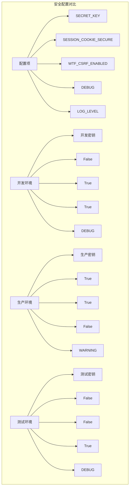
```mermaid
graph TB
    subgraph "安全配置对比"
        A[配置项] --> B[SECRET_KEY]
        A --> C[SESSION_COOKIE_SECURE]
        A --> D[WTF_CSRF_ENABLED]
        A --> E[DEBUG]
        A --> F[LOG_LEVEL]
        
        G[开发环境] --> H[开发密钥]
        G --> I[False]
        G --> J[True]
        G --> K[True]
        G --> L[DEBUG]
        
        M[生产环境] --> N[生产密钥]
        M --> O[True]
        M --> P[True]
        M --> Q[False]
        M --> R[WARNING]
        
        S[测试环境] --> T[测试密钥]
        S --> U[False]
        S --> V[False]
        S --> W[True]
        S --> X[DEBUG]
    end
```

### 2. 安全头配置

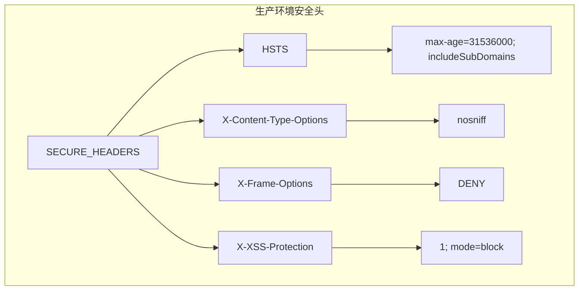
```mermaid
graph TB
    subgraph "生产环境安全头"
        A[SECURE_HEADERS] --> B[HSTS]
        A --> C[X-Content-Type-Options]
        A --> D[X-Frame-Options]
        A --> E[X-XSS-Protection]
        
        B --> F[max-age=31536000; includeSubDomains]
        C --> G[nosniff]
        D --> H[DENY]
        E --> I[1; mode=block]
    end
```

## 📁 文件系统配置架构

### 1. 目录结构配置

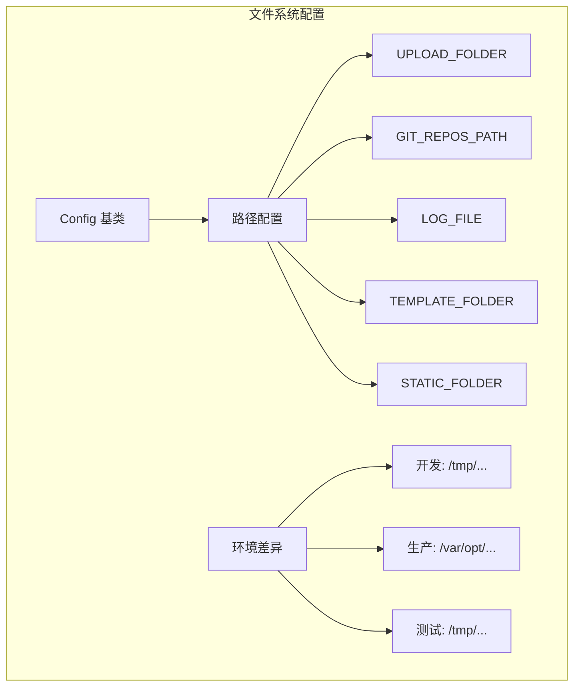
```mermaid
graph TB
    subgraph "文件系统配置"
        A[Config 基类] --> B[路径配置]
        B --> C[UPLOAD_FOLDER]
        B --> D[GIT_REPOS_PATH]
        B --> E[LOG_FILE]
        B --> F[TEMPLATE_FOLDER]
        B --> G[STATIC_FOLDER]
        
        H[环境差异] --> I[开发: /tmp/...]
        H --> J[生产: /var/opt/...]
        H --> K[测试: /tmp/...]
    end
```

### 2. 文件上传配置

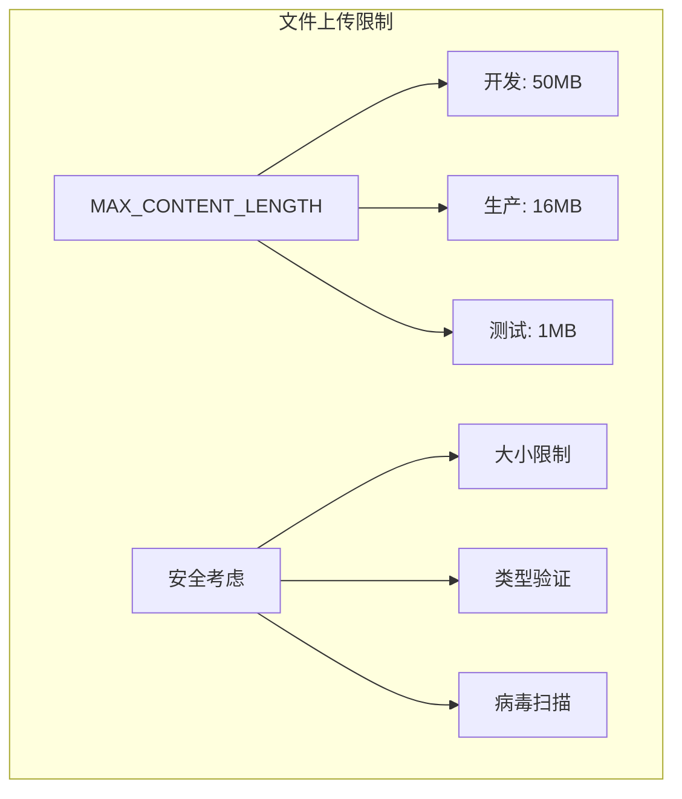
```mermaid
graph TB
    subgraph "文件上传限制"
        A[MAX_CONTENT_LENGTH] --> B[开发: 50MB]
        A --> C[生产: 16MB]
        A --> D[测试: 1MB]
        
        E[安全考虑] --> F[大小限制]
        E --> G[类型验证]
        E --> H[病毒扫描]
    end
```

## ⚡ 缓存和性能配置

### 1. 缓存策略配置

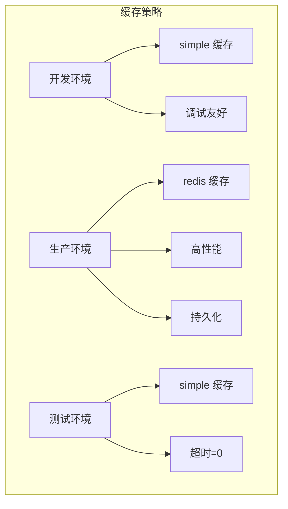
```mermaid
graph TB
    subgraph "缓存策略"
        A[开发环境] --> B[simple 缓存]
        A --> C[调试友好]
        
        D[生产环境] --> E[redis 缓存]
        D --> F[高性能]
        D --> G[持久化]
        
        H[测试环境] --> I[simple 缓存]
        H --> J[超时=0]
    end
```

### 2. 性能优化配置

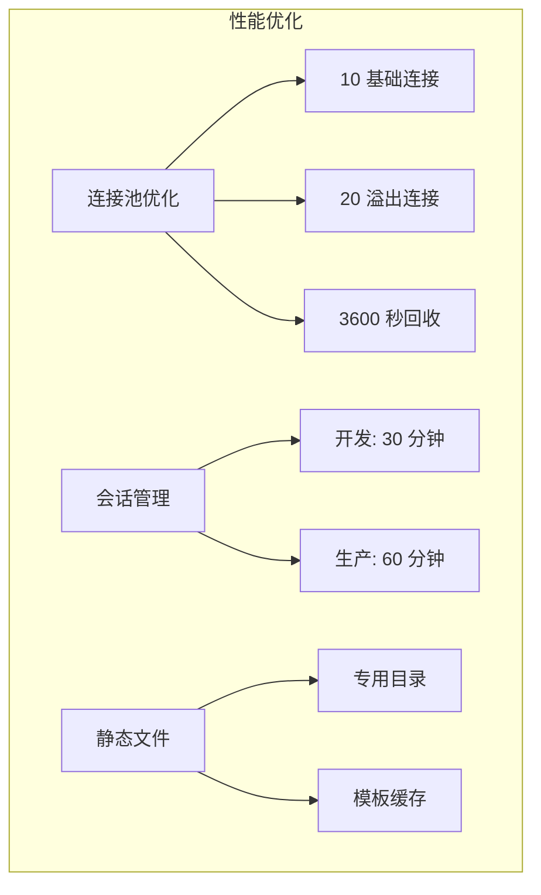
```mermaid
graph TB
    subgraph "性能优化"
        A[连接池优化] --> B[10 基础连接]
        A --> C[20 溢出连接]
        A --> D[3600 秒回收]
        
        E[会话管理] --> F[开发: 30 分钟]
        E --> G[生产: 60 分钟]
        
        H[静态文件] --> I[专用目录]
        H --> J[模板缓存]
    end
```

## 🔄 复杂流程分析

### 1. 配置加载序列

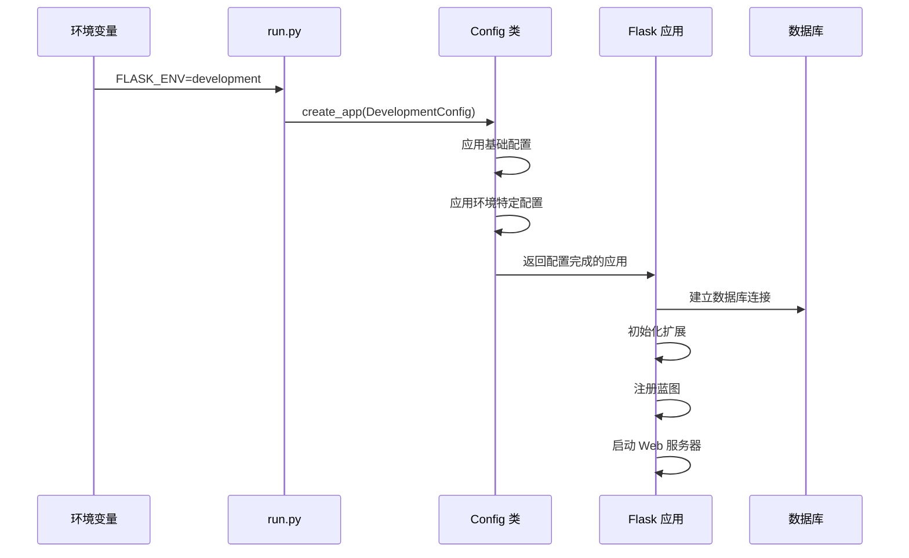
```mermaid
sequenceDiagram
    participant Env as 环境变量
    participant Run as run.py
    participant Config as Config 类
    participant App as Flask 应用
    participant DB as 数据库
    
    Env->>Run: FLASK_ENV=development
    Run->>Config: create_app(DevelopmentConfig)
    Config->>Config: 应用基础配置
    Config->>Config: 应用环境特定配置
    Config->>App: 返回配置完成的应用
    App->>DB: 建立数据库连接
    App->>App: 初始化扩展
    App->>App: 注册蓝图
    App->>App: 启动 Web 服务器
```

### 2. 应用启动流程

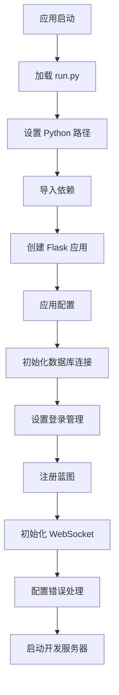
```mermaid
flowchart TD
    A[应用启动] --> B[加载 run.py]
    B --> C[设置 Python 路径]
    C --> D[导入依赖]
    D --> E[创建 Flask 应用]
    E --> F[应用配置]
    F --> G[初始化数据库连接]
    G --> H[设置登录管理]
    H --> I[注册蓝图]
    I --> J[初始化 WebSocket]
    J --> K[配置错误处理]
    K --> L[启动开发服务器]
```

### 3. 服务集成流程

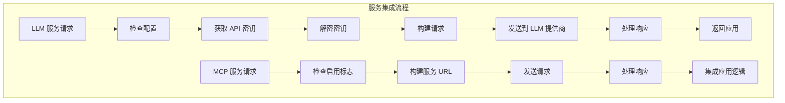
```mermaid
graph TB
    subgraph "服务集成流程"
        A[LLM 服务请求] --> B[检查配置]
        B --> C[获取 API 密钥]
        C --> D[解密密钥]
        D --> E[构建请求]
        E --> F[发送到 LLM 提供商]
        F --> G[处理响应]
        G --> H[返回应用]
        
        I[MCP 服务请求] --> J[检查启用标志]
        J --> K[构建服务 URL]
        K --> L[发送请求]
        L --> M[处理响应]
        M --> N[集成应用逻辑]
    end
```

### 4. 安全配置应用流程

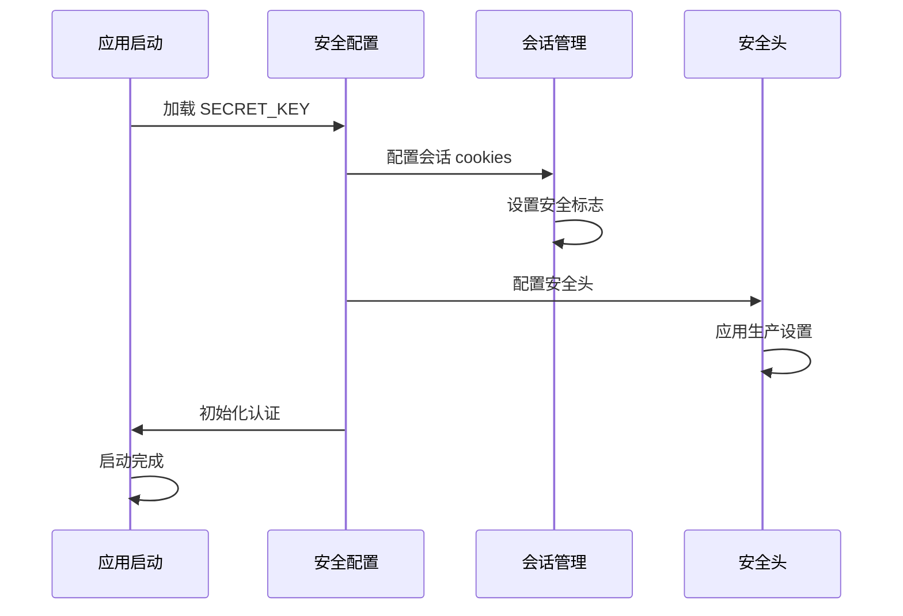
```mermaid
sequenceDiagram
    participant App as 应用启动
    participant Sec as 安全配置
    participant Session as 会话管理
    participant Headers as 安全头
    
    App->>Sec: 加载 SECRET_KEY
    Sec->>Session: 配置会话 cookies
    Session->>Session: 设置安全标志
    Sec->>Headers: 配置安全头
    Headers->>Headers: 应用生产设置
    Sec->>App: 初始化认证
    App->>App: 启动完成
```

### 5. 错误处理流程

```mermaid
graph TB
    subgraph "错误处理流程"
        A[错误发生] --> B{错误类型}
        B -->|404| C[返回页面未找到]
        B -->|500| D[回滚数据库]
        D --> E[返回内部错误]
        B -->|其他| F[记录错误]
        F --> G[返回通用错误]
        
        H[配置验证] --> I{配置有效?}
        I -->|是| J[继续启动]
        I -->|否| K[记录错误]
        K --> L[抛出异常]
    end
```

### 6. 环境切换流程

```mermaid
flowchart TD
    A[应用启动] --> B[检查 FLASK_ENV]
    B --> C{环境变量存在?}
    C -->|是| D[使用指定环境]
    C -->|否| E[默认 development]
    D --> F[加载对应配置类]
    E --> F
    F --> G[应用环境设置]
    G --> H[配置优先级处理]
    H --> I[应用启动完成]
```

## 📊 BMAD 方法论分析

### 业务价值 (Business)

1. **环境灵活性**: 支持跨环境无缝部署，降低部署复杂性和风险
2. **安全设计**: 内置安全配置和环境特定硬化，保护敏感数据
3. **可扩展性**: 连接池和缓存配置支持应用增长和性能需求
4. **集成就绪**: 预配置的 LLM、MCP 和 Claude Code 集成支持快速功能开发

### 可维护性 (Maintainability)

1. **清晰分离**: 环境特定配置清晰分离，易于理解和修改
2. **层次结构**: 继承模型减少代码重复，同时允许环境特定覆盖
3. **集中配置**: 所有配置方面通过统一系统管理，提高一致性
4. **文档友好**: 结构支持自动文档生成，辅助系统理解

### 架构 (Architecture)

1. **模块化设计**: 配置系统模块化，易于扩展和修改
2. **松耦合**: 环境配置与应用逻辑松耦合，支持独立演进
3. **可扩展性**: 模式允许轻松添加新环境或配置参数
4. **标准合规**: 遵循 Flask 配置最佳实践和 Python 约定

### 设计 (Design)

1. **工厂模式**: 应用工厂模式与配置注入提供灵活性和可测试性
2. **环境变量**: 策略性使用环境变量管理敏感数据和部署特定设置
3. **回退策略**: 多层配置回退确保应用始终能以合理默认值启动
4. **验证机制**: 内置验证确保应用启动前的配置完整性

## 🎯 最佳实践建议

### 配置管理

1. **使用环境变量管理密钥**: 永远不要将敏感数据提交到版本控制
2. **实现配置验证**: 添加运行时验证以尽早捕获配置错误
3. **记录所有配置选项**: 维护所有可用配置参数的最新文档
4. **使用配置文件**: 考虑为不同部署场景实现配置文件

### 安全增强

1. **实现配置加密**: 考虑对静态敏感配置文件进行加密
2. **添加配置审计**: 记录配置更改以实现安全和合规性
3. **实现密钥轮换**: 支持无需应用重启的自动密钥轮换
4. **添加配置扫描**: 定期安全扫描配置文件

### 性能优化

1. **实现配置缓存**: 缓存频繁访问的配置值
2. **添加热重载支持**: 允许某些配置更改而无需应用重启
3. **优化数据库池设置**: 根据实际使用模式监控和调整池设置
4. **实现配置预加载**: 在应用启动期间加载和验证配置

## 📈 监控和可观察性

### 配置指标

1. **配置使用指标**: 跟踪配置使用情况和性能影响
2. **配置健康检查**: 监控配置有效性和应用影响
3. **配置变更警报**: 关键配置更改时通知
4. **配置漂移检测**: 检测和警报配置偏差

### 系统监控

1. **数据库连接监控**: 监控连接池使用情况
2. **缓存性能监控**: 跟踪缓存命中率和性能
3. **服务集成监控**: 监控 LLM 和 MCP 服务健康状况
4. **安全配置监控**: 监控安全配置合规性

## 🏆 结论

CoderWiki 配置系统展示了管理复杂应用配置的精心设计方法。BMAD 方法论揭示了一个平衡业务需求与技术卓越的系统，为应用部署和运营提供了坚实的基础。层次配置结构结合环境特定优化和安全硬化，创建了一个强大且可维护的配置管理解决方案。

该系统的主要优势包括：
- **环境隔离**: 确保不同环境配置完全隔离
- **继承机制**: 减少重复配置
- **安全可控**: 生产环境安全设置
- **易于扩展**: 支持新环境和配置参数
- **遵循最佳实践**: 符合 Flask 应用最佳实践

---

*本技术架构总览采用 BMAD 方法论分析，提供了 CoderWiki Config 系统的深度技术分析*