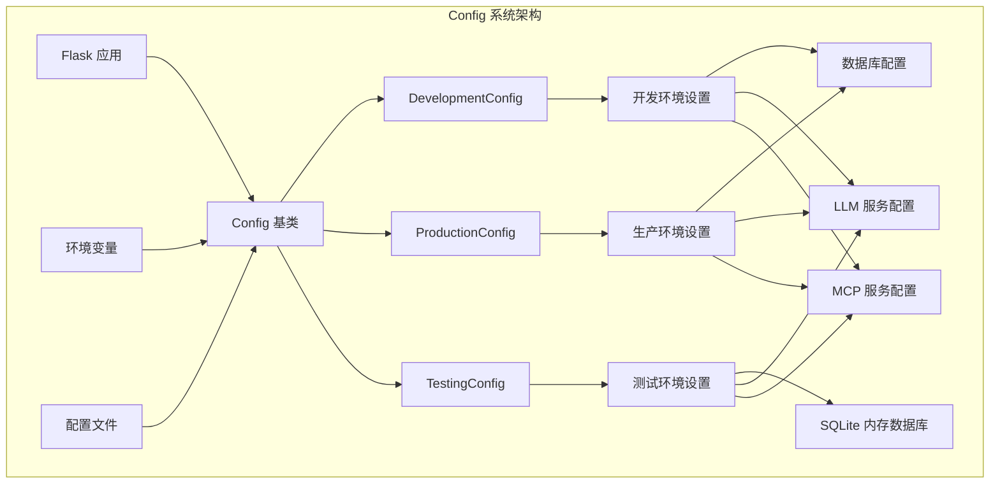
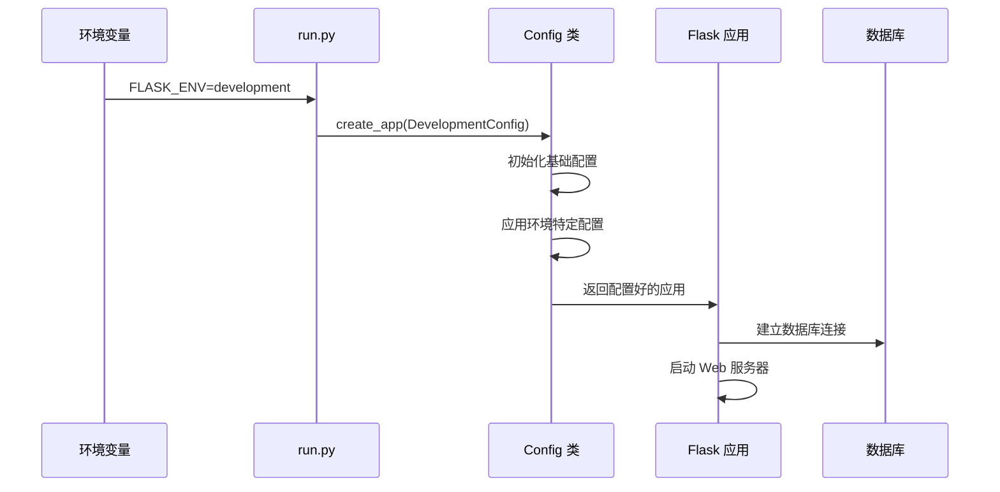
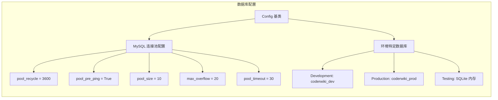
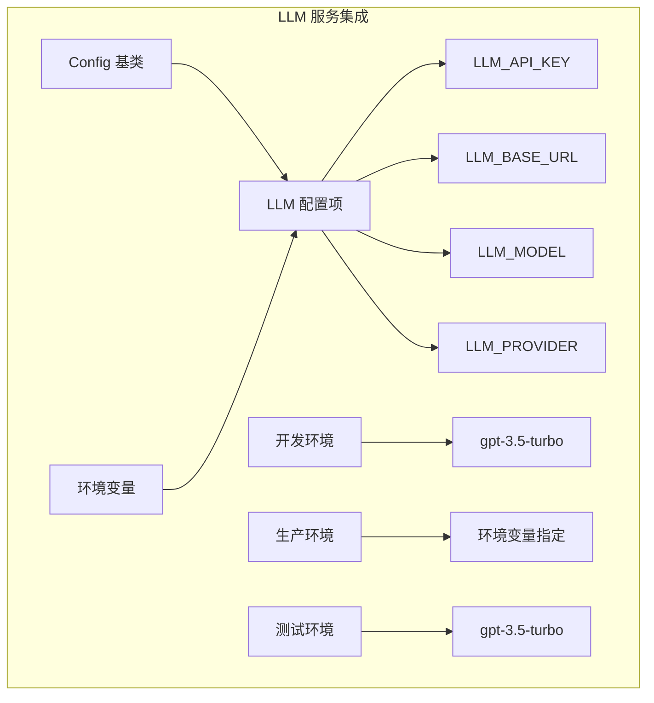
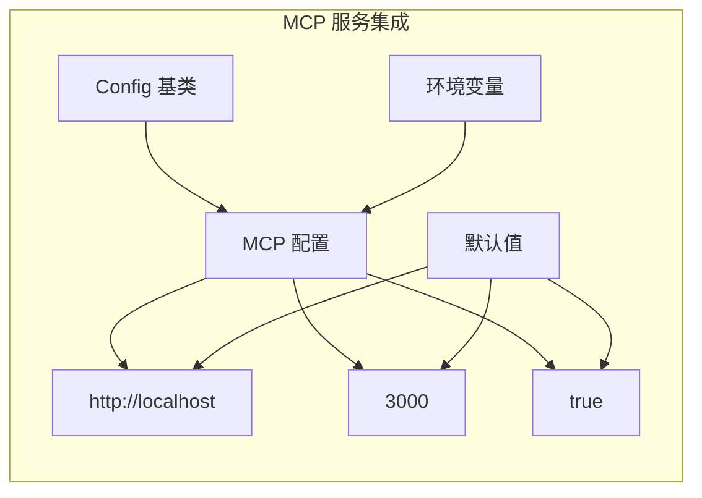
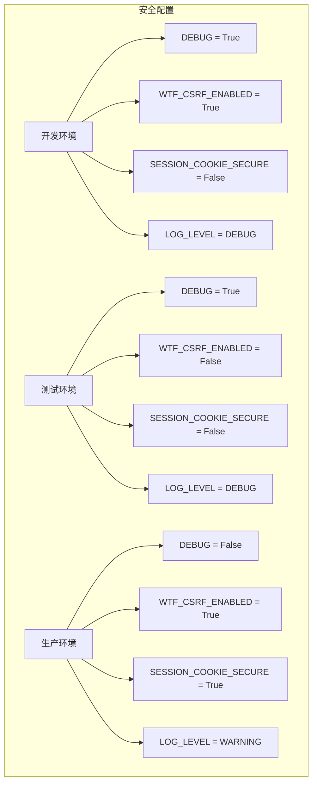
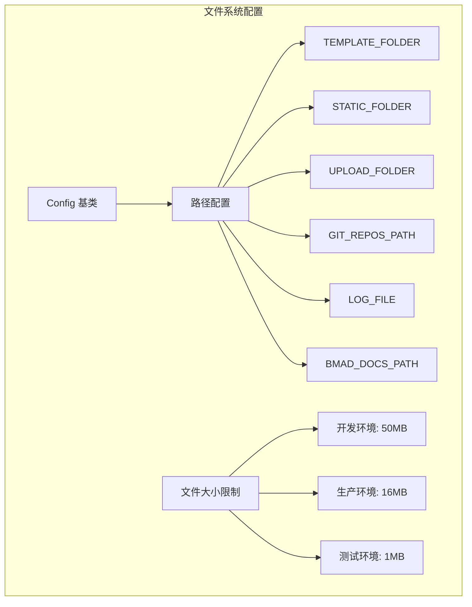
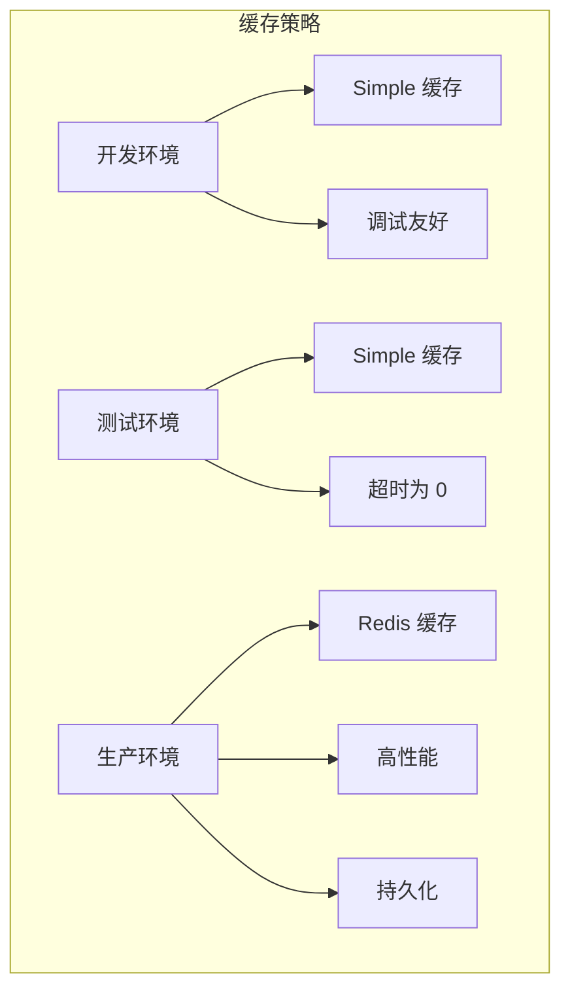
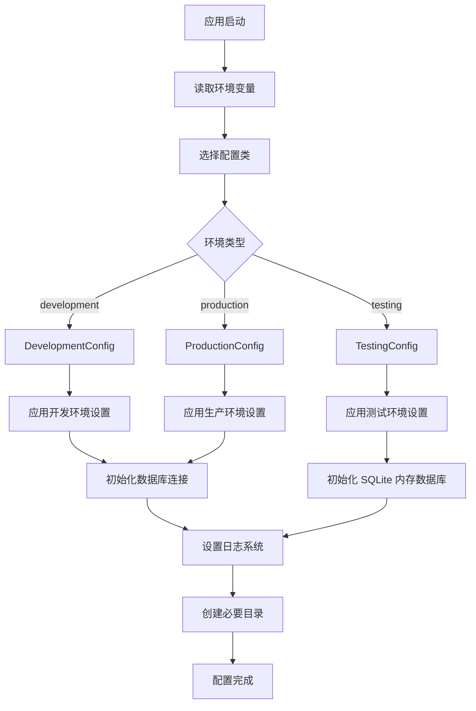

# CoderWiki Config 系统技术总览图

## 🏗️ 系统架构概览



## 📋 配置类层次结构

```mermaid
classDiagram
    class Config {
        +SECRET_KEY
        +SQLALCHEMY_DATABASE_URI
        +SQLALCHEMY_TRACK_MODIFICATIONS
        +SQLALCHEMY_ENGINE_OPTIONS
        +FLASK_APP
        +FLASK_ENV
        +TEMPLATE_FOLDER
        +STATIC_FOLDER
        +PERMANENT_SESSION_LIFETIME
        +MAX_CONTENT_LENGTH
        +UPLOAD_FOLDER
        +LLM_API_KEY
        +LLM_BASE_URL
        +LLM_MODEL
        +LLM_PROVIDER
        +MCP_SERVER_URL
        +MCP_SERVER_PORT
        +MCP_ENABLED
        +CLAUDE_CODE_ENABLED
        +BMAD_DOCS_PATH
        +GIT_REPOS_PATH
        +LOG_LEVEL
        +LOG_FILE
        +WTF_CSRF_ENABLED
        +WTF_CSRF_SECRET_KEY
        +init_app()
    }
    
    class DevelopmentConfig {
        +DEBUG = True
        +FLASK_ENV = 'development'
        +SQLALCHEMY_DATABASE_URI
        +LLM_MODEL
        +LOG_LEVEL = 'DEBUG'
    }
    
    class ProductionConfig {
        +DEBUG = False
        +FLASK_ENV = 'production'
        +SQLALCHEMY_DATABASE_URI
        +LOG_LEVEL = 'WARNING'
    }
    
    class TestingConfig {
        +TESTING = True
        +DEBUG = True
        +SQLALCHEMY_DATABASE_URI
        +SQLALCHEMY_ENGINE_OPTIONS = {}
        +LOG_LEVEL = 'DEBUG'
    }
    
    Config <|-- DevelopmentConfig
    Config <|-- ProductionConfig
    Config <|-- TestingConfig
```

## 🔧 配置加载流程



## 🗄️ 数据库配置架构



## 🤖 LLM 服务配置



## 🔌 MCP 服务配置



## 🔐 安全配置矩阵



## 📁 文件系统配置



## ⚡ 缓存策略配置



## 🚀 配置初始化过程



## 📊 配置参数对比表

| 配置项 | 开发环境 | 测试环境 | 生产环境 | 说明 |
|--------|----------|----------|----------|------|
| DEBUG | True | True | False | 调试模式 |
| TESTING | False | True | False | 测试模式 |
| SQLALCHEMY_DATABASE_URI | MySQL: coderwiki_dev | SQLite: :memory: | MySQL: coderwiki_prod | 数据库连接 |
| LOG_LEVEL | DEBUG | DEBUG | WARNING | 日志级别 |
| MAX_CONTENT_LENGTH | 50MB | 1MB | 16MB | 文件上传限制 |
| LLM_MODEL | gpt-3.5-turbo | gpt-3.5-turbo | 环境变量 | LLM 模型 |
| WTF_CSRF_ENABLED | True | False | True | CSRF 保护 |
| SESSION_COOKIE_SECURE | False | False | True | 会话安全 |
| CACHE_TYPE | simple | simple | redis | 缓存类型 |

## 🔧 核心配置模块

### 1. 基础配置模块 (config.py)
- **位置**: `/backend/config.py`
- **作用**: 定义所有环境共享的基础配置
- **特点**: 包含数据库、LLM、MCP 等核心服务配置

### 2. 应用配置模块 (app/config.py)
- **位置**: `/backend/app/config.py`
- **作用**: 应用特定的配置类
- **特点**: 继承基础配置，添加应用级设置

### 3. 环境配置目录 (/config/)
- **位置**: `/config/`
- **作用**: 环境特定的配置文件
- **包含**: development.py, production.py, testing.py

## 🎯 最佳实践

1. **环境隔离**: 每个环境使用独立的配置
2. **安全优先**: 生产环境启用所有安全功能
3. **敏感信息**: 使用环境变量管理密码和密钥
4. **性能优化**: 生产环境使用高性能缓存
5. **日志管理**: 根据环境调整日志级别

## 📈 系统集成点

- **Flask 应用**: 通过 `create_app()` 函数集成
- **数据库**: 通过 SQLAlchemy 集成
- **LLM 服务**: 通过配置的 API 集成
- **MCP 服务**: 通过配置的服务地址集成
- **文件系统**: 通过配置的路径集成
- **日志系统**: 通过配置的日志设置集成

---

*此技术总览图展示了 CoderWiki Config 系统的完整架构和配置关系*