# CoderWiki Config 系统技术总览图 (Mermaid 版本)

## 🏗️ 系统架构总览

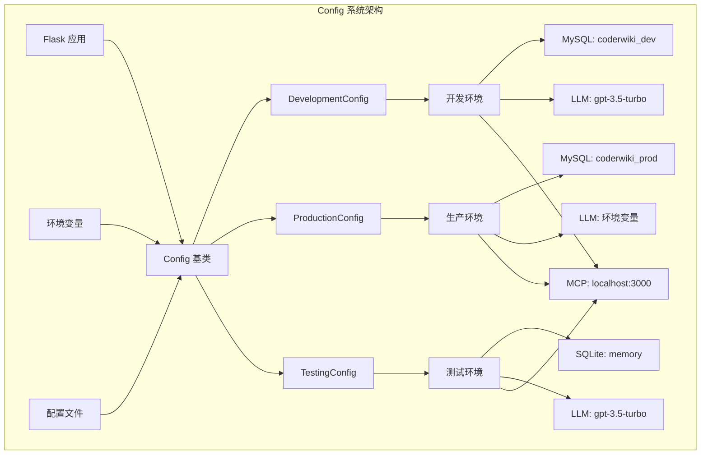

## 📋 配置类继承关系

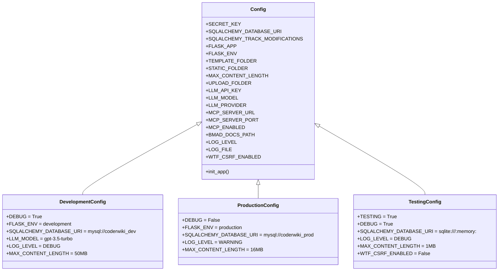

## 🔧 配置加载流程

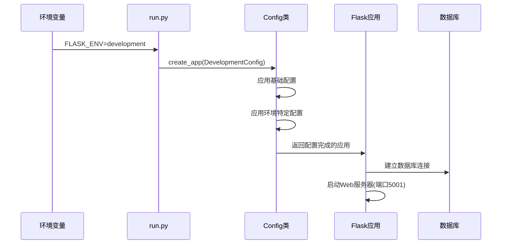

## 🗄️ 数据库配置架构

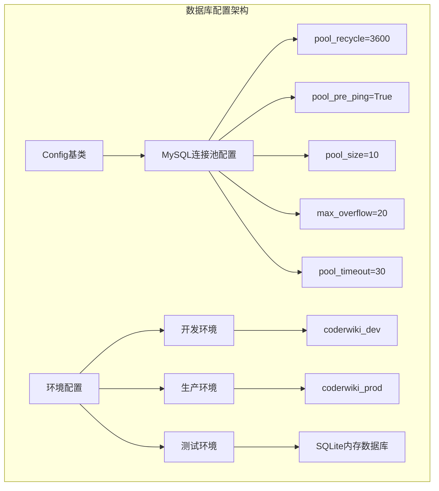

## 🤖 LLM服务配置

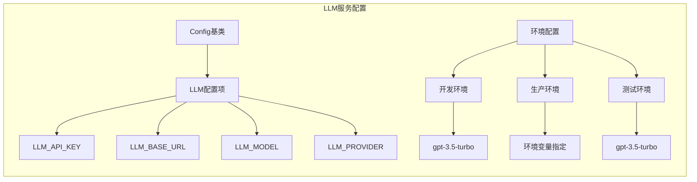

## 🔌 MCP服务配置

```mermaid
graph TB
    subgraph "MCP服务配置"
        A[Config基类] --> B[MCP配置]
        B --> C[MCP_SERVER_URL]
        B --> D[MCP_SERVER_PORT]
        B --> E[MCP_ENABLED]
        B --> F[CLAUDE_CODE_ENABLED]
        B --> G[BMAD_DOCS_PATH]
        
        H[默认配置] --> I[localhost:3000]
        H --> J[enabled=true]
        H --> K[/BMAD-METHOD/...]
    end
```

## 🔐 安全配置矩阵

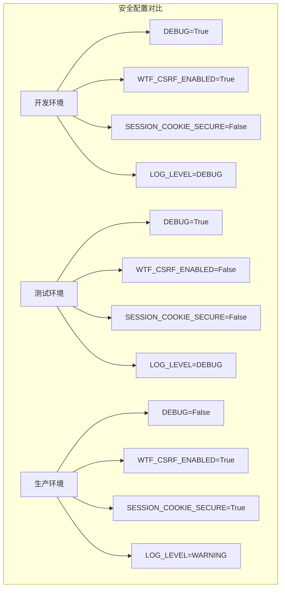

## 📁 文件系统配置

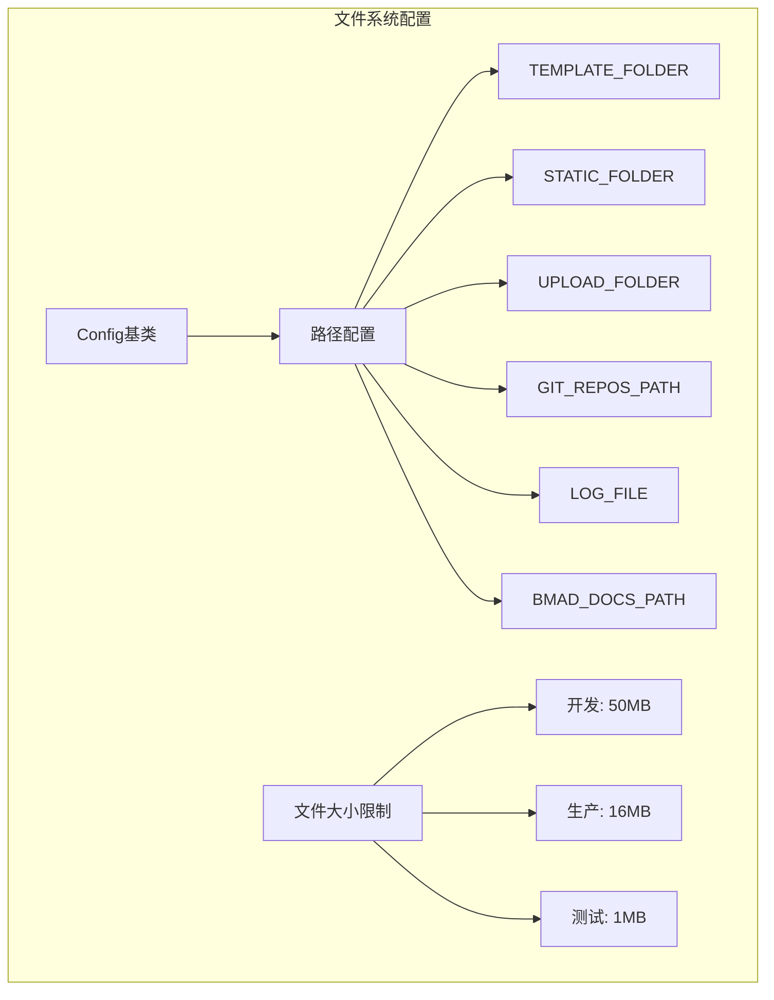

## ⚡ 缓存策略配置

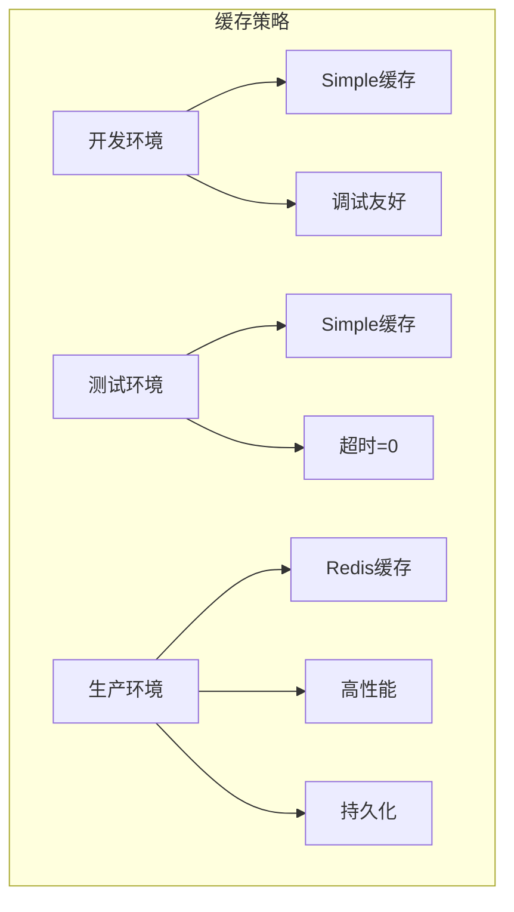

## 🚀 应用启动流程

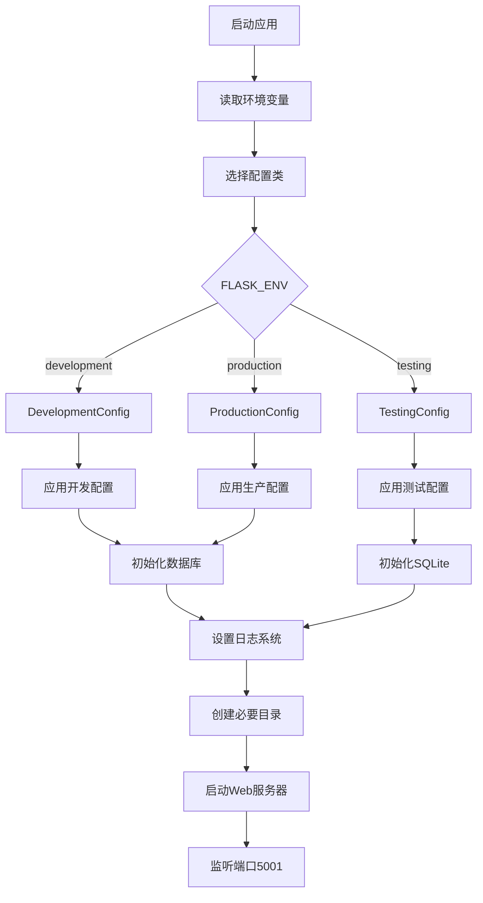

## 📊 配置参数对比

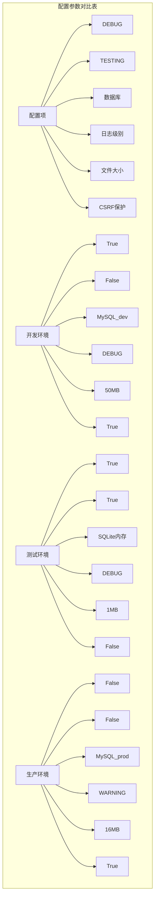

## 🔧 核心服务集成

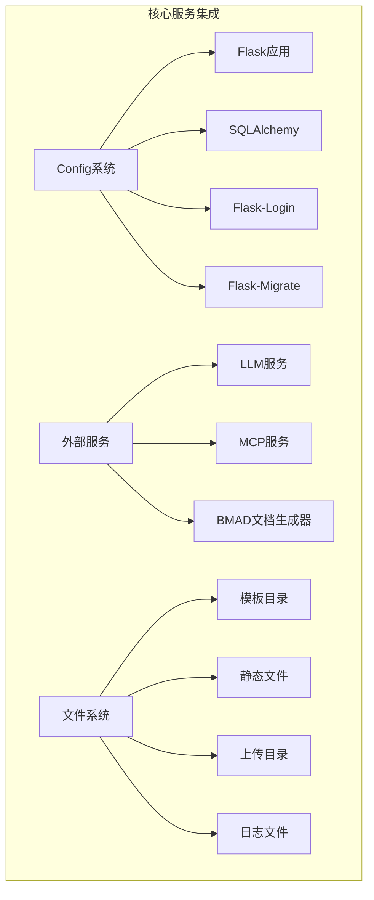

## 🎯 配置管理最佳实践

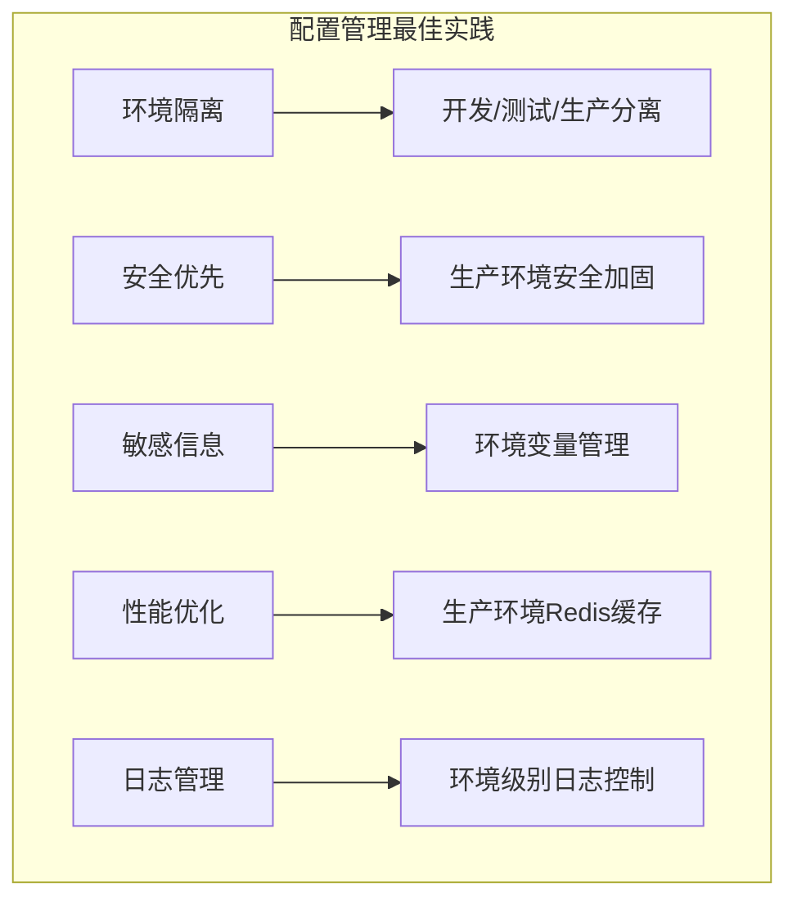

---

*此技术总览图使用 Mermaid 格式展示了 CoderWiki Config 系统的完整架构*

## 📝 使用说明

1. **查看架构**: 使用支持 Mermaid 的 Markdown 查看器查看图表
2. **环境切换**: 通过 `FLASK_ENV` 环境变量切换配置
3. **自定义配置**: 继承相应配置类进行扩展
4. **安全配置**: 生产环境请确保所有安全选项已启用

## 🔗 相关文件

- **主配置文件**: `/backend/config.py`
- **应用配置**: `/backend/app/config.py`
- **启动脚本**: `/backend/run.py`
- **环境配置**: `/config/` 目录