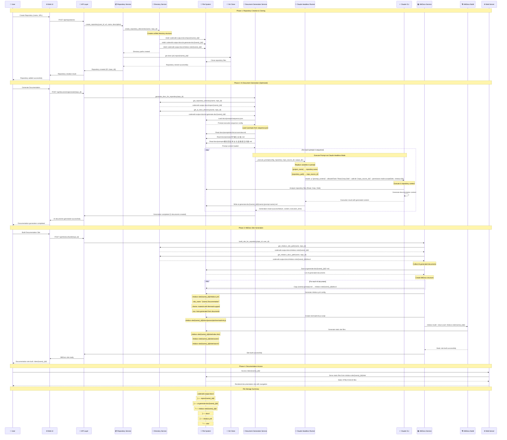

# CoderWiki Optimized Workflow - Complete Sequence Diagram

## System Overview

The CoderWiki system has been optimized to bypass the complex BMAD workflow orchestrator and directly use Claude headless mode with prompts from `docs/prompts/` directory. This sequence diagram shows the complete end-to-end workflow from repository creation to final MkDocs site generation.

## Key Optimizations

1. **Simplified Architecture**: Direct prompts + Claude headless mode (no BMAD orchestrator)
2. **Unified Directory Management**: Centralized path handling via DirectoryService
3. **Configuration-Driven**: Uses `docs/prompts/sequence.json` for execution sequence
4. **Streamlined Generation**: Three-step AI document generation process

## Complete End-to-End Sequence Diagram



## Key Components and Their Responsibilities

### 1. **DirectoryService** (Unified Path Management)

- **Location**: `/backend/app/services/directory_service.py`
- **Responsibility**: Centralized directory structure management
- **Key Methods**:
  - `get_repository_clone_path()` → `coderwiki-output-docs/repos/{name}_{id}/`
  - `get_ai_docs_path()` → `coderwiki-output-docs/ai-generate-doc/{name}_{id}/`
  - `get_mkdocs_site_path()` → `coderwiki-output-docs/mkdocs-site/{name}_{id}/`

### 2. **DocumentGenerationService** (Optimized AI Generation)

- **Location**: `/backend/app/services/document_generation_service.py`
- **Responsibility**: Direct Claude headless mode execution with prompts
- **Key Optimizations**:
  - Loads prompts directly from `docs/prompts/` directory
  - Uses `sequence.json` for execution configuration
  - Bypasses BMAD orchestrator completely
  - Direct variable replacement in prompts

### 3. **Claude Headless Runner** (AI Execution Engine)

- **Location**: `/claude_headless_runner.py`
- **Responsibility**: Execute Claude CLI in headless mode
- **Key Features**:
  - Configurable tools (Read, Grep, Glob, Bash, WebSearch)
  - Working directory context (`--add-dir`)
  - Permission modes (`acceptEdits`)
  - Timeout handling (300-1200s)

### 4. **MkDocsService** (Static Site Generation)

- **Location**: `/backend/app/services/mkdocs_service.py`
- **Responsibility**: Convert AI documents to static documentation sites
- **Key Features**:
  - Material theme with dark/light mode
  - Mermaid diagram support
  - Search functionality
  - Auto-generated navigation

## Configuration Files

### 1. **Prompt Execution Sequence** (`docs/prompts/sequence.json`)

```json
{
  "version": "1.0",
  "execution_sequence": [
    {
      "prompt_file": "technical-overview.md",
      "timeout": 600,
      "tools": ["Read", "Grep", "Glob"]
    },
    {
      "prompt_file": "API接口分析.md",
      "timeout": 900,
      "tools": ["Read", "Grep", "Bash"]
    },
    {
      "prompt_file": "模块深度考古与高频提交问题.md",
      "timeout": 1200,
      "tools": ["Read", "Grep", "Bash", "WebSearch"]
    }
  ]
}
```

### 2. **Available Prompts** (`docs/prompts/`)

- `technical-overview.md` - Comprehensive technical analysis
- `API接口分析.md` - API reverse engineering analysis
- `模块深度考古与高频提交问题.md` - Module archaeology & commit analysis

## File Storage Locations

### **Repository Files**

- **Location**: `coderwiki-output-docs/repos/{name}_{id}/`
- **Content**: Original cloned git repository
- **Purpose**: Source code analysis context for AI

### **AI Generated Documents**

- **Location**: `coderwiki-output-docs/ai-generate-doc/{name}_{id}/`
- **Content**: `{name}-{prompt-name}.md` files
- **Purpose**: AI-generated technical documentation

### **MkDocs Sites**

- **Location**: `coderwiki-output-docs/mkdocs-site/{name}_{id}/`
- **Structure**:
  - `docs/` - Source markdown files (copied from ai-generate-doc)
  - `mkdocs.yml` - MkDocs configuration
  - `site/` - Built static HTML site
  - `docs/javascripts/mermaid-init.js` - Mermaid diagram support

## Performance & Scalability Features

1. **Parallel Processing**: Multiple prompts can be executed in sequence
2. **Configurable Timeouts**: Different prompts have different complexity timeouts
3. **Tool Restrictions**: Each prompt specifies allowed tools for security
4. **Directory Isolation**: Each repository has isolated directory structure
5. **Static Site Caching**: Built sites are cached until regenerated

## System Requirements

1. **Claude CLI**: Must be installed and available in PATH
2. **MkDocs**: Python package with Material theme
3. **Git**: For repository cloning
4. **Python 3.8+**: For backend services
5. **Node.js**: For frontend (optional)

This optimized architecture provides a streamlined, maintainable, and scalable solution for automated technical documentation generation with AI assistance.
