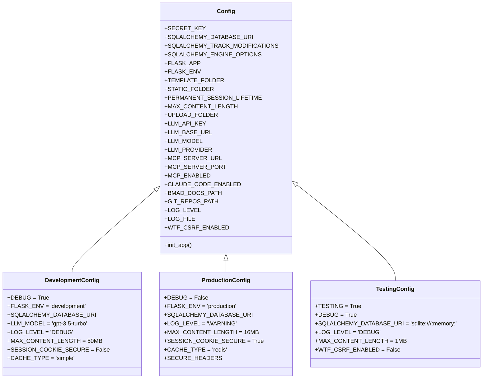
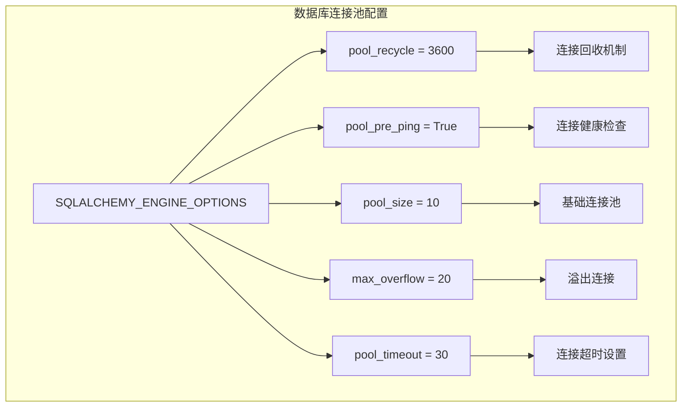
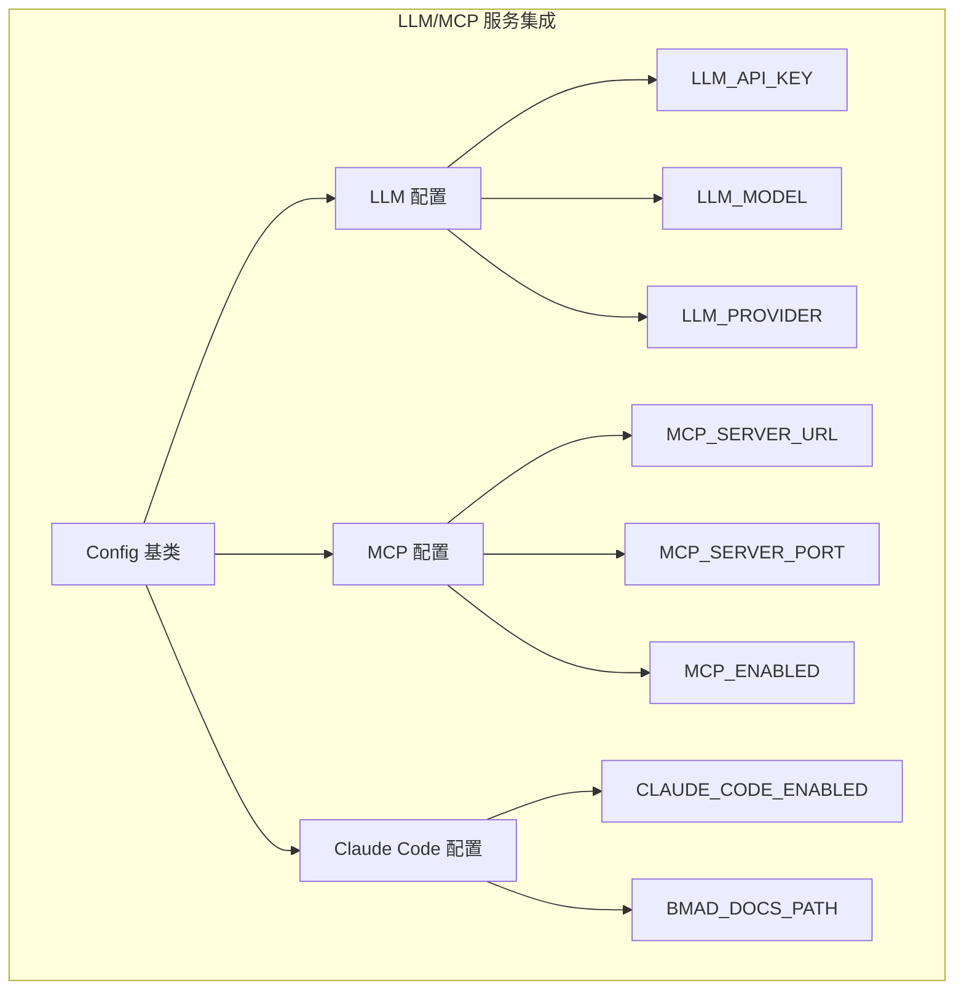

# CoderWiki Config 目录技术架构总览

## 🏗️ 系统架构总览

```mermaid
graph TB
    subgraph "CoderWiki Config 系统架构"
        A[Flask 应用] --> B[配置系统核心]
        B --> C[基础配置类 Config]
        B --> D[环境特定配置]
        B --> E[扩展配置目录]
        
        C --> F[数据库配置]
        C --> G[安全配置]
        C --> H[LLM 服务配置]
        C --> I[MCP 服务配置]
        C --> J[文件系统配置]
        
        D --> K[DevelopmentConfig]
        D --> L[ProductionConfig]
        D --> M[TestingConfig]
        
        E --> N[/config/ 目录]
        N --> O[development.py]
        N --> P[production.py]
        N --> Q[testing.py]
    end
```

## 📋 配置类继承层次



## 🔧 环境特定配置分析

### 开发环境配置特点
- **调试模式**: 启用详细日志和调试信息
- **数据库**: MySQL 开发数据库 (coderwiki_dev)
- **文件上传**: 50MB 限制，支持大文件测试
- **缓存**: Simple 缓存，便于调试
- **安全**: 宽松的安全设置，便于开发

### 生产环境配置特点
- **调试模式**: 禁用，优化性能
- **数据库**: MySQL 生产数据库 (coderwiki_prod)
- **文件上传**: 16MB 限制，平衡功能和安全
- **缓存**: Redis 高性能缓存
- **安全**: 严格的安全设置和头配置

### 测试环境配置特点
- **测试模式**: 启用测试专用设置
- **数据库**: SQLite 内存数据库，隔离测试
- **文件上传**: 1MB 限制，测试用例
- **缓存**: Simple 缓存，超时为 0
- **安全**: CSRF 保护禁用，便于测试

## 🗄️ 数据库配置架构



## 🤖 服务集成架构



## 🔐 安全配置矩阵

| 配置项 | 开发环境 | 测试环境 | 生产环境 | 说明 |
|--------|----------|----------|----------|------|
| DEBUG | True | True | False | 调试模式 |
| TESTING | False | True | False | 测试模式 |
| SESSION_COOKIE_SECURE | False | False | True | 会话安全 |
| WTF_CSRF_ENABLED | True | False | True | CSRF 保护 |
| LOG_LEVEL | DEBUG | DEBUG | WARNING | 日志级别 |
| MAX_CONTENT_LENGTH | 50MB | 1MB | 16MB | 文件大小 |
| CACHE_TYPE | simple | simple | redis | 缓存类型 |

---

*本架构总览由 BMAD 文档生成器自动生成*
