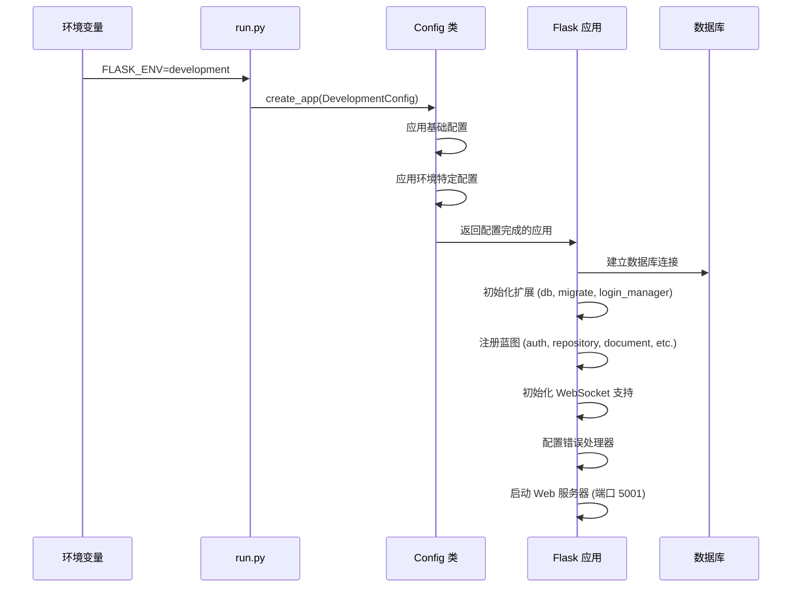
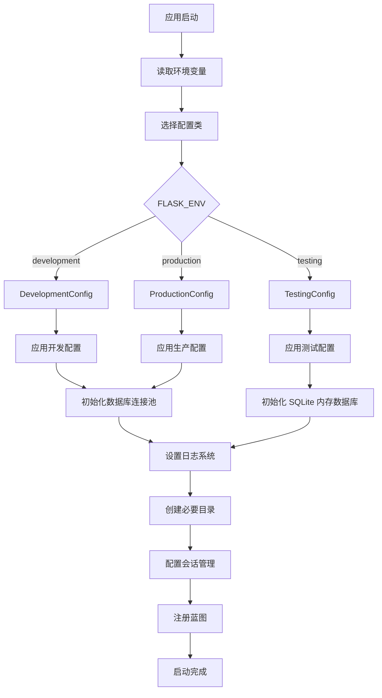
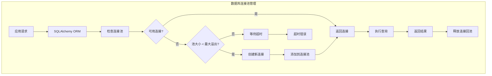
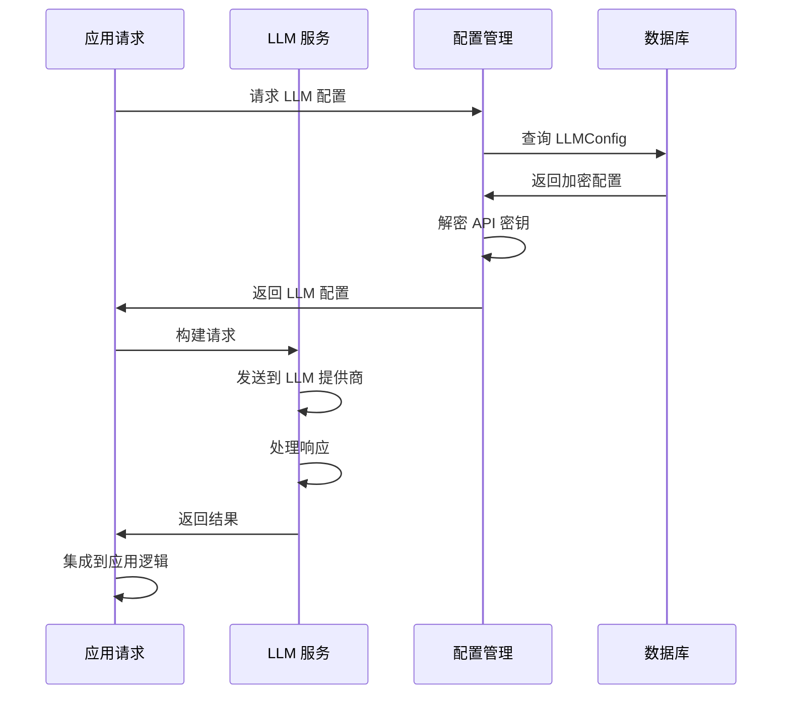
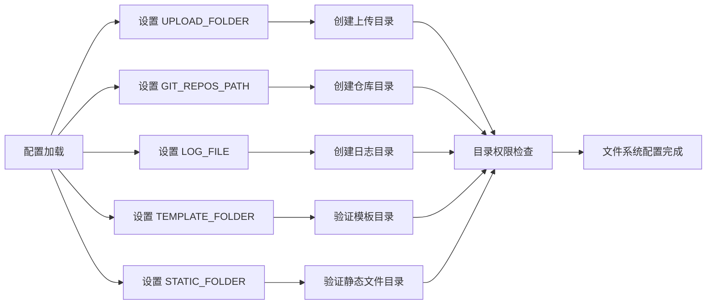
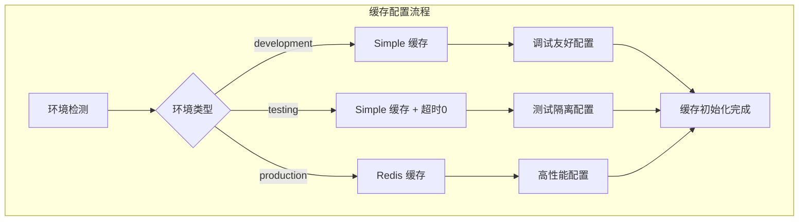
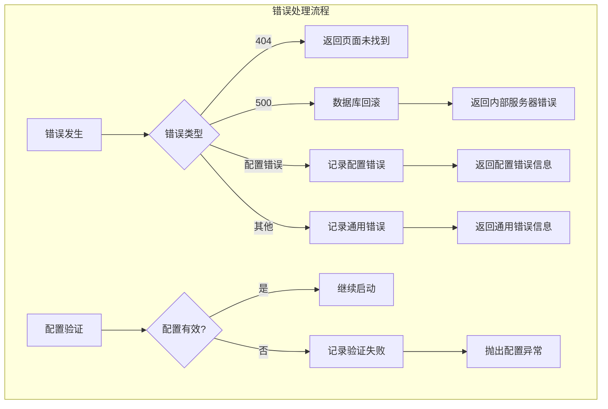
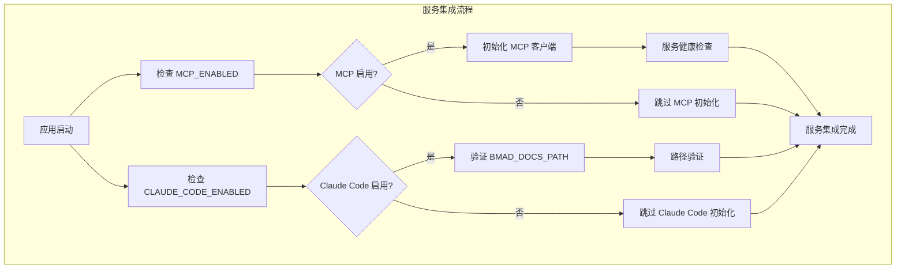
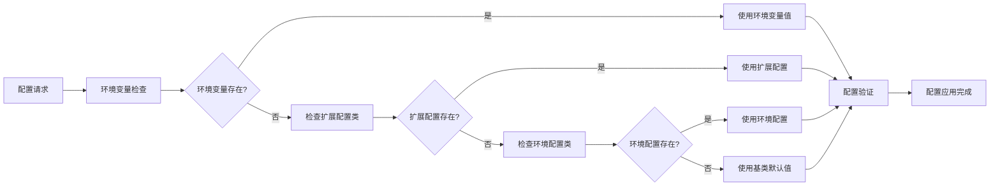

# CoderWiki Config 复杂流程分析

## 🚀 应用启动流程



## 🔄 配置加载流程



## 🗄️ 数据库连接管理流程



## 🤖 LLM 服务调用流程



## 🔐 安全配置应用流程

```mermaid
graph TB
    subgraph "安全配置应用"
        A[应用启动] --> B[加载 SECRET_KEY]
        B --> C[配置会话 cookies]
        C --> D[设置 SESSION_COOKIE_SECURE]
        D --> E[配置 WTF_CSRF_ENABLED]
        E --> F[应用安全头 (生产环境)]
        F --> G[配置登录管理器]
        G --> H[初始化认证系统]
        H --> I[安全配置完成]
    end
```

## 📁 文件系统配置流程



## ⚡ 缓存配置流程



## 🚨 错误处理流程



## 🔧 服务集成流程



## 📊 配置优先级流程



---

*本流程分析由 BMAD 文档生成器自动生成*
