# coze-loop 复杂流程深度分析

## 1. Prompt 模板执行引擎

### 流程概述
**业务目标**: 执行用户定义的 Prompt 模板，支持变量替换、多轮对话、流式响应  
**触发条件**: 用户通过 API 或 Playground 触发 Prompt 执行请求  
**潜在核心问题**: 模板渲染失败可能导致 LLM 调用异常，流式响应中断影响用户体验  
**关键非功能点**: 响应时间 < 2s (首字节)，支持 8 分钟超时控制，最大 8 轮迭代

### Mermaid 时序图

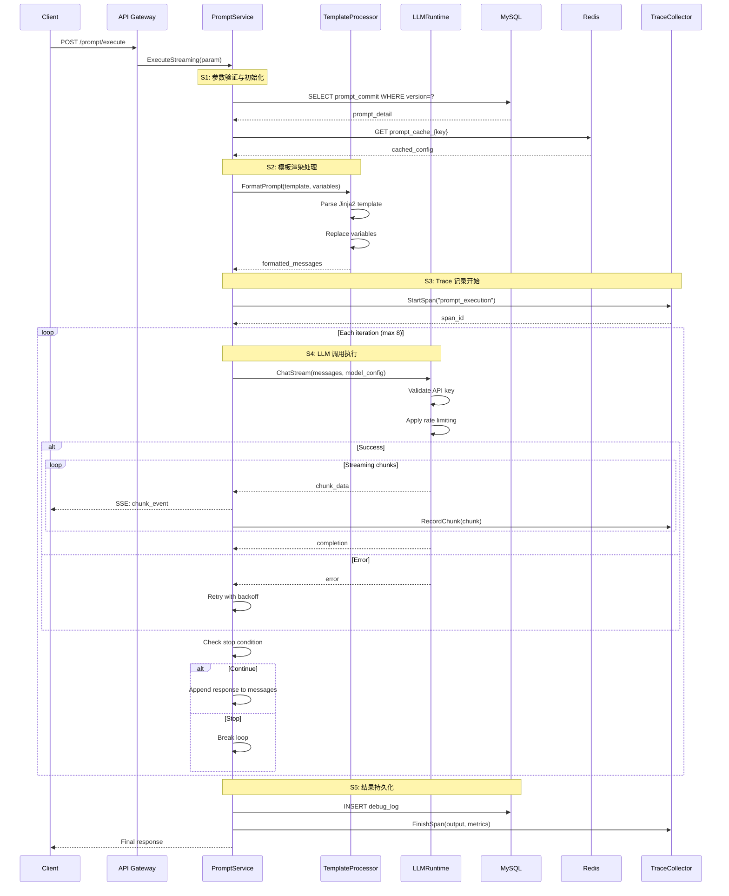

### 关键配置项
- `PROMPT_MAX_ITERATIONS`: 最大迭代轮数，默认 8
- `PROMPT_TIMEOUT_MS`: 执行超时时间，默认 480000ms (8分钟)
- `LLM_RETRY_COUNT`: LLM 调用重试次数，默认 3
- `STREAM_CHUNK_SIZE`: 流式响应分块大小，默认 1024 bytes
- `TEMPLATE_CACHE_TTL`: 模板缓存时间，默认 3600s

### 详细步骤分析

**S1: 参数验证与初始化**
- 业务规则：必须提供有效的 prompt_id 或 prompt_key，版本号为空时使用最新发布版本
- 关键逻辑：`if param.Prompt == nil { return error("invalid prompt") }`
- 核心作用：确保请求参数完整，加载 Prompt 配置和模板内容

**S2: 模板渲染处理**  
- 业务规则：支持 Jinja2 语法的模板渲染，变量值不能为 null
- 关键逻辑：`template.Render(variables)` 使用第三方 Jinja 引擎
- 核心作用：将用户变量注入模板，生成最终的 LLM 输入消息

**S3: Trace 记录开始**
- 业务规则：所有执行必须记录 Trace，用于后续分析和调试
- 关键逻辑：`span.SetInput(messages); span.SetPrompt(prompt_key, version)`
- 核心作用：建立执行链路追踪，记录输入参数便于问题排查

**S4: LLM 调用执行**
- 业务规则：支持流式和非流式两种模式，失败自动重试，遵守模型限流
- 关键逻辑：`for retry < maxRetry { result = llm.Chat(); if success { break } }`
- 核心作用：调用配置的 LLM 模型，处理响应流，实现多轮对话

**S5: 结果持久化**
- 业务规则：调试模式下保存完整日志，生产模式仅保存关键指标
- 关键逻辑：`if debug_mode { db.SaveDebugLog(full_context) }`
- 核心作用：持久化执行结果，支持历史回放和问题分析

## 2. 实验运行调度器

### 流程概述
**业务目标**: 协调评测实验的执行，管理多个评测任务的并行运行  
**触发条件**: 用户创建实验并点击运行，或定时任务触发  
**潜在核心问题**: 任务调度失败导致实验卡住，并发控制不当造成资源耗尽  
**关键非功能点**: 支持 1000+ 并发任务，任务失败率 < 1%，调度延迟 < 100ms

### Mermaid 时序图

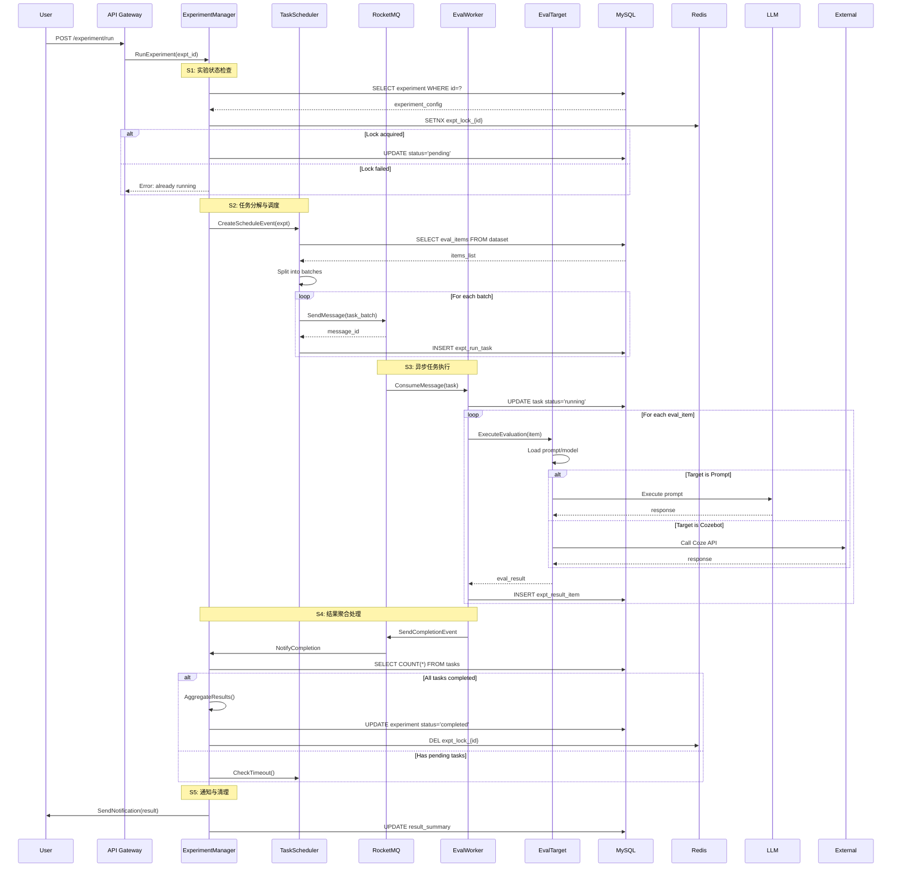

### 关键配置项
- `EXPT_MAX_CONCURRENT_TASKS`: 最大并发任务数，默认 100
- `EXPT_TASK_BATCH_SIZE`: 任务批次大小，默认 50
- `EXPT_MAX_ALIVE_TIME_MS`: 实验最大存活时间，默认 7200000ms (2小时)
- `EXPT_RETRY_MAX_ATTEMPTS`: 失败重试次数，默认 3
- `WORKER_POOL_SIZE`: Worker 池大小，默认 20

### 详细步骤分析

**S1: 实验状态检查**
- 业务规则：实验状态必须为 draft 或 failed 才能运行，同一实验不能并发执行
- 关键逻辑：`if expt.Status != "draft" && expt.Status != "failed" { return error }`
- 核心作用：防止重复执行，确保实验状态机正确流转

**S2: 任务分解与调度**
- 业务规则：根据数据集大小自动分批，每批不超过配置的批次大小
- 关键逻辑：`batches = splitItems(items, batchSize); for batch { queue.Send(batch) }`
- 核心作用：将大任务分解为小批次，实现并行处理和负载均衡

**S3: 异步任务执行**
- 业务规则：每个任务独立执行，失败不影响其他任务，支持断点续传
- 关键逻辑：`try { result = target.Execute(item) } catch { retry() }`
- 核心作用：执行具体的评测逻辑，调用目标系统获取结果

**S4: 结果聚合处理**
- 业务规则：所有任务完成或超时后进行聚合，计算统计指标
- 关键逻辑：`if allCompleted() { aggregate() } else if timeout() { drain() }`
- 核心作用：收集所有任务结果，生成实验报告和统计数据

**S5: 通知与清理**
- 业务规则：实验完成后通知用户，清理临时资源和锁
- 关键逻辑：`notify(user); cleanup(locks, temp_files)`
- 核心作用：及时通知用户结果，释放系统资源

## 3. Trace 数据采集链路

### 流程概述
**业务目标**: 采集、存储和查询 AI Agent 执行的全链路追踪数据  
**触发条件**: SDK 上报 Trace 数据，或系统内部自动采集  
**潜在核心问题**: 高并发写入导致数据丢失，存储压力大造成查询性能下降  
**关键非功能点**: 写入 QPS > 10000，数据延迟 < 1s，压缩率 > 70%

### Mermaid 时序图

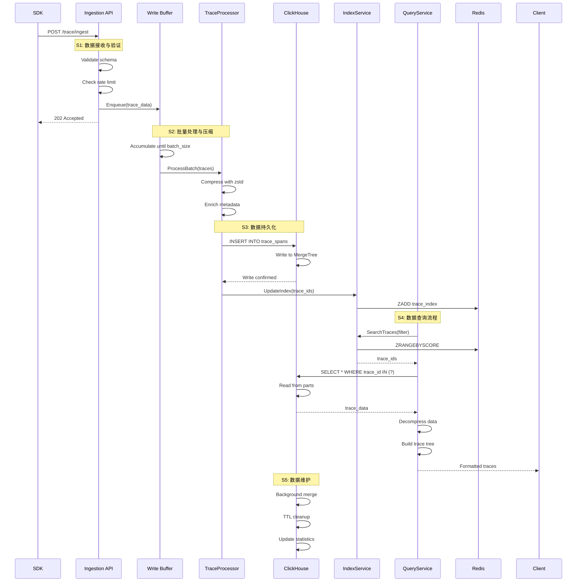

### 关键配置项
- `TRACE_BATCH_SIZE`: 批处理大小，默认 1000
- `TRACE_BATCH_TIMEOUT_MS`: 批处理超时，默认 5000ms
- `TRACE_COMPRESSION_LEVEL`: 压缩级别 (1-9)，默认 6
- `CLICKHOUSE_MAX_CONNECTIONS`: CK 最大连接数，默认 50
- `TRACE_RETENTION_DAYS`: 数据保留天数，默认 30

### 详细步骤分析

**S1: 数据接收与验证**
- 业务规则：必须包含 trace_id、span_id、timestamp，数据大小不超过 1MB
- 关键逻辑：`if len(data) > 1MB { return error("payload too large") }`
- 核心作用：快速接收并验证数据，异步处理避免阻塞客户端

**S2: 批量处理与压缩**
- 业务规则：累积到批次大小或超时后处理，使用 zstd 压缩算法
- 关键逻辑：`if len(buffer) >= batchSize || timeout { compress(buffer); flush() }`
- 核心作用：提高写入效率，减少存储空间占用

**S3: 数据持久化**
- 业务规则：写入 ClickHouse MergeTree 表，同时更新 Redis 索引
- 关键逻辑：`ck.Insert(batch); redis.UpdateIndex(traceIds)`
- 核心作用：持久化 Trace 数据，建立快速检索索引

**S4: 数据查询流程**
- 业务规则：先查索引获取 ID，再查详细数据，支持时间范围和标签过滤
- 关键逻辑：`ids = index.Search(filter); data = ck.Select(ids)`
- 核心作用：提供高效的 Trace 查询能力，支持复杂过滤条件

**S5: 数据维护**
- 业务规则：自动合并小文件，按 TTL 清理过期数据，定期更新统计信息
- 关键逻辑：`OPTIMIZE TABLE; ALTER TABLE DELETE WHERE timestamp < TTL`
- 核心作用：保持查询性能，控制存储成本

## 4. LLM 模型路由系统

### 流程概述
**业务目标**: 统一管理多个 LLM 提供商，实现智能路由和故障切换  
**触发条件**: 应用层调用 LLM 服务接口  
**潜在核心问题**: 模型服务不稳定，认证失败，成本控制  
**关键非功能点**: 路由延迟 < 10ms，故障切换 < 1s，支持 10+ 模型提供商

### Mermaid 时序图

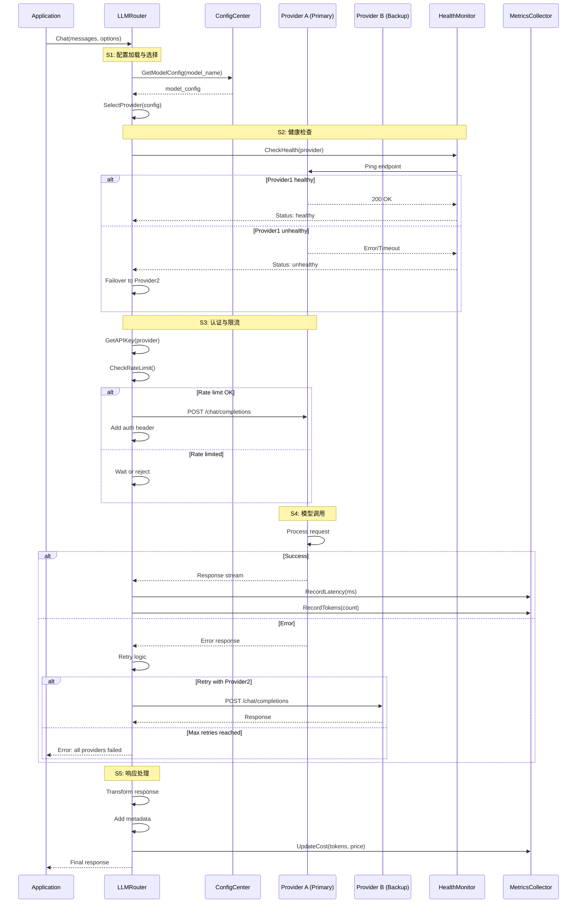

### 关键配置项
- `MODEL_PROVIDER_TIMEOUT_MS`: 提供商超时时间，默认 30000ms
- `MODEL_MAX_RETRIES`: 最大重试次数，默认 3
- `MODEL_HEALTH_CHECK_INTERVAL_S`: 健康检查间隔，默认 30s
- `MODEL_RATE_LIMIT_PER_MIN`: 分钟级限流，默认 100
- `MODEL_FAILOVER_THRESHOLD`: 故障切换阈值，默认 3 次失败

### 详细步骤分析

**S1: 配置加载与选择**
- 业务规则：根据模型名称加载对应配置，支持多提供商负载均衡
- 关键逻辑：`provider = selectByWeight(providers, weights)`
- 核心作用：动态选择最优的模型提供商，实现成本和性能平衡

**S2: 健康检查**
- 业务规则：定期检查提供商健康状态，不健康的自动降级
- 关键逻辑：`if failCount > threshold { markUnhealthy(provider) }`
- 核心作用：及时发现故障，自动切换到备用提供商

**S3: 认证与限流**
- 业务规则：每个提供商使用独立的 API Key，遵守各自的限流规则
- 关键逻辑：`headers["Authorization"] = "Bearer " + apiKey`
- 核心作用：确保请求合法性，避免超出配额导致封禁

**S4: 模型调用**
- 业务规则：支持流式和非流式响应，自动处理部分失败
- 关键逻辑：`response = provider.Call(request); if failed { retry() }`
- 核心作用：实际调用 LLM 服务，处理各种异常情况

**S5: 响应处理**
- 业务规则：统一响应格式，记录使用指标，计算成本
- 关键逻辑：`cost = tokens * pricePerToken; metrics.Record(cost)`
- 核心作用：标准化输出，提供成本分析数据

## 5. 评测器执行引擎

### 流程概述
**业务目标**: 执行自定义评测逻辑，对 AI 输出进行多维度评分  
**触发条件**: 实验运行过程中触发评测任务  
**潜在核心问题**: 评测逻辑错误导致评分异常，执行超时影响实验进度  
**关键非功能点**: 评测准确率 > 95%，执行时间 < 5s，支持自定义评测器

### Mermaid 时序图

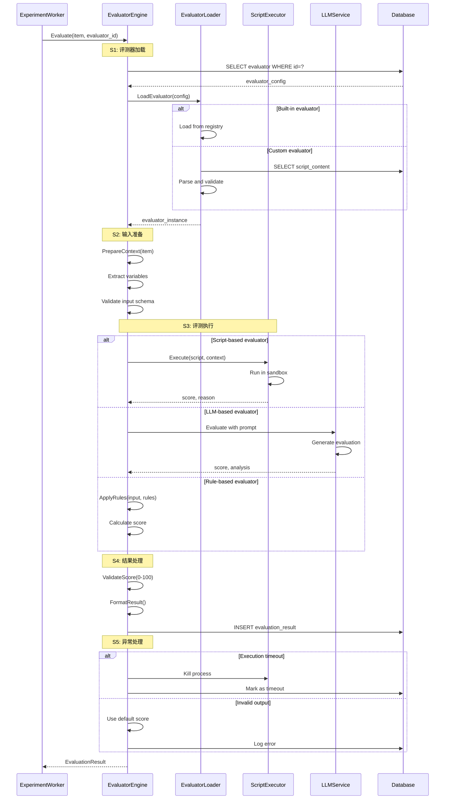

### 关键配置项
- `EVALUATOR_TIMEOUT_MS`: 评测执行超时，默认 5000ms
- `EVALUATOR_MEMORY_LIMIT_MB`: 内存限制，默认 256MB
- `EVALUATOR_SANDBOX_ENABLED`: 是否启用沙箱，默认 true
- `EVALUATOR_CACHE_TTL_S`: 评测器缓存时间，默认 600s
- `EVALUATOR_MAX_RETRIES`: 失败重试次数，默认 2

### 详细步骤分析

**S1: 评测器加载**
- 业务规则：支持内置、脚本、LLM 三种评测器类型，脚本需通过安全检查
- 关键逻辑：`if type == "script" { validateSafety(script) }`
- 核心作用：加载并初始化评测器，确保执行环境安全

**S2: 输入准备**
- 业务规则：输入必须符合评测器定义的 schema，缺失字段使用默认值
- 关键逻辑：`context = {input: item.input, output: item.output, expected: item.expected}`
- 核心作用：准备评测所需的完整上下文，确保数据完整性

**S3: 评测执行**
- 业务规则：不同类型评测器采用不同执行策略，脚本在沙箱中运行
- 关键逻辑：`result = sandbox.Execute(script, timeout=5000)`
- 核心作用：安全地执行评测逻辑，生成评分和理由

**S4: 结果处理**
- 业务规则：评分范围 0-100，必须包含评分理由，结果需持久化
- 关键逻辑：`if score < 0 || score > 100 { score = 50 }`
- 核心作用：标准化评测结果，便于后续统计分析

**S5: 异常处理**
- 业务规则：超时自动终止，异常时使用默认评分，记录错误日志
- 关键逻辑：`try { execute() } catch(timeout) { kill(); return default }`
- 核心作用：保证评测流程的健壮性，不因单个失败影响整体

## 6. 用户认证授权

### 流程概述
**业务目标**: 管理用户身份认证和权限控制，保护系统资源安全  
**触发条件**: 用户登录请求或 API 访问需要权限验证  
**潜在核心问题**: Token 泄露风险，权限配置错误，会话管理复杂  
**关键非功能点**: 认证延迟 < 100ms，Token 有效期 7 天，支持 RBAC

### Mermaid 时序图

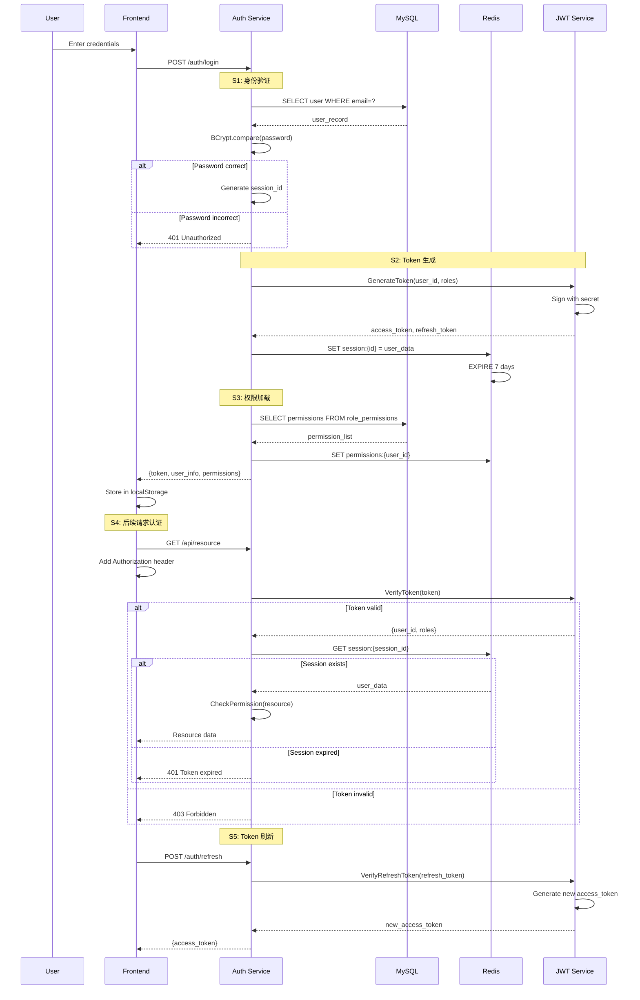

### 关键配置项
- `JWT_SECRET`: JWT 签名密钥
- `JWT_ACCESS_TOKEN_TTL`: 访问令牌有效期，默认 2 小时
- `JWT_REFRESH_TOKEN_TTL`: 刷新令牌有效期，默认 7 天
- `SESSION_TTL`: 会话有效期，默认 7 天
- `PASSWORD_MIN_LENGTH`: 密码最小长度，默认 8

### 详细步骤分析

**S1: 身份验证**
- 业务规则：邮箱必须存在，密码使用 BCrypt 加密，失败 5 次锁定账号
- 关键逻辑：`if loginAttempts > 5 { lockAccount(30min) }`
- 核心作用：验证用户身份，防止暴力破解

**S2: Token 生成**
- 业务规则：生成 JWT 格式的访问令牌和刷新令牌，包含用户 ID 和角色
- 关键逻辑：`token = JWT.sign({user_id, roles}, secret, {expiresIn: "2h"})`
- 核心作用：创建无状态的身份凭证，支持分布式验证

**S3: 权限加载**
- 业务规则：基于 RBAC 模型，角色关联权限，权限控制到接口级别
- 关键逻辑：`permissions = roles.flatMap(role => role.permissions)`
- 核心作用：加载用户完整权限集，支持细粒度访问控制

**S4: 后续请求认证**
- 业务规则：每个请求必须携带有效 Token，验证通过才能访问资源
- 关键逻辑：`if !hasPermission(user, resource) { return 403 }`
- 核心作用：保护系统资源，实现访问控制

**S5: Token 刷新**
- 业务规则：访问令牌过期可用刷新令牌换取新令牌，刷新令牌只能使用一次
- 关键逻辑：`newToken = refreshToken(oldRefreshToken); invalidate(oldRefreshToken)`
- 核心作用：延长用户会话，提升用户体验

## 7. 实验结果聚合分析

### 流程概述
**业务目标**: 聚合实验运行结果，计算统计指标，生成分析报告  
**触发条件**: 实验所有任务完成后自动触发  
**潜在核心问题**: 数据量大导致聚合缓慢，统计算法错误，内存溢出  
**关键非功能点**: 处理 100万条记录 < 30s，支持 20+ 统计指标

### Mermaid 时序图

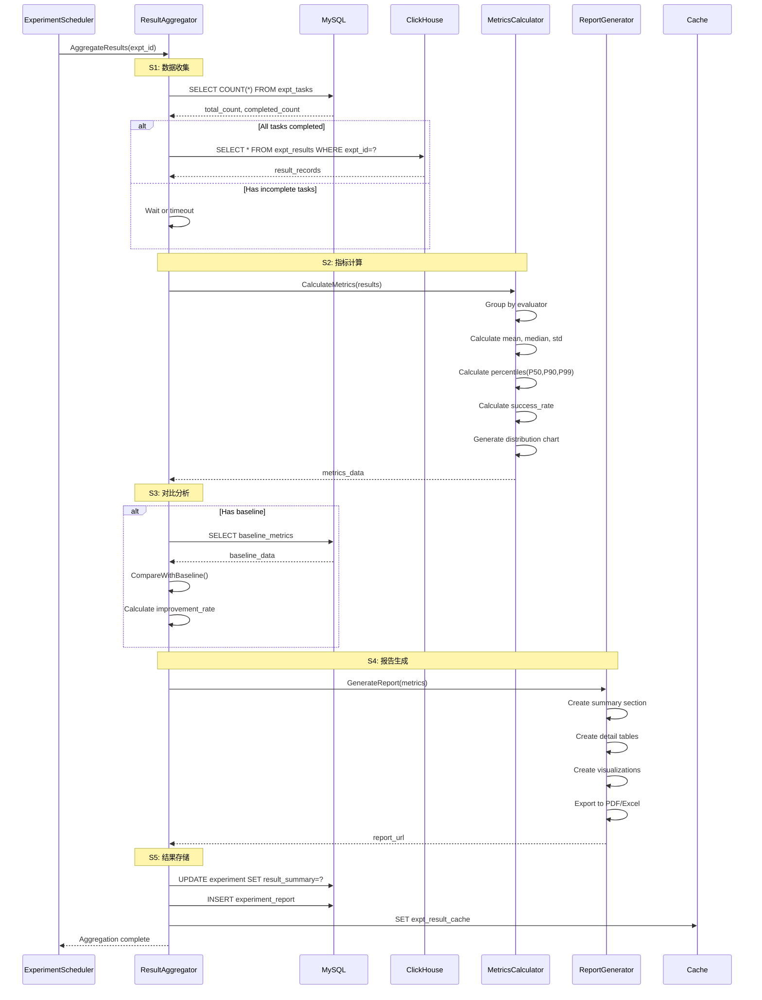

### 关键配置项
- `AGGREGATION_BATCH_SIZE`: 聚合批次大小，默认 10000
- `AGGREGATION_TIMEOUT_S`: 聚合超时时间，默认 300s
- `METRICS_CACHE_TTL`: 指标缓存时间，默认 3600s
- `REPORT_FORMAT`: 报告格式，支持 PDF/Excel/JSON
- `PERCENTILES_TO_CALCULATE`: 计算的百分位数，默认 [50, 90, 95, 99]

### 详细步骤分析

**S1: 数据收集**
- 业务规则：等待所有任务完成或达到超时时间，从 ClickHouse 批量读取结果
- 关键逻辑：`if completedCount < totalCount && !timeout { wait() }`
- 核心作用：确保数据完整性，避免遗漏未完成的结果

**S2: 指标计算**
- 业务规则：按评测器分组计算，包括均值、中位数、标准差、百分位数等
- 关键逻辑：`metrics = {mean: avg(scores), p90: percentile(scores, 0.9)}`
- 核心作用：生成全面的统计指标，支持多维度分析

**S3: 对比分析**
- 业务规则：如果设置了基线实验，计算相对改进率和显著性检验
- 关键逻辑：`improvement = (current - baseline) / baseline * 100`
- 核心作用：评估模型优化效果，支持 A/B 测试

**S4: 报告生成**
- 业务规则：生成结构化报告，包含摘要、详细数据、可视化图表
- 关键逻辑：`report = {summary, details, charts, recommendations}`
- 核心作用：提供直观的实验结果展示，便于决策

**S5: 结果存储**
- 业务规则：持久化聚合结果，更新实验状态，缓存常用查询
- 关键逻辑：`db.Save(summary); cache.Set(key, result, ttl=3600)`
- 核心作用：保存分析结果，提供快速查询能力

## 8. 消息队列消费处理

### 流程概述
**业务目标**: 可靠地消费和处理异步任务消息，保证任务不丢失  
**触发条件**: 消息队列中有新消息到达  
**潜在核心问题**: 消息重复消费，处理失败导致积压，消费者宕机  
**关键非功能点**: 消费延迟 < 100ms，消息不丢失率 > 99.99%

### Mermaid 时序图

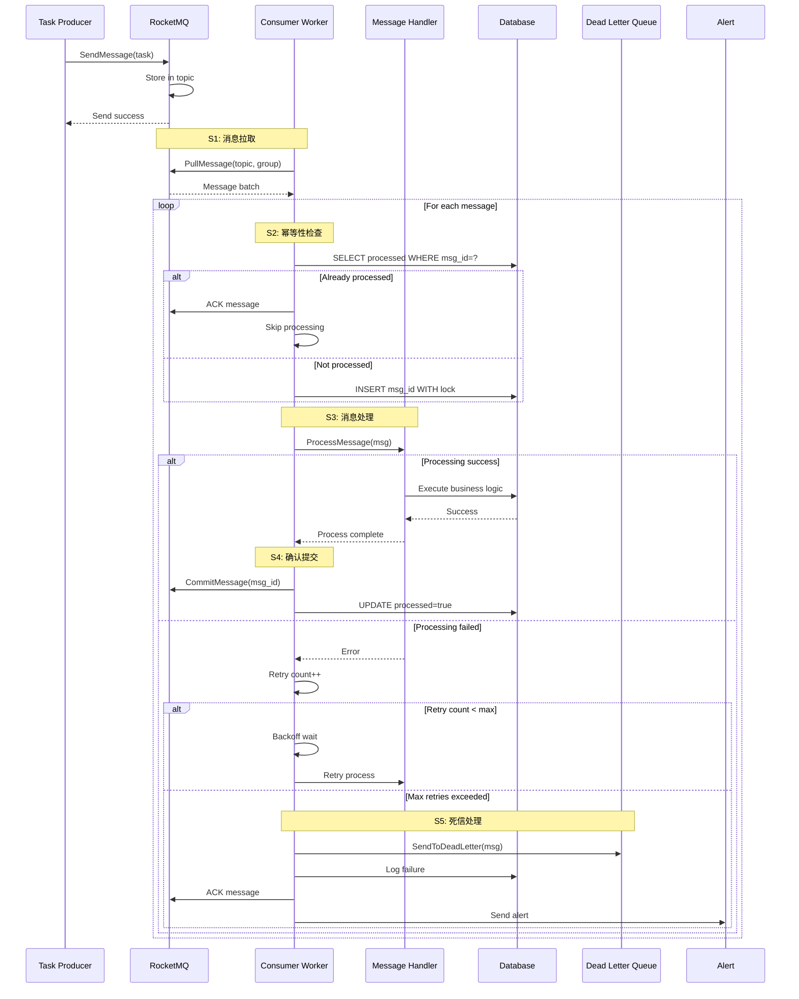

### 关键配置项
- `CONSUMER_POOL_SIZE`: 消费者线程池大小，默认 10
- `CONSUMER_BATCH_SIZE`: 批量拉取消息数，默认 32
- `CONSUMER_MAX_RETRIES`: 最大重试次数，默认 3
- `CONSUMER_BACKOFF_MS`: 重试退避时间，默认 [1000, 2000, 4000]
- `DLQ_RETENTION_DAYS`: 死信队列保留天数，默认 7

### 详细步骤分析

**S1: 消息拉取**
- 业务规则：按消费组拉取消息，保证同组内消息顺序，批量拉取提高效率
- 关键逻辑：`messages = mq.Pull(topic, group, batchSize=32)`
- 核心作用：从消息队列获取待处理任务，实现任务分发

**S2: 幂等性检查**
- 业务规则：基于消息 ID 去重，防止重复消费造成数据不一致
- 关键逻辑：`if exists(msgId) { ack(); continue }`
- 核心作用：保证消息只被处理一次，实现幂等性

**S3: 消息处理**
- 业务规则：调用业务处理逻辑，失败时进行重试，记录处理结果
- 关键逻辑：`try { handler.Process(msg) } catch { retry() }`
- 核心作用：执行实际的业务逻辑，处理异步任务

**S4: 确认提交**
- 业务规则：处理成功后确认消息，更新处理状态，释放消息
- 关键逻辑：`mq.Commit(msgId); db.UpdateProcessed(msgId)`
- 核心作用：确认消息已处理，避免重复投递

**S5: 死信处理**
- 业务规则：超过最大重试次数的消息进入死信队列，触发告警
- 关键逻辑：`if retries > max { dlq.Send(msg); alert() }`
- 核心作用：隔离问题消息，避免影响正常消费，便于问题排查

## 9. 限流熔断机制

### 流程概述
**业务目标**: 保护系统免受流量冲击，实现优雅降级  
**触发条件**: 请求到达 API 网关时进行限流检查  
**潜在核心问题**: 限流算法不准确，熔断恢复策略不当，影响正常用户  
**关键非功能点**: 限流精度 > 99%，熔断响应时间 < 10ms

### Mermaid 时序图

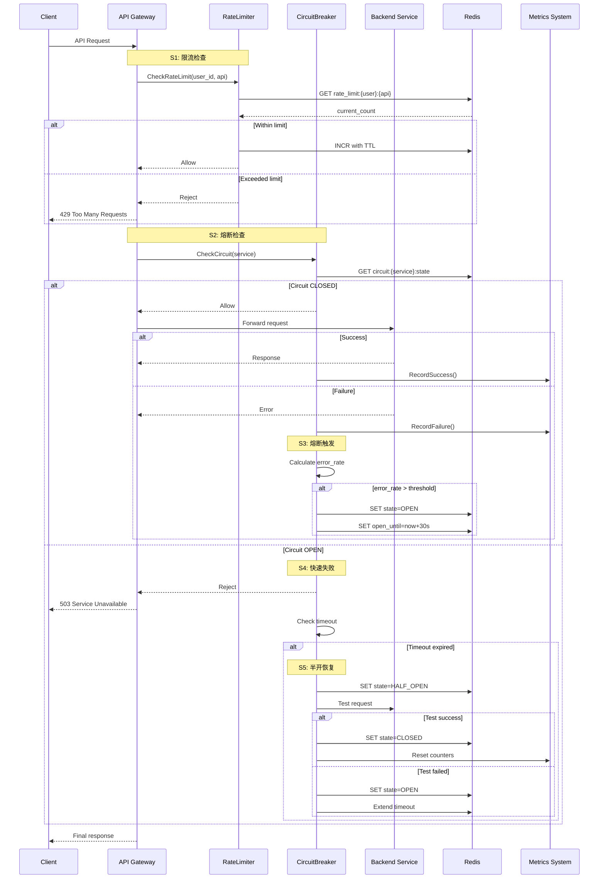

### 关键配置项
- `RATE_LIMIT_WINDOW_S`: 限流时间窗口，默认 60s
- `RATE_LIMIT_MAX_REQUESTS`: 窗口内最大请求数，默认 100
- `CIRCUIT_ERROR_THRESHOLD`: 熔断错误率阈值，默认 50%
- `CIRCUIT_TIMEOUT_S`: 熔断持续时间，默认 30s
- `CIRCUIT_HALF_OPEN_REQUESTS`: 半开状态测试请求数，默认 3

### 详细步骤分析

**S1: 限流检查**
- 业务规则：基于滑动窗口算法，支持用户级和 API 级限流
- 关键逻辑：`if count > limit { reject() } else { increment() }`
- 核心作用：控制请求速率，防止资源耗尽

**S2: 熔断检查**
- 业务规则：监控错误率，超过阈值自动熔断，保护下游服务
- 关键逻辑：`if errorRate > 50% { openCircuit() }`
- 核心作用：快速失败，避免级联故障

**S3: 熔断触发**
- 业务规则：连续失败或错误率超标触发熔断，设置恢复时间
- 关键逻辑：`state = OPEN; reopenTime = now + timeout`
- 核心作用：隔离故障服务，给予恢复时间

**S4: 快速失败**
- 业务规则：熔断期间直接返回错误，不调用后端服务
- 关键逻辑：`if state == OPEN { return 503 }`
- 核心作用：减少无效调用，快速响应

**S5: 半开恢复**
- 业务规则：熔断超时后进入半开状态，放行少量请求测试
- 关键逻辑：`if testSuccess { close() } else { reopen() }`
- 核心作用：渐进式恢复，避免瞬间流量冲击

## 10. API 网关路由

### 流程概述
**业务目标**: 统一 API 入口，处理路由分发、认证鉴权、中间件链  
**触发条件**: 客户端发起 HTTP 请求  
**潜在核心问题**: 路由配置错误，中间件执行顺序问题，性能瓶颈  
**关键非功能点**: 路由延迟 < 5ms，支持 10000+ QPS

### Mermaid 时序图

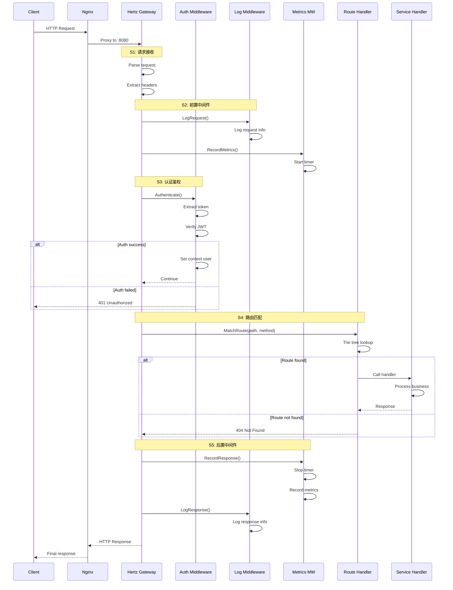

### 关键配置项
- `GATEWAY_MAX_REQUEST_SIZE`: 最大请求体大小，默认 10MB
- `GATEWAY_TIMEOUT_S`: 请求超时时间，默认 30s
- `GATEWAY_MAX_CONNECTIONS`: 最大连接数，默认 10000
- `MIDDLEWARE_ORDER`: 中间件执行顺序
- `ROUTE_CACHE_SIZE`: 路由缓存大小，默认 1000

### 详细步骤分析

**S1: 请求接收**
- 业务规则：解析 HTTP 请求，提取必要信息，验证请求格式
- 关键逻辑：`request = parseHTTP(raw); validateContentType(request)`
- 核心作用：标准化请求数据，为后续处理准备

**S2: 前置中间件**
- 业务规则：按顺序执行前置中间件，包括日志、监控、限流等
- 关键逻辑：`for mw in middlewares { mw.Before(ctx) }`
- 核心作用：实现横切关注点，如日志记录和性能监控

**S3: 认证鉴权**
- 业务规则：验证请求合法性，提取用户信息，检查访问权限
- 关键逻辑：`user = auth.Verify(token); if !hasPermission(user, resource) { deny() }`
- 核心作用：保护 API 资源，实现访问控制

**S4: 路由匹配**
- 业务规则：基于路径和方法匹配路由，支持参数提取和通配符
- 关键逻辑：`handler = router.Match(path, method); handler.Execute(ctx)`
- 核心作用：分发请求到正确的处理器，执行业务逻辑

**S5: 后置中间件**
- 业务规则：处理响应，记录日志，统计指标，处理错误
- 关键逻辑：`for mw in reverse(middlewares) { mw.After(ctx, response) }`
- 核心作用：完成请求生命周期，记录关键信息

## 11. 分布式事务处理

### 流程概述
**业务目标**: 保证跨服务操作的数据一致性  
**触发条件**: 涉及多个数据源或服务的业务操作  
**潜在核心问题**: 事务协调失败，数据不一致，性能开销大  
**关键非功能点**: 事务成功率 > 99.9%，补偿成功率 > 99%

### Mermaid 时序图

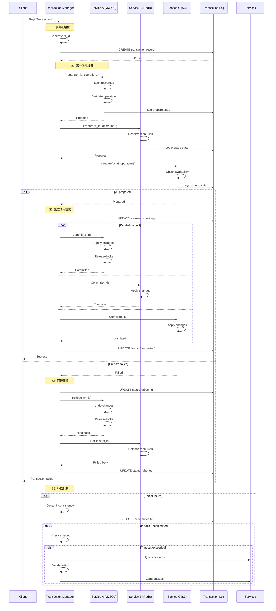

### 关键配置项
- `TX_TIMEOUT_S`: 事务超时时间，默认 30s
- `TX_RETRY_COUNT`: 事务重试次数，默认 3
- `TX_LOG_RETENTION_DAYS`: 事务日志保留天数，默认 30
- `COMPENSATION_DELAY_S`: 补偿延迟时间，默认 60s
- `PREPARE_TIMEOUT_S`: 准备阶段超时，默认 5s

### 详细步骤分析

**S1: 事务初始化**
- 业务规则：生成全局唯一事务 ID，创建事务上下文，记录事务日志
- 关键逻辑：`txId = UUID(); log.Create({id: txId, status: "init"})`
- 核心作用：建立事务协调机制，跟踪事务状态

**S2: 第一阶段准备**
- 业务规则：各参与者预留资源，验证操作可行性，记录 undo 日志
- 关键逻辑：`prepared = all(services.map(s => s.prepare()))`
- 核心作用：确保所有操作可以执行，实现原子性保证

**S3: 第二阶段提交**
- 业务规则：所有参与者都准备好后统一提交，并行执行提高效率
- 关键逻辑：`if allPrepared { parallel(services.map(s => s.commit())) }`
- 核心作用：原子性地应用所有变更，完成事务

**S4: 回滚处理**
- 业务规则：任一参与者失败则全部回滚，释放所有资源
- 关键逻辑：`if anyFailed { services.forEach(s => s.rollback()) }`
- 核心作用：保证数据一致性，清理失败事务

**S5: 补偿机制**
- 业务规则：定期检查未完成事务，超时后执行补偿，保证最终一致性
- 关键逻辑：`if tx.age > timeout { compensate(tx) }`
- 核心作用：处理异常情况，修复数据不一致

## 12. 安全防护机制

### 流程概述
**业务目标**: 保护系统免受各类安全威胁，确保数据安全  
**触发条件**: 所有外部请求和敏感操作  
**潜在核心问题**: 安全漏洞被利用，数据泄露，服务被攻击  
**关键非功能点**: 防护成功率 > 99.9%，性能影响 < 5%

### Mermaid 时序图

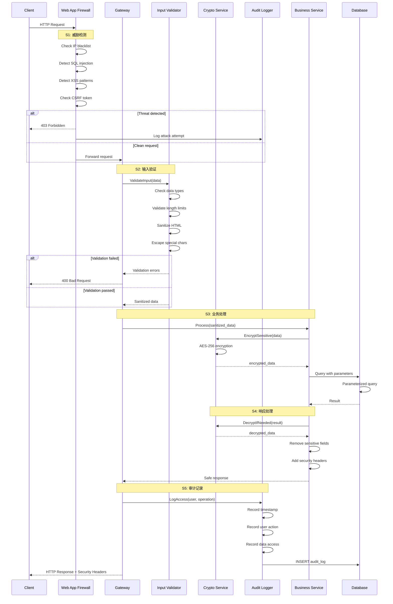

### 关键配置项
- `SECURITY_IP_BLACKLIST`: IP 黑名单列表
- `SECURITY_MAX_REQUEST_SIZE`: 最大请求大小，默认 10MB
- `SECURITY_CSRF_TOKEN_TTL`: CSRF Token 有效期，默认 1 小时
- `ENCRYPTION_ALGORITHM`: 加密算法，默认 AES-256-GCM
- `AUDIT_LOG_RETENTION_DAYS`: 审计日志保留天数，默认 90

### 详细步骤分析

**S1: 威胁检测**
- 业务规则：检测常见攻击模式，包括 SQL 注入、XSS、CSRF 等
- 关键逻辑：`if detectSQLi(input) || detectXSS(input) { block() }`
- 核心作用：第一道防线，阻止明显的攻击请求

**S2: 输入验证**
- 业务规则：严格验证输入数据，转义特殊字符，限制输入长度
- 关键逻辑：`sanitized = escapeHtml(input); validate(sanitized, schema)`
- 核心作用：防止注入攻击，确保数据符合预期格式

**S3: 业务处理**
- 业务规则：敏感数据加密存储，使用参数化查询，最小权限原则
- 关键逻辑：`encrypted = encrypt(sensitive); db.Query(sql, params)`
- 核心作用：保护数据安全，防止 SQL 注入

**S4: 响应处理**
- 业务规则：脱敏处理，移除内部信息，添加安全响应头
- 关键逻辑：`response.RemoveSensitive(); response.AddSecurityHeaders()`
- 核心作用：防止信息泄露，增强客户端安全

**S5: 审计记录**
- 业务规则：记录所有敏感操作，包括访问者、时间、操作内容
- 关键逻辑：`audit.Log({user, action, timestamp, data})`
- 核心作用：满足合规要求，支持安全审计和问题追溯