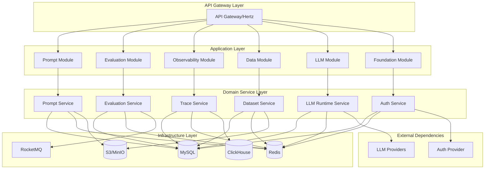
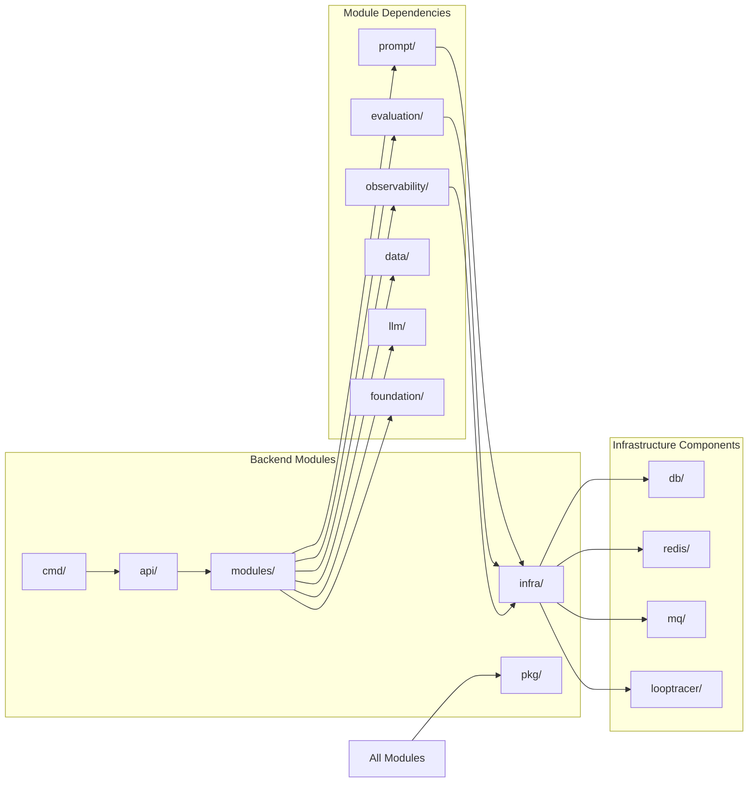
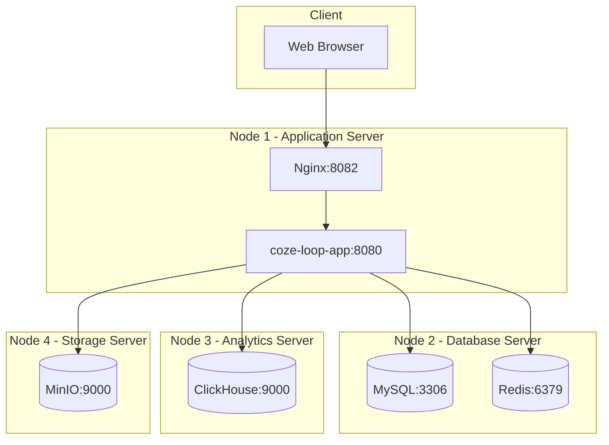
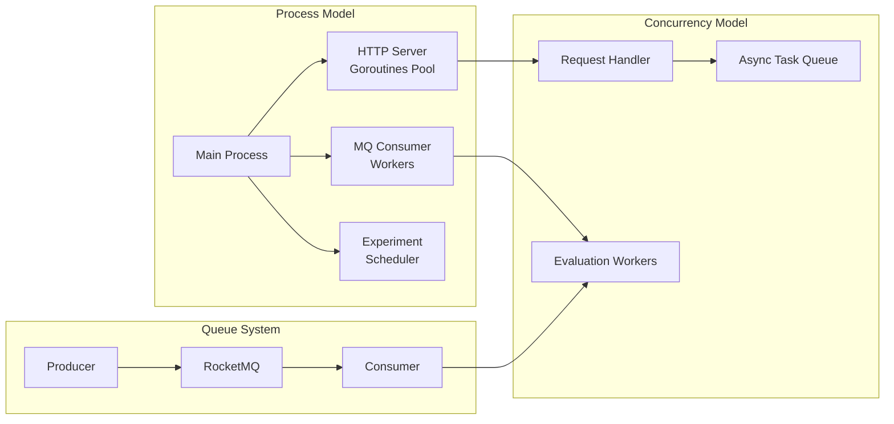
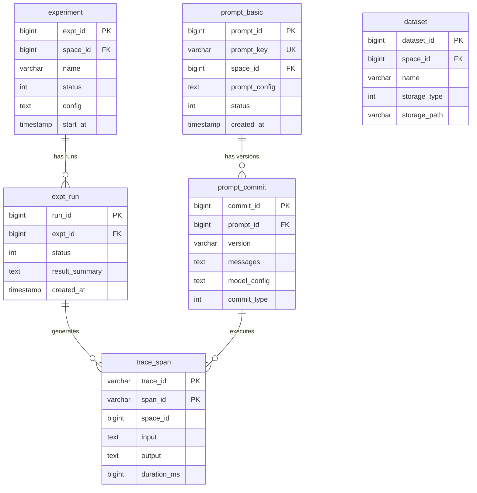

# coze-loop 项目技术总览

## Part A: 项目概述

### 项目背景与使命
Coze Loop 是一个面向开发者的 AI Agent 开发与运维平台级解决方案。它为 AI Agent 开发提供从开发、调试、评估到监控的全生命周期管理能力。作为扣子(Coze)生态的核心组件，Coze Loop 开源版让开发者能够零门槛参与 AI Agent 的探索与实践，通过开源模式共享核心技术框架，促进社区共建。

### 主要用户角色与场景
- **AI 开发工程师**: 使用 Prompt 开发、调试工具进行提示词工程，通过 Playground 实时测试不同大语言模型效果
- **算法工程师**: 利用评测模块对 AI Agent 进行多维度性能评估，包括准确性、简洁性和合规性检测
- **运维工程师**: 通过观测模块监控 AI Agent 运行状态，获取全链路执行过程的可视化数据
- **企业开发团队**: 基于开源版进行二次开发，定制符合业务需求的 AI Agent 平台

## Part B: 技术栈详解

| 技术层级 | 组件名称 | 版本/类型 | 作用说明 |
|---------|----------|-----------|----------|
| **前端** | React | 18.2.0 | 核心前端框架 |
| **前端** | TypeScript | 5.8.2 | 类型安全的开发语言 |
| **前端** | Tailwind CSS | 3.3.3 | 原子化 CSS 框架 |
| **前端** | Zustand | 4.4.7 | 状态管理库 |
| **前端** | RSBuild | 1.1.0 | 构建工具 |
| **前端** | React Router | 6.22.0 | 路由管理 |
| **后端** | Go | 1.24.0+ | 后端核心开发语言 |
| **后端** | Hertz | 0.9.7 | CloudWeGo 高性能 HTTP 框架 |
| **后端** | Kitex | 0.13.1 | CloudWeGo RPC 框架 |
| **后端** | Eino | 0.3.55 | LLM 集成框架 |
| **中间件** | MySQL | - | 主数据存储 |
| **中间件** | Redis | - | 缓存与分布式锁 |
| **中间件** | ClickHouse | - | 时序数据与 Trace 存储 |
| **中间件** | S3/MinIO | - | 对象存储服务 |
| **中间件** | RocketMQ | - | 消息队列 |
| **部署与运维** | Docker | - | 容器化技术 |
| **部署与运维** | Docker Compose | - | 容器编排(开发环境) |
| **部署与运维** | Kubernetes/Helm | - | 容器编排(生产环境) |
| **部署与运维** | Nginx | - | 反向代理与负载均衡 |

## Part C: 架构五视图分析

### 1. 逻辑视图 (Logical View)

**解释**: 系统采用分层架构设计。典型的 API 请求从 Hertz 网关进入，通过 `/api/handler/coze/loop/apis/handler.go` 路由到对应的应用模块。例如，Prompt 执行请求会经过 PromptHandler -> PromptExecuteService -> LLMRuntimeService，最终调用配置的 LLM 模型(如火山方舟)。数据持久化主要依赖 MySQL，Redis 提供缓存和分布式锁支持，ClickHouse 存储海量 Trace 数据。

### 2. 开发视图 (Development View)

**解释**: 项目采用 DDD(领域驱动设计)的模块化架构。`backend/modules/` 目录下按业务领域划分为 6 个核心模块，每个模块内部遵循 `application/domain/infra` 三层架构。`pkg/` 提供通用工具库，`infra/` 封装基础设施访问。关键第三方依赖包括 CloudWeGo 系列(Hertz/Kitex)、Eino LLM 框架等。

### 3. 部署视图 (Deployment View)

**解释**: 典型的私有化部署采用多节点架构。应用服务器运行 Nginx 和主应用进程，数据库服务器部署 MySQL 和 Redis，ClickHouse 独立部署处理大规模 Trace 数据，MinIO 提供对象存储服务。生产环境通过 Kubernetes/Helm 编排，支持水平扩展和高可用部署。

### 4. 运行视图 (Runtime View)

**解释**: 系统采用 Go 协程池处理并发请求，通过 `alitto/pond` 管理协程池。实验评测等耗时任务通过 RocketMQ 异步处理，消费者通过 `cmd/consumer.go` 启动。Redis 提供分布式锁保证并发安全，系统通过限流器(`limiter/`)控制请求速率，确保服务稳定性。

### 5. 数据视图 (Data View)

**解释**: 
- **prompt_basic**: 存储 Prompt 基础信息，包含唯一标识 prompt_key 和空间归属
- **prompt_commit**: Prompt 版本管理，存储每个版本的消息模板和模型配置
- **experiment**: 评测实验主表，定义实验配置和运行参数
- **expt_run**: 实验运行实例，记录每次运行的状态和结果汇总
- **trace_span**: Trace 数据存储在 ClickHouse，记录执行链路详情
- **dataset**: 数据集管理，支持多种存储类型(S3/本地文件系统)

## Part D: 核心复杂流程识别表

| 流程名称 | 流程入口函数 | 核心复杂性解释 | 潜在问题 | 重要程度 |
|---------|-------------|--------------|---------|----------|
| Prompt 模板执行引擎 | `ExecuteStreaming()` | 处理 Prompt 模板渲染、变量替换、多轮对话、流式响应，包含重试机制和超时控制 | 模板渲染错误、变量缺失、LLM 调用失败 | 高 |
| 实验运行调度器 | `RunExperiment()` | 管理实验生命周期，协调多个评测任务并行执行，处理失败重试和结果聚合 | 任务堆积、并发控制失败、结果不一致 | 高 |
| Trace 数据采集链路 | `ITraceIngestionApplication.IngestTrace()` | 接收、解析、存储海量 Trace 数据，处理数据压缩和批量写入 | 数据丢失、写入延迟、存储溢出 | 高 |
| LLM 模型路由系统 | `LLMRuntimeService.Chat()` | 根据配置动态路由到不同 LLM 提供商，处理认证、限流、重试 | 模型不可用、认证失败、超时 | 高 |
| 数据集版本管理 | `CreateDatasetVersion()` | 管理数据集多版本，处理大文件上传、增量更新、版本回滚 | 版本冲突、存储空间不足、上传中断 | 中 |
| 评测器执行引擎 | `EvaluatorService.Execute()` | 执行自定义评测逻辑，支持多种评测器类型，处理评分计算 | 评测器异常、评分错误、超时 | 高 |
| 用户认证授权 | `AuthNService.Login()` | 处理用户登录、Token 生成、权限验证、会话管理 | 认证失败、Token 过期、权限不足 | 高 |
| 文件上传下载服务 | `FileService.Upload()` | 处理大文件分片上传、断点续传、文件元数据管理 | 上传失败、文件损坏、存储满 | 中 |
| Prompt 版本对比 | `ComparePromptVersions()` | 对比不同版本 Prompt 的差异，生成可视化对比结果 | 版本不存在、对比超时 | 中 |
| 实验结果聚合分析 | `AggregateExperimentResults()` | 聚合多次运行结果，计算统计指标，生成分析报告 | 数据不完整、计算错误 | 高 |
| 消息队列消费处理 | `ConsumeExperimentTask()` | 消费实验任务消息，处理任务分发、状态更新、失败重试 | 消息丢失、重复消费、处理失败 | 高 |
| 空间资源管理 | `SpaceService.CreateSpace()` | 管理工作空间，处理资源配额、成员管理、权限继承 | 配额超限、权限冲突 | 中 |
| 模型配置热更新 | `ReloadModelConfig()` | 动态加载模型配置，无需重启服务即可切换模型 | 配置错误、切换失败 | 中 |
| Debug 日志收集 | `CollectDebugLogs()` | 收集 Prompt 执行的详细日志，支持断点调试和回放 | 日志丢失、存储溢出 | 低 |
| 标签系统管理 | `TagService.ManageTags()` | 管理 Prompt 和数据集的标签，支持层级标签和搜索 | 标签冲突、索引失效 | 低 |
| 批量导入导出 | `BatchImportDataset()` | 批量导入导出数据集，支持多种格式转换 | 格式错误、内存溢出 | 中 |
| WebSocket 流式通信 | `HandleStreamConnection()` | 处理实时流式响应，维护长连接，处理断线重连 | 连接断开、消息丢失 | 中 |
| 缓存预热与失效 | `CacheManager.Warm()` | 管理多级缓存，处理缓存预热、失效策略、一致性 | 缓存雪崩、数据不一致 | 中 |
| 限流熔断机制 | `RateLimiter.Check()` | 实现分布式限流，处理熔断降级，保护后端服务 | 限流误判、服务降级 | 高 |
| 异步任务调度 | `TaskScheduler.Schedule()` | 调度定时任务，处理任务依赖，管理任务队列 | 任务积压、调度失败 | 中 |
| 数据迁移工具 | `MigrateData()` | 处理数据库 Schema 变更，数据迁移，版本升级 | 数据丢失、迁移失败 | 中 |
| 监控指标采集 | `MetricsCollector.Collect()` | 采集系统性能指标，处理指标聚合，推送监控系统 | 指标丢失、采集延迟 | 低 |
| 国际化处理 | `I18nTranslater.Translate()` | 处理多语言翻译，管理语言包，动态切换语言 | 翻译缺失、编码错误 | 低 |
| 健康检查服务 | `HealthCheck.Check()` | 检查各组件健康状态，处理自动恢复，服务发现 | 误判、级联故障 | 中 |
| 配置中心集成 | `ConfigLoader.Load()` | 从配置中心加载配置，处理配置变更通知，热更新 | 配置错误、更新失败 | 中 |
| 审计日志记录 | `AuditService.Log()` | 记录用户操作审计日志，处理合规要求，数据安全 | 日志丢失、性能影响 | 中 |
| API 网关路由 | `Router.Route()` | 处理 API 请求路由，中间件链执行，错误处理 | 路由错误、中间件异常 | 高 |
| 分布式事务处理 | `TransactionManager.Execute()` | 协调跨服务事务，处理事务补偿，保证数据一致性 | 事务失败、数据不一致 | 高 |
| 安全防护机制 | `SecurityGuard.Protect()` | 实现 XSS/CSRF 防护，SQL 注入防护，敏感数据加密 | 安全漏洞、防护失效 | 高 |