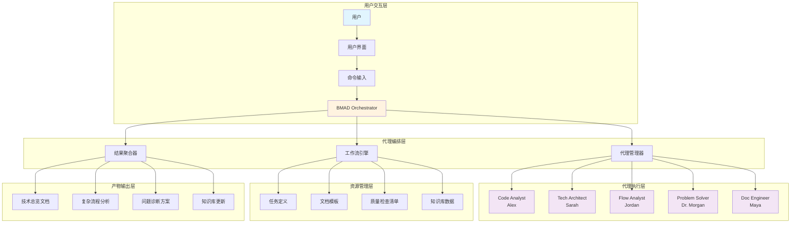
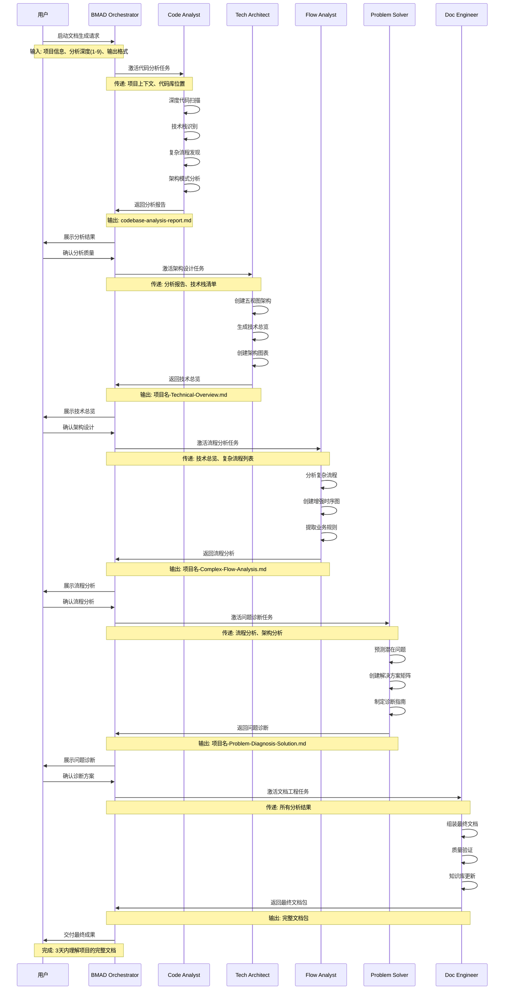
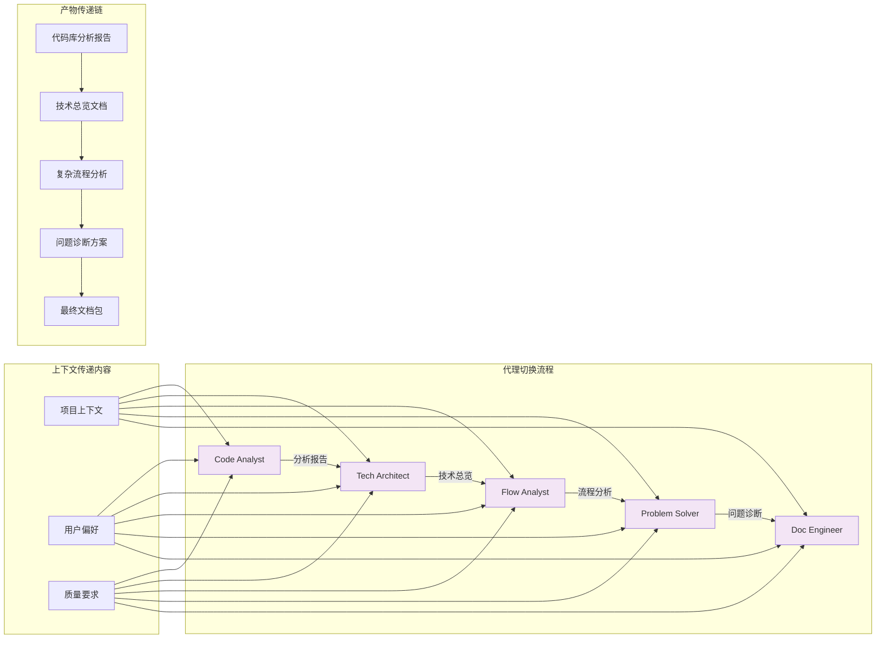
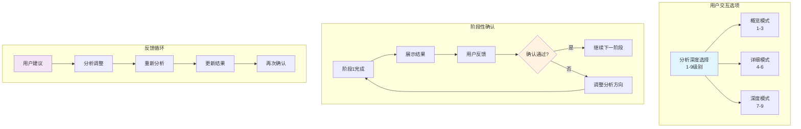
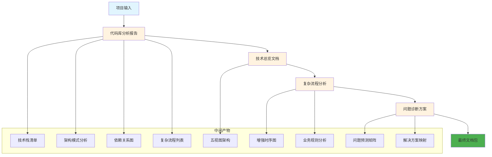
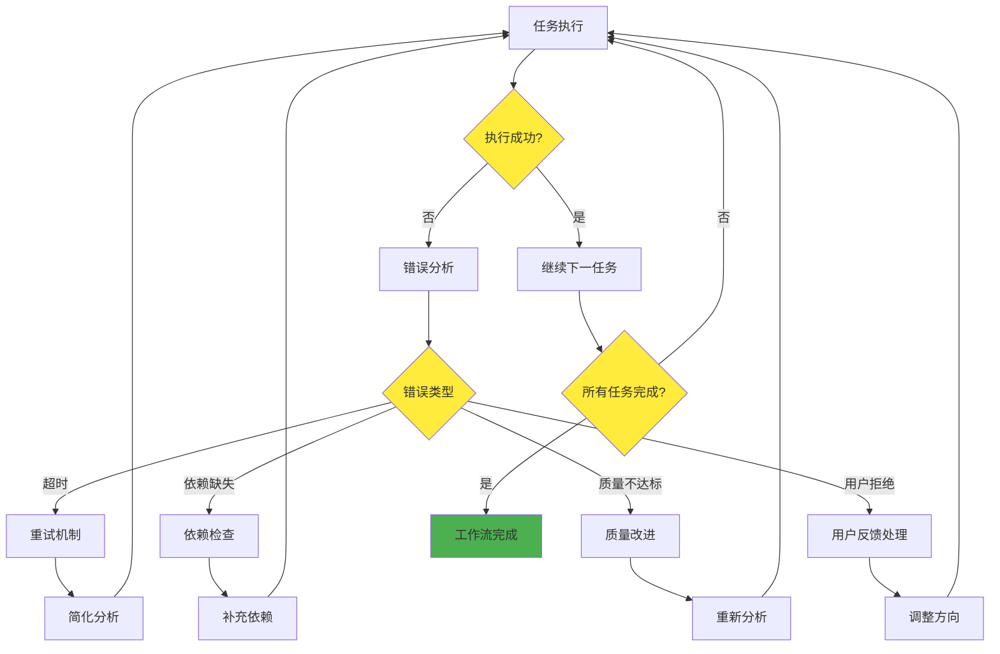
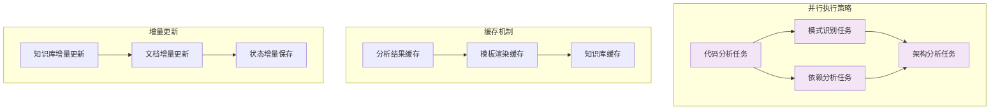
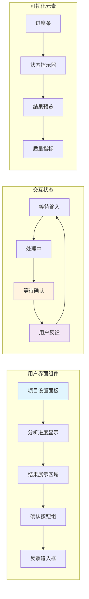

# .bmad-core 人机交互流程图

## 1. 整体交互架构图

## 2. 详细工作流程时序图

## 3. 代理切换与上下文传递图

## 4. 质量门控与用户确认点

```mermaid
graph TD
    A[开始工作流] --> B[代码库分析]
    B --> C{质量门控1<br/>分析完整性}
    C -->|通过| D[用户确认1<br/>分析结果]
    C -->|失败| B
    
    D --> E[架构设计]
    E --> F{质量门控2<br/>架构视图}
    F -->|通过| G[用户确认2<br/>技术总览]
    F -->|失败| E
    
    G --> H[流程分析]
    H --> I{质量门控3<br/>流程分析}
    I -->|通过| J[用户确认3<br/>流程分析]
    I -->|失败| H
    
    J --> K[问题诊断]
    K --> L{质量门控4<br/>问题诊断}
    L -->|通过| M[用户确认4<br/>诊断方案]
    L -->|失败| K
    
    M --> N[文档工程]
    N --> O{质量门控5<br/>最终质量}
    O -->|通过| P[完成交付]
    O -->|失败| N
    
    style C fill:#ffeb3b
    style F fill:#ffeb3b
    style I fill:#ffeb3b
    style L fill:#ffeb3b
    style O fill:#ffeb3b
    style D fill:#4caf50
    style G fill:#4caf50
    style J fill:#4caf50
    style M fill:#4caf50
    style P fill:#2196f3
```

## 5. 交互式验证机制图

## 6. 产物依赖关系图

## 7. 错误处理与恢复机制

## 8. 性能优化与并行处理

## 9. 用户界面交互设计

## 10. 总结

.bmad-core 的人机交互机制通过以下关键特性实现了类似 Manus 的智能协作：

1. **渐进式确认**: 每个阶段都有用户确认点
2. **智能代理切换**: 基于上下文的代理切换机制
3. **质量门控**: 多层次的质量保证机制
4. **产物传递**: 清晰的产物依赖和传递链
5. **错误恢复**: 完善的错误处理和恢复机制
6. **性能优化**: 并行处理和缓存机制
7. **用户友好**: 直观的界面和交互设计

这种设计确保了高质量的技术文档生成，同时提供了优秀的用户体验。

