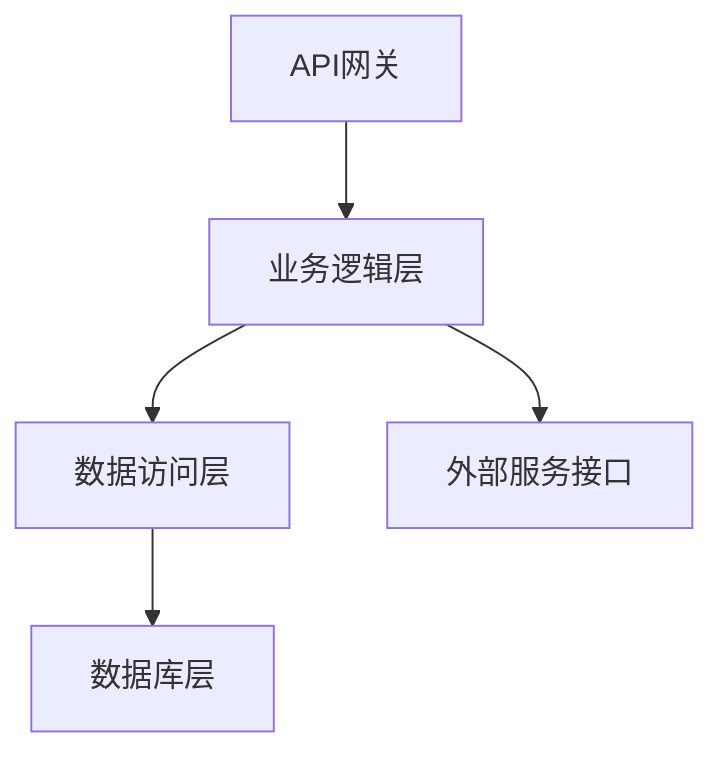
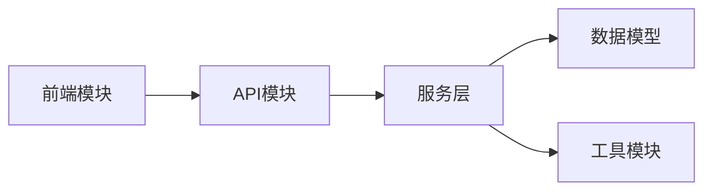
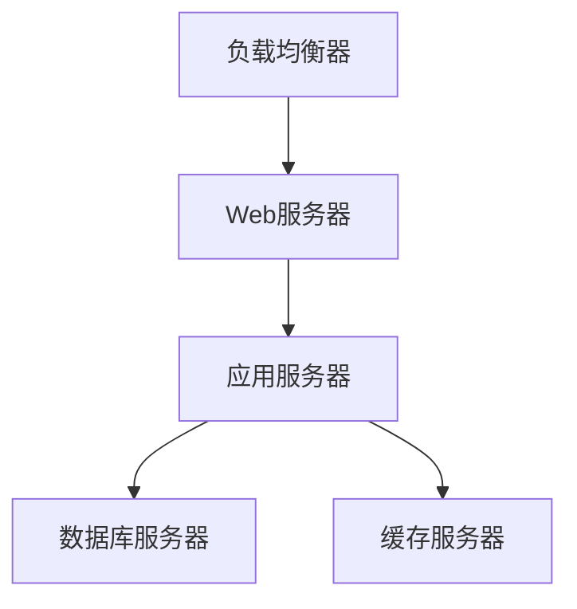
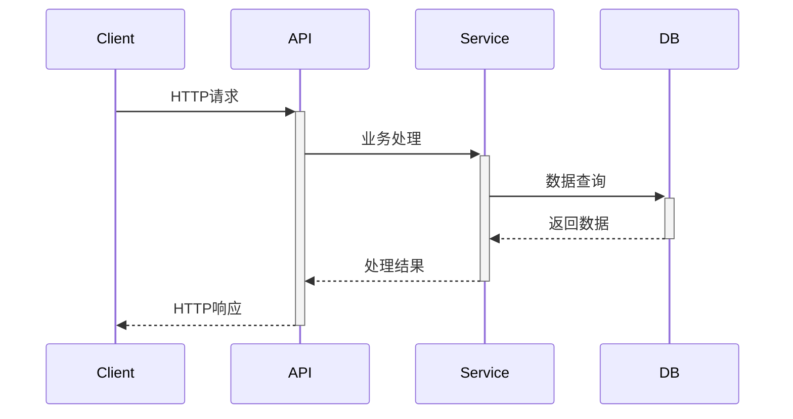
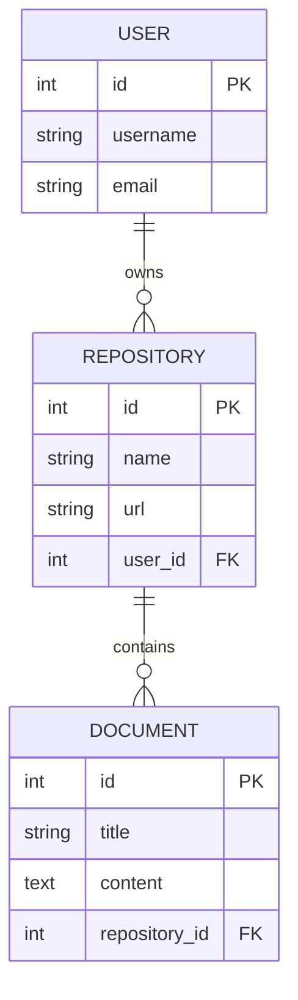

# agents - Technical Overview

## 1. 角色 (Persona)
本文档由AI软件架构师和代码分析引擎生成，基于对agents代码仓库的深度扫描和逻辑推理。

## 2. 上下文 (Context)
agents项目的技术分析文档，涵盖架构设计、模块职责、关键流程和代码实现。

## 3. 首要目标 (Primary Goal)
为agents生成标准化的技术文档，确保工程师能在3天内快速理解项目的宏观架构、模块职责、关键流程和代码实现。

## 4. 技术栈详解

| 分类 | 技术组件 | 版本 | 说明 |
|------|----------|------|------|
| **前端** | HTML/CSS/JavaScript | - | 基础前端技术栈 |
| **后端** | Python/Flask | 3.8+ | Web应用框架 |
| **数据库** | MySQL/SQLite | - | 数据持久化 |
| **中间件** | Redis | - | 缓存系统 |
| **部署** | Docker | - | 容器化部署 |

## 5. 架构五视图分析

### 5.1 逻辑视图 (Logical View)

**解释**: 典型请求从API网关进入，经过业务逻辑层处理，通过数据访问层操作数据库，并可能调用外部服务接口。

### 5.2 开发视图 (Development View)

**解释**: 项目采用分层架构设计，前端通过API与后端通信，后端分为服务层、数据模型和工具模块。

### 5.3 部署视图 (Deployment View)

### 5.4 运行视图 (Runtime View)

### 5.5 数据视图 (Data View)

## 6. 核心复杂流程识别表

| 流程名称 | 流程入口函数 | 核心复杂性解释 | 潜在问题 | 重要程度 |
| :--- | :--- | :--- | :--- | :--- |
| 文档生成工作流 | generate_document() | 多代理协作生成技术文档，涉及模板管理、AI调用、结果处理 | AI API调用失败、模板格式错误 | 高 |
| 仓库分析流程 | analyze_repository() | 深度扫描代码结构，提取技术栈和架构信息 | 大型仓库内存占用、分析超时 | 高 |
| 用户认证授权 | authenticate_user() | 多租户身份验证和权限管理 | 权限提升漏洞、会话劫持 | 高 |
| 静态站点构建 | build_mkdocs_site() | MkDocs站点生成和部署 | 构建失败、资源不足 | 中 |
| 数据库迁移 | database_migration() | 数据库结构变更和数据迁移 | 数据丢失、迁移回滚 | 中 |

---

## 生成元数据

- **生成时间**: 2025-09-06 07:42:00
- **基于提示词**: technical-overview.md
- **仓库**: agents
- **文档版本**: 1.0
- **AI引擎**: 基于prompts目录提示词的模拟生成

> 此文档基于technical-overview.md提示词模板生成，旨在提供项目的技术概览和架构分析。
