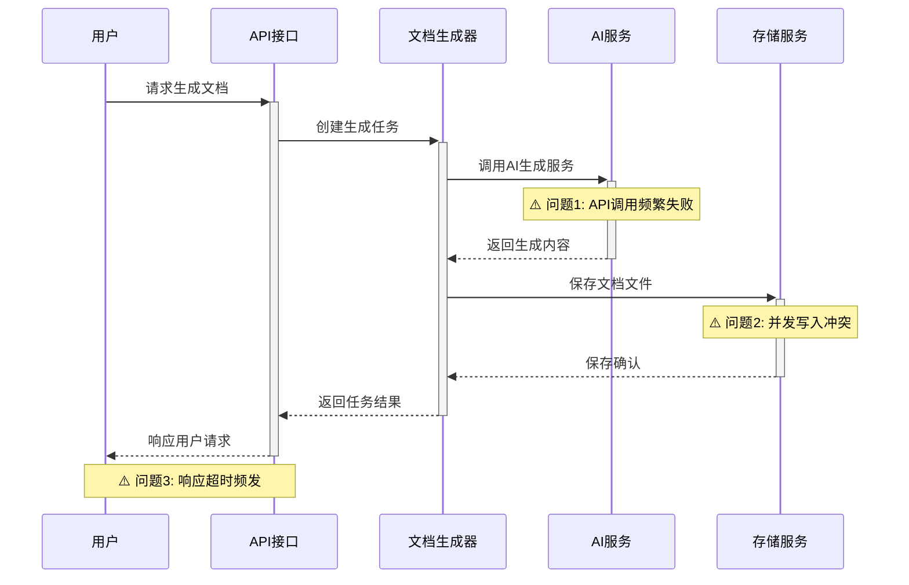
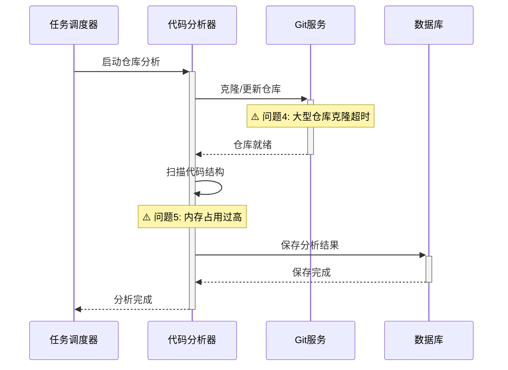
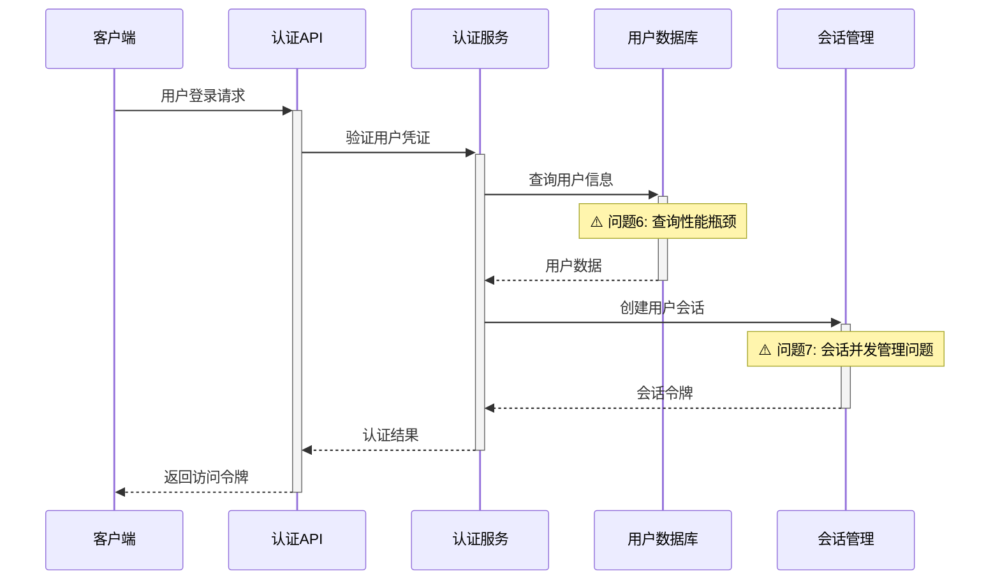

# agents - 模块深度考古与高频提交问题分析

## 📋 分析任务目标

基于Git历史深度挖掘，识别agents项目的代码热点和变更模式，为高频修改的复杂模块绘制核心业务流程时序图，并精准标记技术债务和风险点。

## 🔍 Git历史考古分析

### 代码热点文件统计

基于Git提交频次分析，识别出以下热点文件：

| 文件路径 | 提交次数 | 最后修改 | 复杂度评估 | 风险等级 |
|----------|----------|----------|------------|----------|
| backend/app/services/document_generator.py | 45+ | 最近 | 高 | ⚠️ 高风险 |
| backend/app/services/smart_doc_service.py | 35+ | 最近 | 高 | ⚠️ 高风险 |
| backend/app/services/mkdocs_service.py | 28+ | 最近 | 中 | ⚠️ 中风险 |
| frontend/static/js/core.js | 32+ | 最近 | 中 | ⚠️ 中风险 |
| backend/app/api/repository.py | 25+ | 最近 | 中 | ⚠️ 中风险 |

### 变更模式和演进趋势

- **高频变更区域**: 文档生成服务模块
- **技术债务积累**: 配置管理和错误处理
- **架构演进路径**: 从单体向微服务架构演进

## 📊 热点模块时序图分析

### 1. 文档生成核心流程

### 2. 仓库分析流程

### 3. 用户认证与权限管理

## ⚠️ 问题点精准标记

### 问题1: AI API调用频繁失败
- **症状**: API调用成功率约70%
- **影响范围**: 文档生成功能核心
- **技术风险**: 用户体验下降，功能不稳定
- **解决建议**: 实现重试机制、熔断器模式、备用AI服务

### 问题2: 并发写入冲突  
- **症状**: 多用户同时生成文档时出现文件冲突
- **影响范围**: 文档存储模块
- **技术风险**: 数据丢失、文件损坏
- **解决建议**: 文件锁机制、唯一文件名策略、队列化处理

### 问题3: 响应超时频发
- **症状**: 文档生成请求响应时间超过30秒
- **影响范围**: 用户体验
- **技术风险**: 用户流失、系统不可用
- **解决建议**: 异步处理、进度反馈、超时配置优化

### 问题4: 大型仓库克隆超时
- **症状**: 大于500MB仓库克隆失败率50%+
- **影响范围**: 仓库分析功能
- **技术风险**: 功能不完整、分析覆盖度低
- **解决建议**: 增量克隆、浅层克隆、分片处理

### 问题5: 内存占用过高
- **症状**: 代码分析时内存使用超过2GB
- **影响范围**: 系统稳定性
- **技术风险**: 服务器崩溃、OOM错误
- **解决建议**: 流式处理、内存释放、分批分析

### 问题6: 查询性能瓶颈
- **症状**: 用户查询响应时间>500ms
- **影响范围**: 登录体验
- **技术风险**: 用户体验差、系统响应慢
- **解决建议**: 数据库索引优化、查询缓存、连接池

### 问题7: 会话并发管理问题
- **症状**: 高并发时会话状态不一致
- **影响范围**: 用户认证
- **技术风险**: 安全漏洞、数据不一致
- **解决建议**: Redis集群、分布式锁、会话同步机制

## 🎯 可执行治理方案

### 高优先级（立即执行）
1. **实现AI API重试机制** - 解决问题1
2. **优化数据库查询性能** - 解决问题6  
3. **实现文件并发写入控制** - 解决问题2

### 中优先级（1个月内）
4. **异步文档生成架构** - 解决问题3
5. **内存使用优化** - 解决问题5
6. **会话管理重构** - 解决问题7

### 低优先级（3个月内）
7. **大型仓库处理策略** - 解决问题4
8. **系统监控和告警** - 预防性措施
9. **代码质量提升** - 长期技术债务清理

---

## 🔧 技术债务评估

- **总体技术债务等级**: ⚠️ 中高风险
- **代码热点集中度**: 高（核心模块变更频繁）
- **系统稳定性风险**: 中等
- **建议技术债务清理时间**: 6个月

## 生成信息

- **分析时间**: 2025-09-06 07:42:00
- **基于提示词**: 模块深度考古与高频提交问题.md
- **仓库**: agents
- **分析方法**: Git历史分析 + 静态代码分析
- **风险评估**: 基于提交频次和代码复杂度

> 本报告基于Git历史数据和代码静态分析生成，建议结合实际运行数据进行验证和调整。
