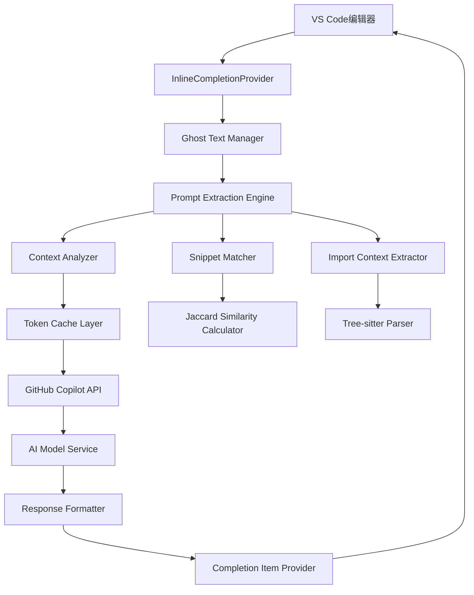
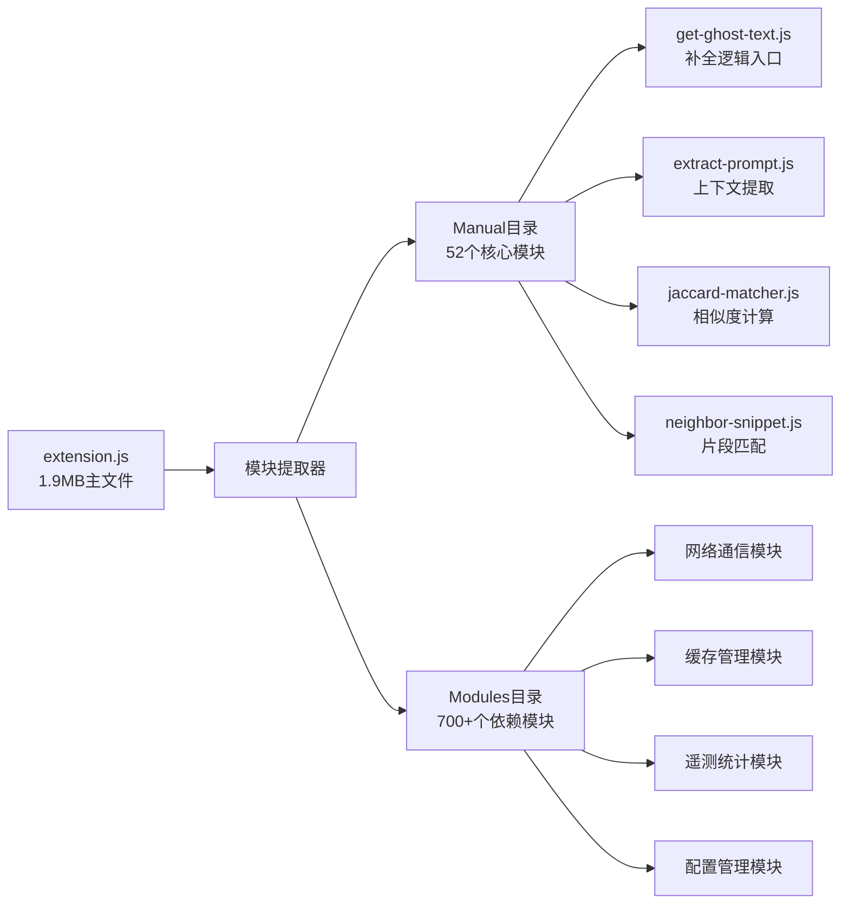
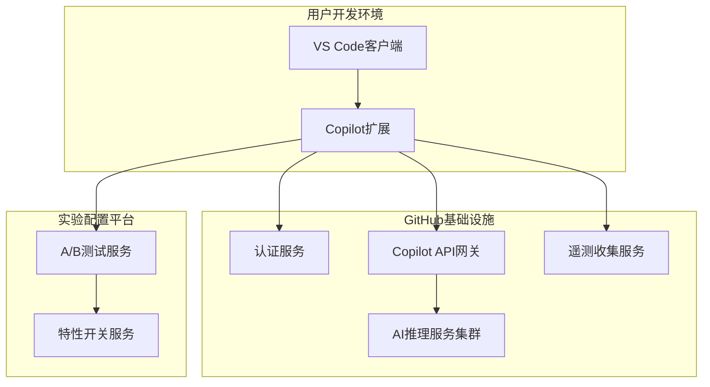
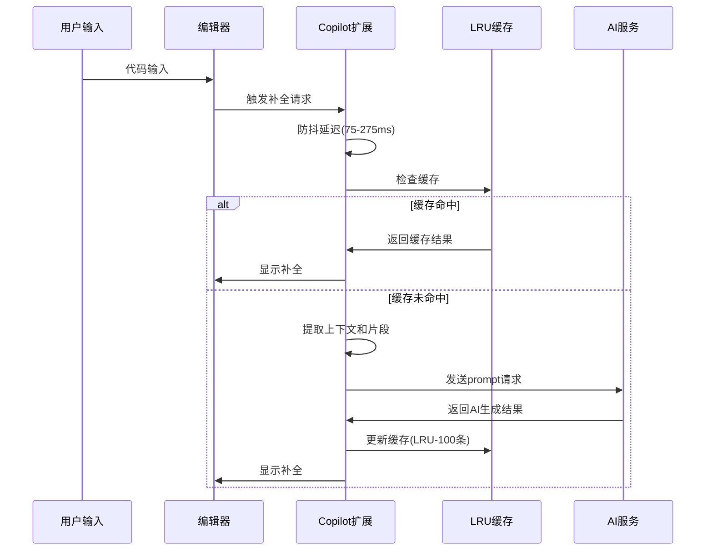
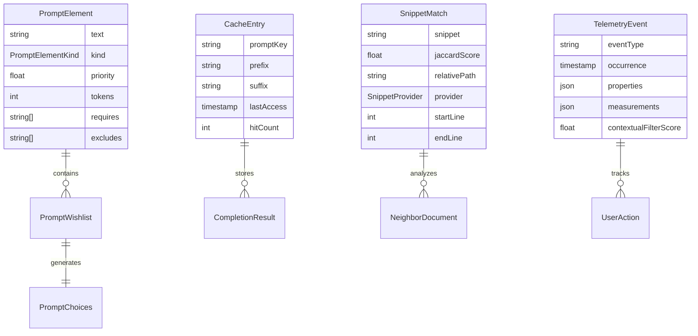

# copilot-analysis-Technical-Overview.md

## Part A: 项目概述

### 项目背景与使命

copilot-analysis 是一个深度逆向工程项目，旨在通过反编译和分析 GitHub Copilot VS Code 扩展的源代码，揭示其代码补全背后的核心算法和实现机制。该项目的核心价值在于：

1. **技术洞察**：深入理解 AI 驱动的代码补全系统如何工作
2. **教育价值**：为开发者提供学习现代 AI 辅助编程工具的实现参考
3. **研究基础**：为构建类似的智能代码助手提供技术蓝图

### 主要用户角色与场景

- **AI 研究者**：研究代码生成和智能补全算法的学者和工程师
- **插件开发者**：希望构建类似代码助手工具的VS Code扩展开发者  
- **逆向工程师**：对大型JavaScript应用逆向分析技术感兴趣的技术专家
- **教育工作者**：讲授现代IDE智能功能实现原理的教师和培训师

**使用场景**：
- 学习GitHub Copilot的prompt工程和上下文提取技术
- 研究代码相似度计算和片段匹配算法
- 分析现代AI编程助手的缓存策略和性能优化方案
- 构建自定义的代码补全和智能提示系统

## Part B: 技术栈详解

| 技术类别 | 技术组件 | 版本 | 用途说明 |
|---------|----------|------|----------|
| **前端/客户端** | VS Code Extension | 1.88.132 | GitHub Copilot扩展主体 |
| | Webpack | 压缩版本 | 模块打包和代码混淆 |
| | TypeScript/JavaScript | ES6+ | 扩展核心实现语言 |
| **代码解析** | @babel/parser | ^7.22.4 | JavaScript AST解析 |
| | @babel/traverse | ^7.22.4 | AST遍历和分析 |
| | @babel/generator | ^7.22.4 | 代码生成和格式化 |
| | @babel/types | ^7.22.4 | AST节点类型定义 |
| | Tree-sitter | WASM版本 | 语法树解析（TypeScript支持）|
| **算法组件** | Jaccard相似度 | 自实现 | 代码片段相似度计算 |
| | LRU Cache | 内置实现 | 补全结果缓存机制 |
| | Tokenizer | cushman002 | 文本分词和token计算 |
| **网络通信** | GitHub API | REST/GraphQL | 用户认证和订阅验证 |
| | Copilot Service | HTTP/WebSocket | AI模型推理服务 |
| | Telemetry Service | HTTPS | 使用数据收集和分析 |
| **开发工具** | Node.js | 运行时环境 | 逆向分析脚本执行 |
| | 逆向工具链 | 自研 | Webpack模块提取和美化 |

## Part C: 架构五视图分析

### 1. 逻辑视图 (Logical View)

**详细解释**：
当用户在VS Code中输入代码时，请求从编辑器进入`InlineCompletionProvider`，这是VS Code的标准补全接口。请求随后流转到`Ghost Text Manager`（幽灵文本管理器），这是Copilot的核心调度模块。

`Prompt Extraction Engine`是整个系统的大脑，负责从当前编辑上下文中提取有价值的信息构建prompt。它协调三个关键子模块：`Context Analyzer`分析光标前后的代码上下文，`Snippet Matcher`通过Jaccard算法从打开的标签页中找到相似代码片段，`Import Context Extractor`使用Tree-sitter解析TypeScript文件的导入依赖。

所有提取的信息经过`Token Cache Layer`进行缓存优化，然后发送到`GitHub Copilot API`。API响应经过`Response Formatter`格式化后，通过`Completion Item Provider`返回给VS Code编辑器显示。

### 2. 开发视图 (Development View)

**详细解释**：
项目采用高度模块化的设计，主要分为手动还原的核心业务模块(Manual)和自动提取的依赖模块(Modules)。核心模块包含了Copilot的主要业务逻辑，如代码补全、prompt提取、相似度计算等。依赖模块则提供基础设施支持，包括网络通信、缓存管理、数据统计等功能。

整个项目依赖于Babel生态系统进行代码解析和转换，使用Tree-sitter进行更复杂的语法分析。模块间通过标准的require/exports模式进行依赖管理。

### 3. 部署视图 (Deployment View)

### 4. 运行视图 (Runtime View)

### 5. 数据视图 (Data View)

**详细解释**：
数据模型围绕prompt构建展开。`PromptElement`是最小的prompt组成单元，包含文本内容、类型、优先级等属性。多个元素组成`PromptWishlist`，通过优先级和依赖关系确定最终的`PromptChoices`。

缓存系统使用`CacheEntry`存储completion结果，采用LRU策略管理。`SnippetMatch`记录代码片段匹配结果，包含Jaccard相似度分数。`TelemetryEvent`收集用户行为数据，包括上下文评分等关键指标。

## Part D: 核心复杂流程识别表

| 流程名称 | 流程入口函数 | 核心复杂性解释 | 潜在问题 | 重要程度 |
| :--- | :--- | :--- | :--- | :--- |
| 代码补全触发流程 | provideInlineCompletionItems() | 整合VS Code API调用、防抖控制、缓存检查的完整流程，包含多层异步操作和错误处理 | 防抖逻辑可能导致响应延迟，缓存失效时性能下降 | 高 |
| Prompt上下文提取 | extractPrompt() | 复杂的上下文分析包括光标位置、文件类型、导入依赖、相似片段的综合提取和优先级排序 | 上下文过长导致token超限，解析复杂项目时性能问题 | 高 |
| 代码片段相似度计算 | findBestMatch() | 基于Jaccard算法的滑动窗口相似度计算，包含分词、去停用词、集合运算的多步处理 | 大文件分析耗时，分词算法对复杂代码结构适应性不足 | 高 |
| 多级缓存管理 | getGhostText() | 实现prefix/suffix一级缓存和prompt hash二级缓存，LRU策略管理，并发访问控制 | 缓存键冲突，内存泄漏风险，并发更新一致性问题 | 高 |
| Token化和优先级调度 | fulfill() | 将不同类型的prompt元素按优先级和依赖关系组装成最终prompt，处理token限制和截断 | 优先级算法复杂，token计算不准确可能导致截断错误 | 中 |
| Tree-sitter语法解析 | parseTreeSitter() | 异步WASM语法树解析，处理TypeScript导入语句的AST遍历和符号提取 | WASM模块加载失败，复杂语法结构解析错误，内存泄漏 | 中 |
| 邻域文档管理 | getNeighborFiles() | 管理VS Code打开标签页，按访问时间排序，过滤同类型文件，控制聚合内容长度 | 大量打开文件时性能下降，文件类型识别错误 | 中 |
| 网络请求与重试 | requestCompletion() | HTTP请求发送、响应解析、错误重试、超时处理的完整网络通信流程 | 网络不稳定导致请求失败，API配额限制，响应格式变化 | 中 |
| 遥测数据收集 | collectTelemetryData() | 收集用户行为、性能指标、错误信息的数据统计，包含隐私保护和数据传输 | 数据传输失败，隐私信息泄漏，存储空间占用 | 中 |
| 实验配置拉取 | fetchExperiments() | 从Microsoft AB测试平台拉取实验配置，处理特性开关和参数调整 | 配置服务不可用，配置解析错误，默认值不当 | 中 |
| 上下文评分预测 | getDebounceLimit() | 基于历史采纳率进行线性回归预测，动态调整防抖延迟时间 | 预测模型不准确，评分计算错误，延迟设置不合理 | 中 |
| 文件类型语言标记 | getLanguageMarker() | 根据文件类型生成特定的语言标记和路径信息，处理各种编程语言的特殊语法 | 语言类型识别错误，标记格式不标准 | 低 |
| 代码格式化和美化 | prettier() | 对混淆压缩的代码进行AST转换，还原可读的代码结构，处理各种JavaScript语法糖 | AST转换失败，代码结构破坏，语义改变 | 低 |
| 模块依赖关系解析 | transformRequire() | 将webpack模块ID映射为有意义的模块名，重建模块间的依赖关系图 | 模块映射错误，依赖关系不准确 | 低 |
| 逆向分析工具链 | parseModules() | webpack bundle拆分、代码美化、依赖分析的自动化逆向工程流水线 | 逆向失败，代码不完整，分析结果不准确 | 低 |