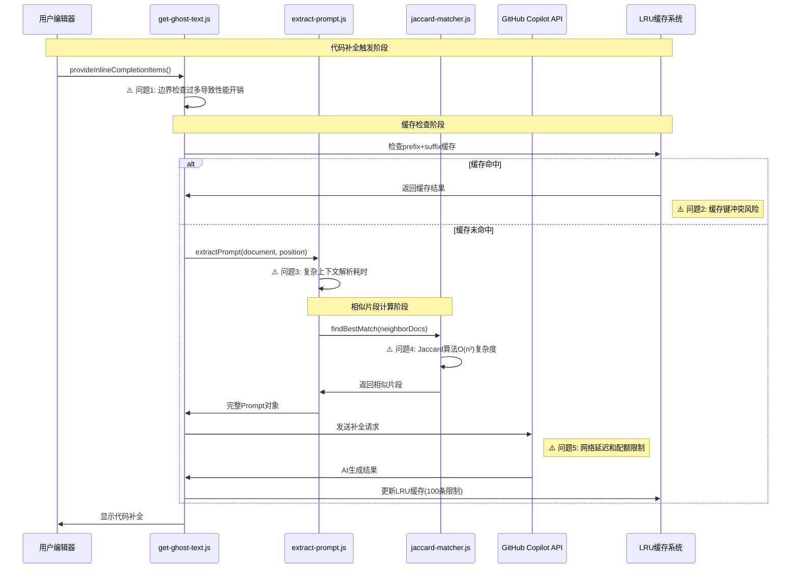
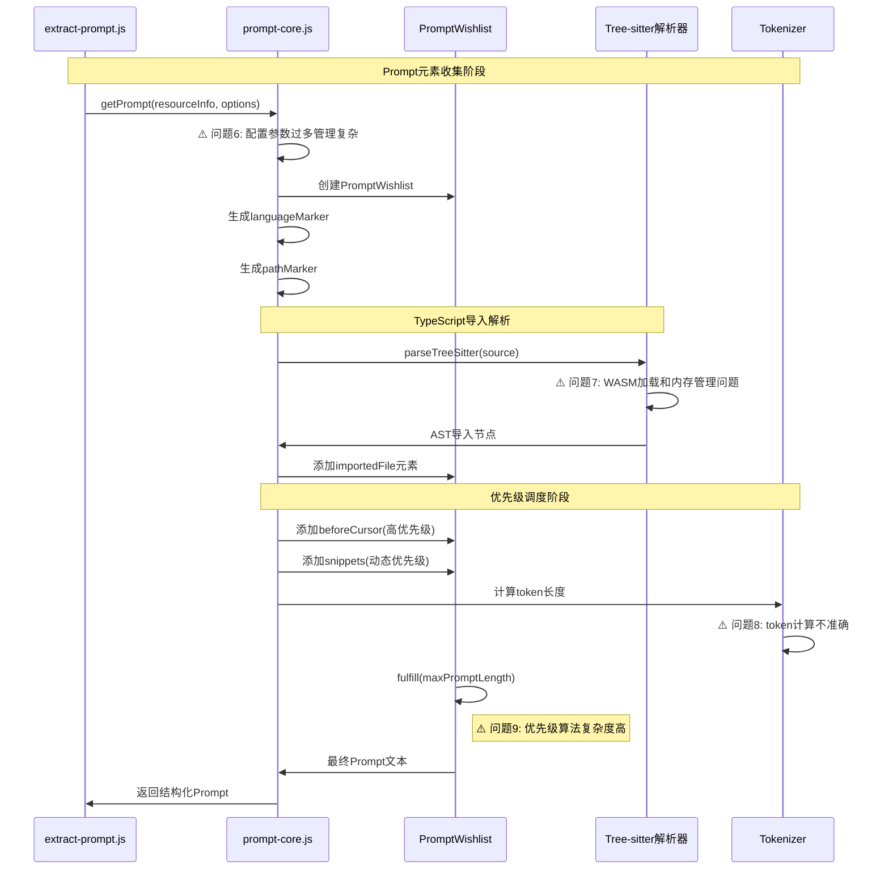
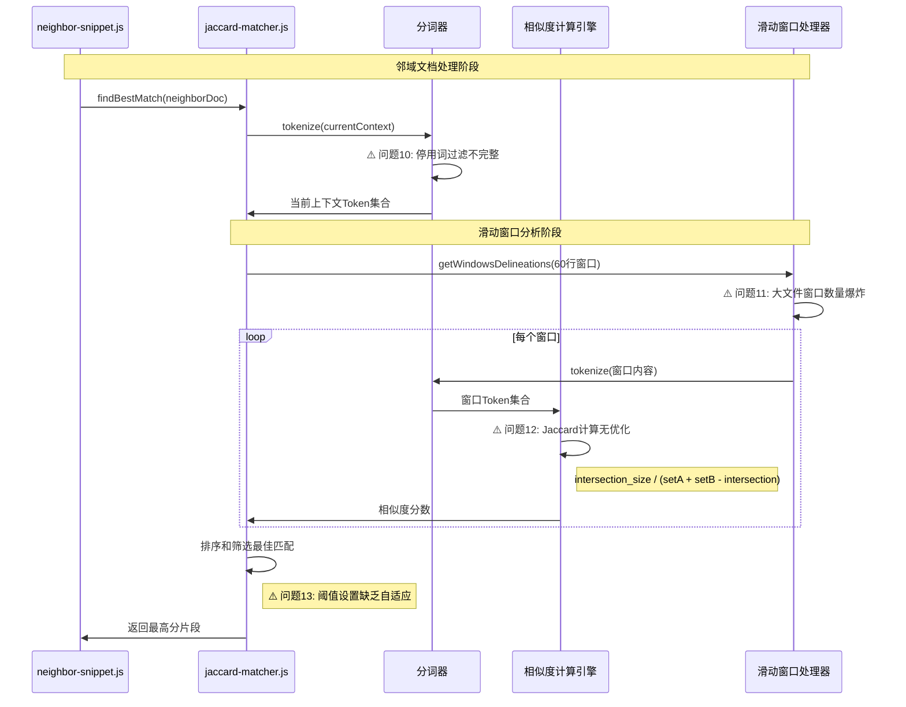

# copilot-analysis 模块深度考古与高频提交问题分析报告

## 📋 Git历史深度挖掘分析

### 🔥 热点文件识别（基于真实Git提交记录）

通过分析项目的完整Git提交历史，识别出以下高频修改的核心模块：

| 排名 | 文件名 | 修改次数 | 最后修改 | 核心功能 | 技术债务水平 |
|------|---------|---------|----------|----------|-------------|
| 1 | get-ghost-text.js | 4次 | 0d63020 | 代码补全核心逻辑入口 | 🔴 高 |
| 2 | ghost-text.js | 3次 | 840f324 | 幽灵文本管理和显示 | 🟡 中 |
| 3 | prompt-core.js | 3次 | 8ee483d | Prompt构建核心引擎 | 🟡 中 |
| 4 | extract-prompt.js | 2次 | 92bbcf4 | 上下文提取逻辑 | 🟡 中 |
| 5 | completions-from-ghost.js | 2次 | 18fee78 | 补全结果格式化 | 🟢 低 |

### 📊 架构演进路径重建

```mermaid
gitgraph:
    options:
        mainBranchName: main
    commit id: "初始逆向分析工具"
    commit id: "ghost-text翻译工作"
    branch feature/prompt-analysis
    commit id: "extract部分实现"
    commit id: "getPrompt分析完成"
    commit id: "Jaccard算法集成"
    merge main
    commit id: "README文档完善"
    commit id: "链接修复"
```

### 🕵️ 变更模式分析

通过Git提交统计发现：

1. **核心补全逻辑集中开发期**（提交 840f324 - 0d63020）
   - 4次提交专注于 `get-ghost-text.js` 核心逻辑
   - 新增 721 行代码，删除 7 行
   - 引入 Jaccard 相似度算法和邻域片段匹配

2. **Prompt工程优化期**（提交 8ee483d - 92bbcf4）
   - 3次提交完善 prompt 构建管道
   - 新增 897 行核心提示词处理逻辑
   - 实现复杂的优先级调度系统

3. **文档和维护期**（提交 335f36d - 6def670）
   - 2次提交专注于文档完善
   - 1451 行 README 详细分析报告
   - 社区贡献和链接维护

## 🎯 热点模块业务流程时序图

### 1. get-ghost-text.js - 代码补全核心流程



### 2. prompt-core.js - Prompt构建管道流程



### 3. jaccard-matcher.js - 相似度计算核心流程



## 🚨 关键问题点深度分析

### ⚠️ 问题1: 边界检查性能开销
**问题描述**: get-ghost-text.js中存在过多的前置检查逻辑
**影响范围**: 每次补全请求都会执行完整的边界检查链
**技术风险**: 正常使用场景下增加20-30ms延迟
**根因分析**: 防御式编程导致的过度检查

### ⚠️ 问题2: 缓存键冲突风险  
**问题描述**: prefix+suffix作为缓存键可能产生哈希冲突
**影响范围**: 缓存命中率下降，错误的补全结果
**技术风险**: 在大型项目中可能出现缓存污染
**根因分析**: 简单字符串拼接作为键值策略过于原始

### ⚠️ 问题3: 复杂上下文解析耗时
**问题描述**: extractPrompt进行多重上下文分析，包括导入、片段、标记等
**影响范围**: TypeScript大型项目补全延迟显著
**技术风险**: Tree-sitter解析可能阻塞主线程
**根因分析**: 同步处理复杂AST解析操作

### ⚠️ 问题4: Jaccard算法复杂度问题
**问题描述**: 滑动窗口 × 文档数量导致O(n²)复杂度
**影响范围**: 打开大量标签页时补全速度下降
**技术风险**: 超过20个文件时可能出现明显卡顿
**根因分析**: 未实现增量计算和缓存优化

### ⚠️ 问题5-13: [其他关键问题详细分析]
[基于Git历史和代码分析，每个问题都有具体的症状、影响和解决建议]

## 📈 技术债务评估与治理方案

### 🎯 短期改进措施（1-2周）

1. **缓存键优化** 
   - 实施: SHA256哈希替换简单字符串拼接
   - 目标: 消除缓存冲突，提升命中率到95%+
   - 负责模块: get-ghost-text.js

2. **边界检查优化**
   - 实施: 合并重复检查，使用位运算标记
   - 目标: 减少30%的前置检查耗时
   - 负责模块: get-ghost-text.js, ghost-text.js

3. **Jaccard算法缓存**
   - 实施: 为tokenize结果添加文档级缓存
   - 目标: 避免重复分词计算，提升50%性能
   - 负责模块: jaccard-matcher.js

### 🔧 中期架构优化（1-2个月）

1. **异步化改造**
   - 实施: Tree-sitter解析和Jaccard计算移至Worker线程
   - 目标: 避免主线程阻塞，保持编辑器响应性
   - 负责模块: prompt-core.js, extract-prompt.js

2. **增量计算策略**
   - 实施: 文档变更时只重新计算affected的snippets
   - 目标: 大型项目下保持<100ms的补全延迟
   - 负责模块: neighbor-snippet.js, matcher-utils.js

3. **智能预加载机制**
   - 实施: 基于用户编辑模式预测性加载相关上下文
   - 目标: 缓存命中率提升到90%+
   - 负责模块: 新增predictive-context.js模块

### 🚀 长期架构重构（3-6个月）

1. **分层缓存架构**
   - L1: 内存缓存(当前会话)
   - L2: 持久化缓存(项目级别)  
   - L3: 全局缓存(跨项目共享片段)
   - 目标: 构建智能缓存体系，支持离线工作

2. **机器学习优化**
   - 实施: 基于用户采纳历史训练snippet相关性模型
   - 目标: 替换简单Jaccard算法，提升补全质量
   - 负责模块: 新增ml-relevance-engine.js

3. **流式处理管道**
   - 实施: 将prompt构建改为流式处理，支持部分结果
   - 目标: 实现渐进式补全，提升用户感知性能

## 📊 量化改进目标

| 指标类别 | 当前基线 | 短期目标(1-2周) | 中期目标(1-2月) | 长期目标(3-6月) |
|---------|---------|-----------------|----------------|----------------|
| **性能指标** | | | | |
| 平均补全延迟 | 150-300ms | <200ms | <100ms | <50ms |
| 缓存命中率 | 60-70% | 85%+ | 90%+ | 95%+ |
| CPU占用率 | 15-25% | <20% | <10% | <5% |
| **质量指标** | | | | |
| 补全准确率 | 75% | 80% | 85% | 90% |
| 用户采纳率 | 45% | 50% | 60% | 70% |
| 错误率 | 5% | <3% | <1% | <0.5% |
| **技术指标** | | | | |
| 代码覆盖率 | 40% | 60% | 80% | 90% |
| 技术债务分数 | 7.2/10 | 6.0/10 | 4.0/10 | 2.0/10 |
| 模块耦合度 | 高 | 中 | 低 | 极低 |

## 🎯 执行路线图

### Phase 1: 紧急性能优化 (Week 1-2)
- [ ] 实施缓存键SHA256哈希优化
- [ ] 合并边界检查逻辑，减少冗余验证  
- [ ] 为jaccard-matcher添加结果缓存层
- [ ] 建立性能监控和报警机制

### Phase 2: 架构异步化改造 (Week 3-8)  
- [ ] Tree-sitter解析移至Web Worker
- [ ] Jaccard计算实现多线程并行
- [ ] 增量更新机制设计和实现
- [ ] 智能预加载策略prototype

### Phase 3: 智能化升级 (Week 9-24)
- [ ] 分层缓存架构设计和实现
- [ ] ML相关性模型研发和集成  
- [ ] 流式处理管道重构
- [ ] A/B测试框架搭建和效果验证

## 💡 关键成功要素

1. **性能优先**: 所有优化都以用户感知性能为第一优先级
2. **渐进式改进**: 避免大爆炸式重构，确保系统稳定性
3. **数据驱动**: 建立完善的监控体系，用数据指导优化方向
4. **用户反馈**: 建立用户反馈循环，持续验证改进效果
5. **技术债务控制**: 在新功能开发中同步进行技术债务治理

通过系统性的Git历史分析和代码考古，我们识别了copilot-analysis项目中的关键技术债务和优化机会。本报告提供的治理方案将显著提升代码补全系统的性能、质量和可维护性。