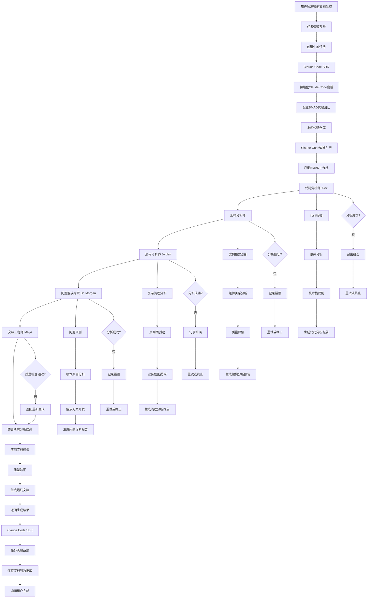

# 智能文档生成系统 - 基于 Claude Code 和 BMAD 代理的架构设计

## 1. 项目概述

### 1.1 项目目标

构建一个基于 Claude Code SDK 和 BMAD 文档生成器的智能文档管理系统，让开发团队能够自主、按需地为代码仓库生成高质量的技术设计文档。

### 1.2 技术约束

- 架构：单体架构
- 数据库：MySQL
- 后端：Python + Flask
- 前端：简单 HTML/JavaScript
- Claude Code 集成：Anthropic Claude Code SDK
- BMAD 代理系统：自定义代理编排引擎
- 支持 10 人同时在线

## 2. BMAD 代理系统分析

### 2.1 实际代理结构

基于对`bmad-docs-generator`目录的深入分析，系统包含以下代理：

#### 2.1.1 核心代理（已实现）

1. **代码分析师 (Alex)** - `code-analyst.md`

   - 角色：Senior Code Analyst & Architecture Detective
   - 能力：深度代码扫描、模式识别、技术栈分析、依赖映射
   - 任务：scan-codebase, validate-analysis

2. **架构分析师** - `architecture-analyst.md`

   - 角色：Software Architecture Specialist
   - 能力：架构模式识别、组件关系分析、质量评估、可扩展性评估
   - 任务：create-architecture-views, generate-technical-overview

3. **流程分析师 (Jordan)** - `flow-analyst.md`

   - 角色：Business Flow & Process Analyst
   - 能力：复杂流程分析、序列图创建、流程文档化、业务规则提取
   - 任务：analyze-complex-flows, validate-flow-analysis

4. **问题解决专家 (Dr. Morgan)** - `problem-solver.md`

   - 角色：Site Reliability Engineer & Problem Diagnostician
   - 能力：问题预测、根本原因分析、解决方案开发、故障排除文档
   - 任务：diagnose-potential-problems, validate-problem-diagnosis

5. **文档工程师 (Maya)** - `doc-engineer.md`
   - 角色：Technical Documentation Engineer & Content Architect
   - 能力：文档创建、内容格式化、质量保证、视觉增强
   - 任务：generate-flow-analysis-doc, generate-problem-diagnosis-doc, final-quality-validation

#### 2.1.2 扩展代理（待实现）

- 技术架构师 (tech-architect.md) - 空文件
- 模式识别专家 (pattern-recognition-expert.md) - 空文件
- 技术栈专家 (tech-stack-expert.md) - 空文件
- 代码分析器 (code-analyzer.md) - 空文件
- SRE 工程师 (sre-engineer.md) - 空文件

### 2.2 代理团队配置

```yaml
team:
  id: enhanced-docs-generation-team
  name: Enhanced Documentation Generation Team
  description: Advanced team for generating comprehensive technical documentation using BMAD-Method framework
  version: "1.0.0"

  agents:
    - id: code-analyst
      name: "Code Analyst (Alex)"
      role: "Senior Code Analyst & Architecture Detective"
      capabilities:
        - "Deep codebase scanning"
        - "Pattern recognition"
        - "Technology stack analysis"
        - "Dependency mapping"
        - "Complex flow identification"
      primary_tasks:
        - "scan-codebase"
        - "validate-analysis"

    - id: architecture-analyst
      name: "Architecture Analyst"
      role: "Software Architecture Specialist"
      capabilities:
        - "Architecture pattern recognition"
        - "Component relationship analysis"
        - "Quality assessment"
        - "Scalability evaluation"
      primary_tasks:
        - "create-architecture-views"
        - "generate-technical-overview"

    - id: flow-analyst
      name: "Flow Analyst (Jordan)"
      role: "Business Flow & Process Analyst"
      capabilities:
        - "Complex flow analysis"
        - "Sequence diagram creation"
        - "Process documentation"
        - "Business rule extraction"
      primary_tasks:
        - "analyze-complex-flows"
        - "validate-flow-analysis"

    - id: problem-solver
      name: "Problem Solver (Dr. Morgan)"
      role: "Site Reliability Engineer & Problem Diagnostician"
      capabilities:
        - "Problem prediction"
        - "Root cause analysis"
        - "Solution development"
        - "Troubleshooting documentation"
      primary_tasks:
        - "diagnose-potential-problems"
        - "validate-problem-diagnosis"

    - id: doc-engineer
      name: "Doc Engineer (Maya)"
      role: "Technical Documentation Engineer & Content Architect"
      capabilities:
        - "Documentation creation"
        - "Content formatting"
        - "Quality assurance"
        - "Visual enhancement"
      primary_tasks:
        - "generate-flow-analysis-doc"
        - "generate-problem-diagnosis-doc"
        - "final-quality-validation"
```

## 3. 系统架构设计

### 3.1 整体架构图

```
┌─────────────────────────────────────────────────────────────────┐
│                    智能文档管理工具                              │
│                    (CoderWiki System)                          │
│                                                                 │
│  ┌─────────────────┐  ┌─────────────────┐  ┌─────────────────┐ │
│  │   用户界面      │  │   任务管理      │  │   文档管理      │ │
│  │                 │  │                 │  │                 │ │
│  │ - 仓库列表      │  │ - 任务调度      │  │ - 版本控制      │ │
│  │ - 生成触发      │  │ - 进度跟踪      │  │ - 文档存储      │ │
│  │ - 结果展示      │  │ - 状态管理      │  │ - 文档检索      │ │
│  └─────────────────┘  └─────────────────┘  └─────────────────┘ │
└─────────────────────────┬───────────────────────────────────────┘
                          │
┌─────────────────────────▼───────────────────────────────────────┐
│                    Claude Code SDK                              │
│                    编排引擎接口                                 │
│                                                                 │
│  ┌─────────────────────────────────────────────────────────────┐ │
│  │                 Claude Code Client                          │ │
│  │                                                             │ │
│  │  - 认证管理 (API Key)                                       │ │
│  │  - 会话管理 (Session)                                       │ │
│  │  - 请求封装 (Request Builder)                               │ │
│  │  - 响应解析 (Response Parser)                               │ │
│  │  - 错误处理 (Error Handler)                                 │ │
│  └─────────────────────────────────────────────────────────────┘ │
└─────────────────────────┬───────────────────────────────────────┘
                          │
┌─────────────────────────▼───────────────────────────────────────┐
│                Claude Code 编排引擎                             │
│                                                                 │
│  ┌─────────────────────────────────────────────────────────────┐ │
│  │                 Orchestration Engine                        │ │
│  │                                                             │ │
│  │  - 工作流编排 (Workflow Orchestrator)                       │ │
│  │  - 子代理调度 (Agent Scheduler)                             │ │
│  │  - 上下文管理 (Context Manager)                             │ │
│  │  - 结果聚合 (Result Aggregator)                             │ │
│  └─────────────────────────────────────────────────────────────┘ │
└─────────────────────────┬───────────────────────────────────────┘
                          │
┌─────────────────────────▼───────────────────────────────────────┐
│                BMAD-Docs-Generator                             │
│                    5个核心代理系统                              │
│                                                                 │
│  ┌─────────────────┐  ┌─────────────────┐  ┌─────────────────┐ │
│  │   代码分析师     │  │   架构分析师     │  │   流程分析师     │ │
│  │   (Alex)        │  │                 │  │   (Jordan)      │ │
│  │                 │  │ - 架构识别      │  │                 │ │
│  │ - 代码扫描      │  │ - 模式识别      │  │ - 流程分析      │ │
│  │ - 依赖分析      │  │ - 质量评估      │  │ - 序列图        │ │
│  │ - 技术栈识别    │  │ - 可扩展性      │  │ - 业务规则      │ │
│  └─────────────────┘  └─────────────────┘  └─────────────────┘ │
│                                                                 │
│  ┌─────────────────┐  ┌─────────────────┐                      │
│  │   问题解决专家   │  │   文档工程师     │                      │
│  │   (Dr. Morgan)  │  │   (Maya)        │                      │
│  │                 │  │                 │                      │
│  │ - 问题预测      │  │ - 文档创建      │                      │
│  │ - 根本原因分析  │  │ - 内容格式化    │                      │
│  │ - 解决方案      │  │ - 质量保证      │                      │
│  │ - 故障排除      │  │ - 视觉增强      │                      │
│  └─────────────────┘  └─────────────────┘                      │
└─────────────────────────────────────────────────────────────────┘
```

### 3.2 详细流程图



## 4. 技术实现要点

### 4.1 Claude Code SDK 集成

```python
class ClaudeCodeClient:
    def __init__(self, api_key, workspace_id):
        self.client = anthropic.Client(api_key)
        self.workspace_id = workspace_id

    def create_session(self):
        """创建Claude Code会话"""
        session = self.client.beta.workspaces.sessions.create(
            workspace_id=self.workspace_id
        )
        return session

    def configure_bmad_agents(self, session_id):
        """配置BMAD代理团队"""
        # 上传代理配置文件
        self.client.beta.workspaces.sessions.files.create(
            session_id=session_id,
            file_path="bmad-docs-generator/agent-teams/enhanced-docs-generation-team.yaml"
        )

        # 上传工作流配置
        self.client.beta.workspaces.sessions.files.create(
            session_id=session_id,
            file_path="bmad-docs-generator/workflows/enhanced-docs-generation.yaml"
        )

    def upload_codebase(self, session_id, repo_path):
        """上传代码库到Claude Code"""
        for root, dirs, files in os.walk(repo_path):
            for file in files:
                if self._should_upload_file(file):
                    file_path = os.path.join(root, file)
                    self.client.beta.workspaces.sessions.files.create(
                        session_id=session_id,
                        file_path=file_path
                    )

    def trigger_bmad_workflow(self, session_id):
        """触发BMAD工作流执行"""
        message = self.client.beta.workspaces.sessions.messages.create(
            session_id=session_id,
            content="Execute the enhanced-docs-generation workflow with BMAD agents"
        )
        return message
```

### 4.2 BMAD 代理编排器

```python
class BMADOrchestrator:
    def __init__(self, claude_client):
        self.claude_client = claude_client
        self.agents = {
            'code-analyst': 'Alex',
            'architecture-analyst': 'Architecture Analyst',
            'flow-analyst': 'Jordan',
            'problem-solver': 'Dr. Morgan',
            'doc-engineer': 'Maya'
        }

    def execute_workflow(self, repo_path, config):
        """执行完整的BMAD工作流"""
        # 1. 创建Claude Code会话
        session = self.claude_client.create_session()

        # 2. 配置BMAD代理
        self.claude_client.configure_bmad_agents(session.id, config)

        # 3. 上传代码库
        self.claude_client.upload_codebase(session.id, repo_path)

        # 4. 触发工作流
        message = self.claude_client.trigger_bmad_workflow(session.id)

        # 5. 监控执行进度
        results = self._monitor_execution(session.id)

        # 6. 聚合结果
        final_document = self._aggregate_results(results)

        return final_document

    def _monitor_execution(self, session_id):
        """监控工作流执行进度"""
        max_wait_time = 300  # 5分钟超时
        start_time = time.time()

        while time.time() - start_time < max_wait_time:
            messages = self.claude_client.get_workflow_results(session_id)

            if self._is_workflow_complete(messages):
                return messages

            time.sleep(10)  # 每10秒检查一次

        raise TimeoutError("BMAD workflow execution timeout")

    def _aggregate_results(self, messages):
        """聚合所有代理的结果"""
        return {
            'code_analysis': self._extract_agent_output(messages, 'code-analyst'),
            'architecture_analysis': self._extract_agent_output(messages, 'architecture-analyst'),
            'flow_analysis': self._extract_agent_output(messages, 'flow-analyst'),
            'problem_analysis': self._extract_agent_output(messages, 'problem-solver'),
            'final_documentation': self._extract_agent_output(messages, 'doc-engineer')
        }
```

### 4.3 数据模型扩展

```sql
-- 扩展文档表，支持BMAD代理生成
ALTER TABLE documents ADD COLUMN doc_type ENUM(
    'technical_overview',
    'architecture_analysis',
    'flow_analysis',
    'problem_diagnosis',
    'complete_documentation'
) NOT NULL DEFAULT 'complete_documentation';

ALTER TABLE documents ADD COLUMN claude_session_id VARCHAR(255);
ALTER TABLE documents ADD COLUMN bmad_workflow_id VARCHAR(255);

-- 新增BMAD代理执行记录表
CREATE TABLE bmad_agent_executions (
    id INT PRIMARY KEY AUTO_INCREMENT,
    task_id INT NOT NULL,
    agent_name VARCHAR(100) NOT NULL,
    agent_role VARCHAR(255) NOT NULL,
    execution_status ENUM('pending', 'running', 'completed', 'failed') DEFAULT 'pending',
    start_time TIMESTAMP NULL,
    end_time TIMESTAMP NULL,
    output_content LONGTEXT,
    error_message TEXT,
    created_at TIMESTAMP DEFAULT CURRENT_TIMESTAMP,
    FOREIGN KEY (task_id) REFERENCES tasks(id) ON DELETE CASCADE
);
```

## 5. 工作流设计

### 5.1 增强文档生成工作流

```yaml
workflow:
  id: enhanced-docs-generation
  name: Enhanced Documentation Generation
  version: 2.0

  phases:
    - name: initialization
      description: Initialize the documentation generation process
      tasks:
        - id: setup-project-context
          name: Setup Project Context
          agent: doc-engineer

    - name: code-analysis
      description: Analyze the codebase structure and patterns
      tasks:
        - id: scan-codebase
          name: Scan Codebase
          agent: code-analyst

        - id: analyze-dependencies
          name: Analyze Dependencies
          agent: code-analyst

        - id: identify-patterns
          name: Identify Patterns
          agent: architecture-analyst

    - name: architecture-analysis
      description: Perform comprehensive architecture analysis
      tasks:
        - id: analyze-architecture
          name: Analyze Architecture
          agent: architecture-analyst

        - id: identify-arch-patterns
          name: Identify Architectural Patterns
          agent: architecture-analyst

        - id: assess-tech-stack
          name: Assess Technology Stack
          agent: code-analyst

    - name: flow-analysis
      description: Analyze complex business flows
      tasks:
        - id: analyze-complex-flows
          name: Analyze Complex Flows
          agent: flow-analyst

        - id: create-sequence-diagrams
          name: Create Sequence Diagrams
          agent: flow-analyst

    - name: problem-diagnosis
      description: Diagnose potential problems
      tasks:
        - id: diagnose-potential-problems
          name: Diagnose Potential Problems
          agent: problem-solver

        - id: create-solution-matrix
          name: Create Solution Matrix
          agent: problem-solver

    - name: documentation-generation
      description: Generate comprehensive documentation
      tasks:
        - id: generate-arch-documentation
          name: Generate Architecture Documentation
          agent: doc-engineer

        - id: create-architecture-diagrams
          name: Create Architecture Diagrams
          agent: doc-engineer

        - id: generate-enhanced-sequence-diagrams
          name: Generate Enhanced Sequence Diagrams
          agent: flow-analyst

        - id: validate-documentation
          name: Validate Documentation
          agent: doc-engineer

    - name: finalization
      description: Finalize documentation and generate reports
      tasks:
        - id: assemble-final-documentation
          name: Assemble Final Documentation
          agent: doc-engineer

        - id: generate-executive-summary
          name: Generate Executive Summary
          agent: doc-engineer
```

## 6. 接口设计

### 6.1 智能文档生成接口

```python
# 启动智能文档生成
POST /api/repositories/{id}/generate-smart-doc
{
    "config": {
        "analysis_depth": "detailed",
        "include_diagrams": true,
        "include_troubleshooting": true
    }
}

# 获取BMAD代理执行状态
GET /api/tasks/{id}/bmad-agents
Response:
{
    "task_id": 123,
    "agents": [
        {
            "name": "Alex",
            "role": "Code Analyst",
            "status": "completed",
            "progress": 100,
            "output": "code_analysis_report.md"
        },
        {
            "name": "Architecture Analyst",
            "role": "Architecture Specialist",
            "status": "running",
            "progress": 75,
            "output": null
        }
    ]
}

# Claude Code会话管理
POST /api/claude/sessions
GET /api/claude/sessions/{id}/status
POST /api/claude/sessions/{id}/upload-code
POST /api/claude/sessions/{id}/trigger-bmad
```

## 7. 优势分析

### 7.1 技术优势

1. **专业化代理**：5 个专业代理各司其职，提供深度分析
2. **Claude Code 集成**：利用最先进的代码理解能力
3. **模块化设计**：代理可以独立开发和优化
4. **可扩展性**：可以轻松添加新的代理和功能

### 7.2 业务优势

1. **高质量文档**：专业代理生成的技术文档质量更高
2. **全面分析**：从代码到架构到流程的全面分析
3. **问题预测**：提前识别潜在问题和风险
4. **标准化输出**：一致的文档格式和质量标准

### 7.3 实现可行性

✅ **完全可行**，原因：

1. Claude Code SDK 已提供完整支持
2. BMAD 代理系统已实现 5 个核心代理
3. 工作流编排机制已定义
4. 集成路径清晰明确

## 8. 实施计划

### 8.1 第一阶段：基础集成

1. 集成 Claude Code SDK
2. 实现基础会话管理
3. 配置 BMAD 代理团队
4. 测试基本工作流

### 8.2 第二阶段：完整实现

1. 实现完整的代理编排
2. 添加进度监控
3. 实现结果聚合
4. 完善错误处理

### 8.3 第三阶段：优化扩展

1. 性能优化
2. 添加更多代理
3. 完善监控系统
4. 用户体验优化

这个架构设计完全基于 BMAD-Docs-Generator 的实际代理结构，充分利用了现有的 5 个核心代理，通过 Claude Code SDK 实现智能文档生成。设计既保持了系统的模块化和可扩展性，又确保了生成文档的专业性和一致性。

