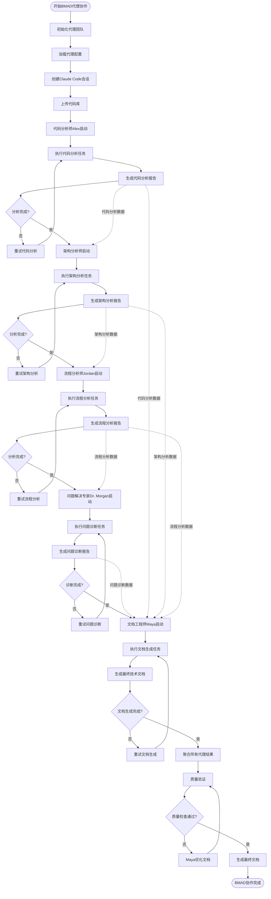
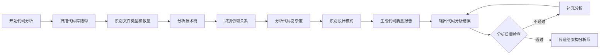
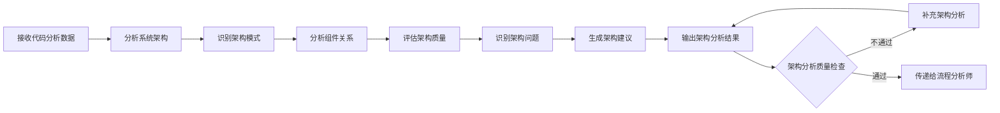
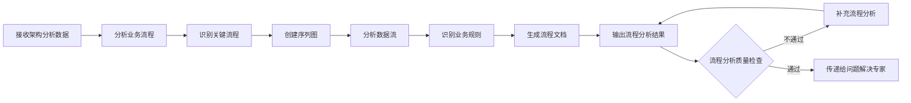
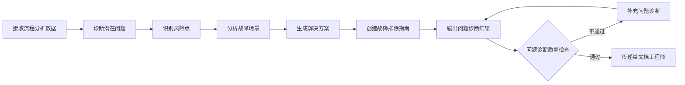
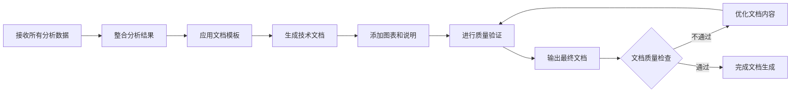

# BMAD 代理协作流程图

## 代理团队协作流程图

## 详细代理工作流程

### 1. 代码分析师 Alex (Alex)

**具体工作内容:**

- 扫描整个代码库的文件结构
- 识别使用的编程语言和框架
- 分析第三方依赖和版本
- 计算代码复杂度和质量指标
- 识别代码中的设计模式
- 生成详细的代码分析报告

### 2. 架构分析师 (Architecture Analyst)

**具体工作内容:**

- 基于代码分析结果分析系统架构
- 识别使用的架构模式（MVC、微服务、分层等）
- 分析组件间的依赖关系
- 评估架构的可扩展性和可维护性
- 识别潜在的架构问题
- 生成架构优化建议

### 3. 流程分析师 Jordan (Jordan)

**具体工作内容:**

- 分析系统的业务流程和用户交互
- 识别关键的业务流程和决策点
- 创建详细的序列图和流程图
- 分析数据在系统中的流动
- 识别业务规则和约束条件
- 生成流程分析文档

### 4. 问题解决专家 Dr. Morgan (Dr. Morgan)

**具体工作内容:**

- 基于前面的分析结果诊断潜在问题
- 识别系统的风险点和薄弱环节
- 分析可能的故障场景和影响
- 生成针对性的解决方案
- 创建详细的故障排除指南
- 提供系统优化建议

### 5. 文档工程师 Maya (Maya)

**具体工作内容:**

- 整合所有代理的分析结果
- 应用统一的文档模板和格式
- 生成结构化的技术文档
- 添加必要的图表、代码示例和说明
- 进行文档的完整性和准确性验证
- 优化文档的可读性和专业性

## 代理协作机制

### 1. 数据传递机制

- **顺序传递**: 每个代理完成后将结果传递给下一个代理
- **并行处理**: 某些分析任务可以并行执行
- **数据聚合**: 最终由 Maya 聚合所有代理的结果

### 2. 质量保证机制

- **自检**: 每个代理对自己的输出进行质量检查
- **互检**: 后续代理可以验证前面代理的结果
- **终检**: Maya 进行最终的文档质量验证

### 3. 错误处理机制

- **重试机制**: 代理执行失败时自动重试
- **降级处理**: 部分代理失败时继续执行其他代理
- **结果标记**: 在最终文档中标记缺失的分析部分

### 4. 进度监控机制

- **实时更新**: 每个代理完成后更新进度
- **状态跟踪**: 跟踪每个代理的执行状态
- **异常报告**: 及时报告代理执行异常

## 输出文档结构

基于 BMAD 代理协作生成的最终文档包含以下部分：

1. **项目概述**

   - 项目基本信息
   - 技术栈总结
   - 系统架构概览

2. **代码分析报告** (Alex 提供)

   - 代码库结构分析
   - 技术栈详细分析
   - 代码质量评估

3. **架构分析报告** (架构分析师提供)

   - 系统架构设计
   - 组件关系分析
   - 架构质量评估

4. **流程分析报告** (Jordan 提供)

   - 业务流程分析
   - 系统交互流程
   - 数据流分析

5. **问题诊断报告** (Dr. Morgan 提供)

   - 潜在问题识别
   - 风险评估
   - 解决方案建议

6. **技术文档** (Maya 整合)
   - 完整的系统文档
   - 部署指南
   - 维护指南

这个协作流程确保了生成的文档具有全面性、准确性和专业性，每个代理都专注于自己的专业领域，通过协作产生高质量的最终文档。
