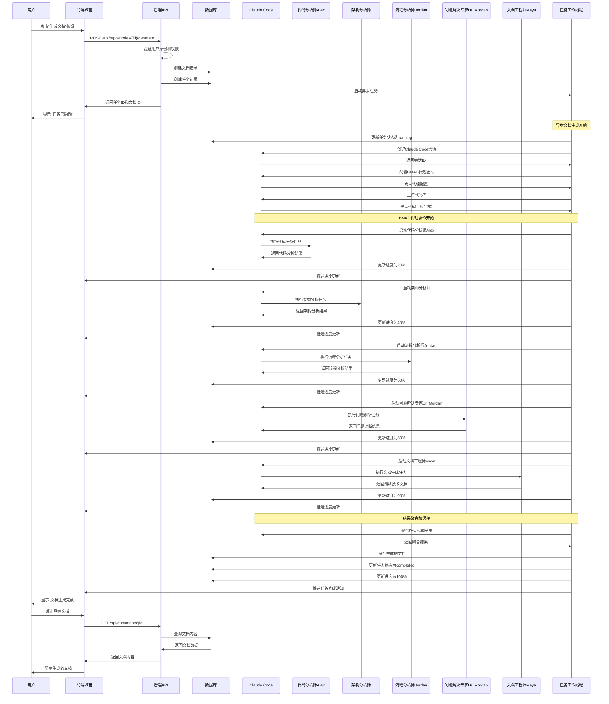
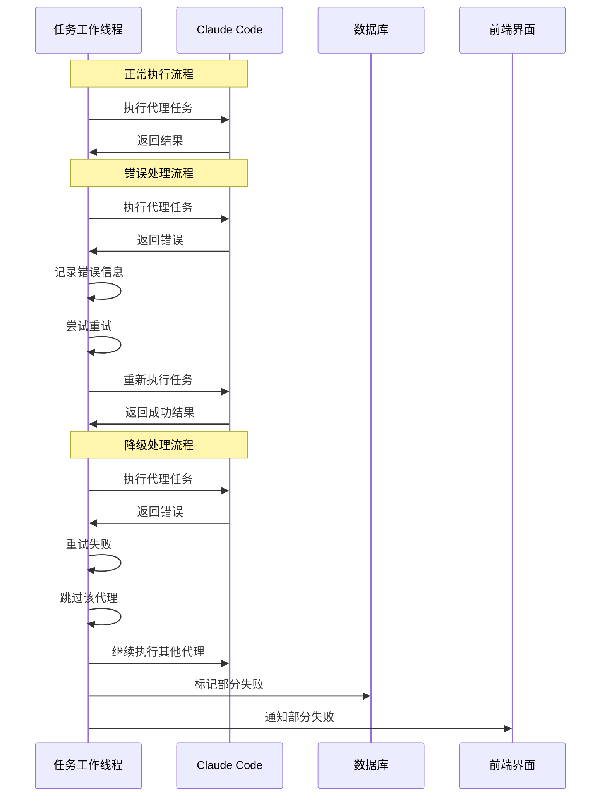

# 文档生成时序图

## 完整时序图

## 详细交互说明

### 1. 用户交互阶段 (0-2 秒)

**用户操作:**

- 用户在仓库管理页面点击"生成文档"按钮
- 前端显示加载状态

**前端处理:**

- 收集生成参数（文档类型、输出格式等）
- 发送 POST 请求到后端 API
- 显示任务启动确认

**后端验证:**

- 验证用户登录状态
- 检查仓库访问权限
- 验证请求参数

### 2. 任务创建阶段 (2-5 秒)

**数据库操作:**

- 创建文档记录
- 创建任务记录
- 设置初始状态

**异步任务启动:**

- 创建后台工作线程
- 传递任务参数
- 返回任务 ID 给前端

### 3. Claude Code 会话管理 (5-10 秒)

**会话创建:**

- 调用 Claude Code SDK
- 创建新的工作会话
- 获取会话 ID

**环境配置:**

- 上传 BMAD 代理配置
- 配置工作流参数
- 准备代码库上传

### 4. 代码库上传 (10-30 秒)

**文件处理:**

- 扫描本地代码库
- 过滤不需要的文件
- 压缩和上传代码

**上传确认:**

- 验证上传完整性
- 确认文件可访问性
- 准备代理执行环境

### 5. BMAD 代理协作执行 (30-300 秒)

#### 5.1 代码分析师 Alex (30-60 秒)

- 扫描代码库结构
- 分析技术栈和依赖
- 生成代码质量报告
- 更新进度为 20%

#### 5.2 架构分析师 (60-120 秒)

- 基于代码分析结果
- 分析系统架构
- 识别架构模式
- 更新进度为 40%

#### 5.3 流程分析师 Jordan (120-180 秒)

- 分析业务流程
- 创建序列图
- 识别关键流程
- 更新进度为 60%

#### 5.4 问题解决专家 Dr. Morgan (180-240 秒)

- 诊断潜在问题
- 识别风险点
- 生成解决方案
- 更新进度为 80%

#### 5.5 文档工程师 Maya (240-300 秒)

- 整合所有分析结果
- 生成最终文档
- 进行质量验证
- 更新进度为 90%

### 6. 结果处理和保存 (300-310 秒)

**结果聚合:**

- 收集所有代理输出
- 整合分析结果
- 生成最终文档

**数据持久化:**

- 保存文档到数据库
- 更新任务状态
- 记录完成时间

### 7. 用户通知和展示 (310-320 秒)

**任务完成通知:**

- 推送完成消息
- 更新前端状态
- 显示成功提示

**文档展示:**

- 用户查看生成结果
- 提供下载选项
- 支持文档编辑

## 关键时间节点

| 阶段        | 时间范围   | 主要活动           | 状态更新        |
| ----------- | ---------- | ------------------ | --------------- |
| 用户交互    | 0-2 秒     | 点击按钮，发送请求 | 任务创建        |
| 任务创建    | 2-5 秒     | 创建记录，启动线程 | 状态：pending   |
| 会话管理    | 5-10 秒    | 创建 Claude 会话   | 状态：running   |
| 代码上传    | 10-30 秒   | 上传代码库         | 进度：10%       |
| Alex 分析   | 30-60 秒   | 代码分析           | 进度：20%       |
| 架构分析    | 60-120 秒  | 架构分析           | 进度：40%       |
| Jordan 分析 | 120-180 秒 | 流程分析           | 进度：60%       |
| Morgan 诊断 | 180-240 秒 | 问题诊断           | 进度：80%       |
| Maya 生成   | 240-300 秒 | 文档生成           | 进度：90%       |
| 结果保存    | 300-310 秒 | 保存文档           | 进度：100%      |
| 用户通知    | 310-320 秒 | 完成通知           | 状态：completed |

## 错误处理时序

## 性能优化点

### 1. 并发处理

- 多个用户可以同时生成文档
- 每个用户使用独立的 Claude Code 会话
- 数据库连接池管理

### 2. 缓存策略

- 代理配置缓存
- 模板缓存
- 结果缓存

### 3. 异步处理

- 非阻塞的任务执行
- 实时进度更新
- 用户界面响应性

### 4. 资源管理

- 会话生命周期管理
- 内存使用优化
- 文件上传优化

这个时序图完整展示了从用户点击按钮到最终文档生成的整个交互过程，包括各个组件之间的时序关系和关键时间节点。
