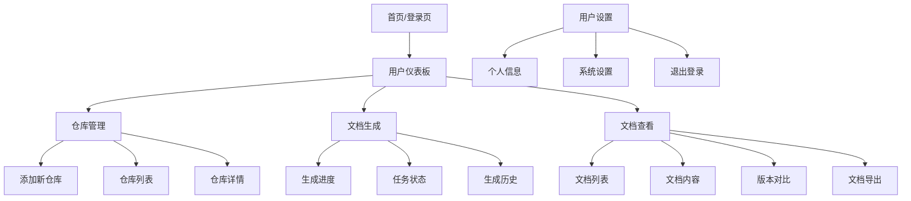
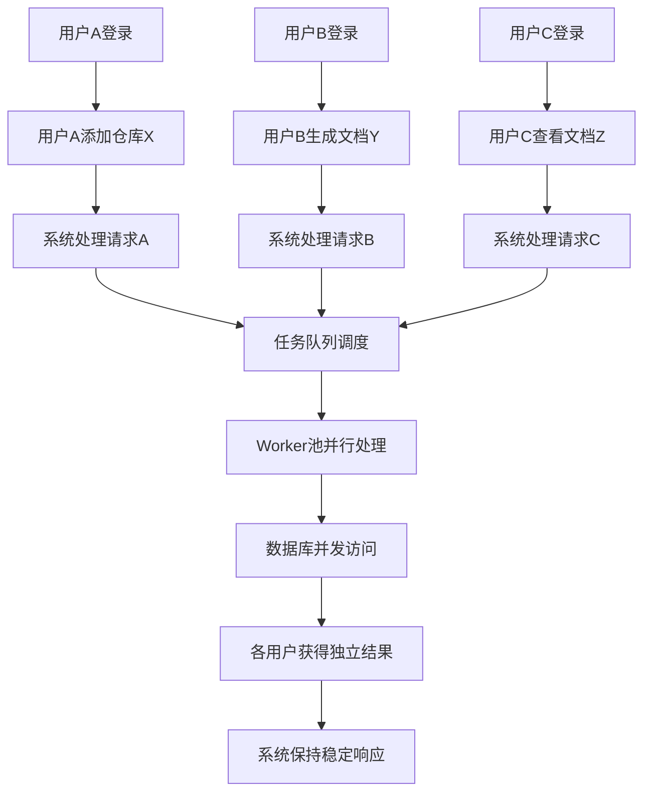

# 代码文档自动生成系统 UI/UX Specification

## Introduction

This document defines the user experience goals, information architecture, user flows, and visual design specifications for 代码文档自动生成系统's user interface. It serves as the foundation for visual design and frontend development, ensuring a cohesive and user-centered experience.

### Overall UX Goals & Principles

#### Target User Personas

Based on your PRD, I've identified the following key user personas:

**技术负责人 (Tech Lead)**
- **Needs:** Quick understanding of project architecture, technical overview, team onboarding
- **Pain Points:** Time constraints, need for accurate technical information
- **Goals:** Efficient team management, technical decision making

**新加入的开发人员 (New Developer)**
- **Needs:** Quick onboarding, understanding codebase structure, getting started guide
- **Pain Points:** Overwhelmed by complex code, lack of documentation
- **Goals:** Become productive quickly, understand system architecture

**项目维护人员 (Maintainer)**
- **Needs:** Understanding existing code structure, maintenance procedures
- **Pain Points:** Outdated documentation, code complexity
- **Goals:** Efficient maintenance, bug fixing, feature updates

**技术文档编写者 (Technical Writer)**
- **Needs:** Documentation framework, content structure, automation tools
- **Pain Points:** Manual documentation creation, keeping docs current
- **Goals:** Efficient documentation generation, consistency

#### Usability Goals

- **Ease of learning:** New users can complete core tasks within 5 minutes
- **Efficiency of use:** Power users can complete frequent tasks with minimal clicks
- **Error prevention:** Clear validation and confirmation for destructive actions
- **Memorability:** Infrequent users can return without relearning
- **Task completion:** Users can successfully generate documentation on first try

#### Design Principles

1. **Clarity over cleverness** - Prioritize clear communication over aesthetic innovation
2. **Progressive disclosure** - Show only what's needed, when it's needed
3. **Consistent patterns** - Use familiar UI patterns throughout the application
4. **Immediate feedback** - Every action should have a clear, immediate response
5. **Accessible by default** - Design for all users from the start

### Change Log

| Date | Version | Description | Author |
|------|---------|-------------|--------|
| 2025-08-21 | 1.0 | Initial UI/UX specification created | Sally (UX Expert) |

## Information Architecture (IA)

### Site Map / Screen Inventory



### Navigation Structure

**主导航：** 顶部导航栏，包含logo、主要功能区域和用户信息

**次级导航：** 左侧边栏，显示当前功能区域的子菜单

**面包屑策略：** 在页面顶部显示当前位置，便于用户了解所在层级

**页面结构说明：**
- **首页/登录页：** 用户认证入口
- **用户仪表板：** 系统概览，显示用户的仓库统计、最近活动
- **仓库管理：** 添加、查看、管理代码仓库
- **文档生成：** 触发文档生成，查看进度和历史
- **文档查看：** 浏览、对比、导出生成的文档
- **用户设置：** 个人信息和系统配置

## User Flows

### 用户首次使用系统流程

**User Goal:** 新用户注册并生成第一个文档

**Entry Points:** 系统首页，注册页面

**Success Criteria:** 用户能够成功注册、添加仓库、生成并查看文档

#### Flow Diagram

```mermaid
graph TD
    A[访问系统首页] --> B[点击注册]
    B --> C[填写注册信息]
    C --> D[系统验证信息]
    D --> E[注册成功]
    E --> F[自动登录]
    F --> G[进入用户仪表板]
    G --> H[点击"添加仓库"]
    H --> I[输入GitHub/GitLab URL]
    I --> J[系统验证仓库]
    J --> K[仓库添加成功]
    K --> L[进入仓库详情页]
    L --> M[点击"生成文档"]
    M --> N[确认生成参数]
    N --> O[创建生成任务]
    O --> P[显示生成进度]
    P --> Q[文档生成完成]
    Q --> R[查看生成的文档]
    R --> S[任务完成]
```

#### Edge Cases & Error Handling:
- 仓库URL格式错误：显示错误提示，要求重新输入
- 仓库无法访问：提示检查仓库权限或网络连接
- 生成任务失败：显示失败原因，提供重试选项
- 用户名已存在：提示使用其他用户名

### 文档重新生成流程

**User Goal:** 为已有仓库重新生成文档

**Entry Points:** 仓库详情页、仓库列表页

**Success Criteria:** 用户能够成功触发重新生成并获得新版本文档

#### Flow Diagram

```mermaid
graph TD
    A[登录系统] --> B[进入仓库列表]
    B --> C[选择目标仓库]
    C --> D[进入仓库详情页]
    D --> E[点击"重新生成"]
    E --> F[确认重新生成]
    F --> G[创建新任务]
    G --> H[显示进度条]
    H --> I[定期更新进度]
    I --> J[任务完成]
    J --> K[创建新版本文档]
    K --> L[通知用户完成]
    L --> M[查看最新版本]
    M --> N[完成]
```

#### Edge Cases & Error Handling:
- 并发生成限制：提示等待当前任务完成
- 仓库内容无变化：提示是否仍要重新生成
- 生成超时：显示超时错误，提供重试选项
- 存储空间不足：提示清理旧版本或增加存储

### 多用户并发使用流程

**User Goal:** 多个用户同时使用系统不互相干扰

**Entry Points:** 各自的仪表板页面

**Success Criteria:** 各用户能够独立完成操作，系统保持稳定

#### Flow Diagram



#### Edge Cases & Error Handling:
- 资源竞争：使用队列机制避免冲突
- 数据库锁冲突：实现重试机制
- 系统负载过高：显示等待提示或限流
- 会话过期：要求重新登录

## Wireframes & Mockups

### Design Files Approach

**主要设计文件：** 由于这是一个轻量级项目，建议使用简单的线框图工具（如Figma Community版本、Draw.io或直接代码实现）来创建设计稿。重点放在功能布局和用户体验上，而非视觉美化。

### Key Screen Layouts

#### 1. 登录页面

**Purpose:** 用户认证入口，简洁直观

**Key Elements:**
- 系统Logo和名称
- 用户名/密码输入框
- 登录按钮
- 注册链接
- 简洁的背景设计

**Interaction Notes:**
- 输入验证实时反馈
- 登录按钮在表单验证通过后启用
- 支持回车键登录
- 错误信息在输入框下方显示

**Design File Reference:** 待创建的Figma链接

#### 2. 用户仪表板

**Purpose:** 系统概览，快速访问主要功能

**Key Elements:**
- 欢迎信息和用户统计
- 仓库数量卡片
- 最近生成的文档列表
- 快速操作按钮（添加仓库、生成文档）
- 系统状态指示器

**Interaction Notes:**
- 统计卡片点击可查看详情
- 最近文档支持直接查看
- 快速操作按钮有悬浮效果
- 实时更新系统状态

**Design File Reference:** 待创建的Figma链接

#### 3. 仓库列表页面

**Purpose:** 管理所有已添加的代码仓库

**Key Elements:**
- 仓库搜索框
- 仓库列表表格
- 每个仓库的基本信息（名称、URL、状态、最后分析时间）
- 操作按钮（查看详情、生成文档、删除）
- 分页控制

**Interaction Notes:**
- 搜索实时过滤结果
- 表格支持排序
- 操作按钮根据仓库状态动态显示
- 删除操作需要二次确认

**Design File Reference:** 待创建的Figma链接

#### 4. 添加仓库页面

**Purpose:** 添加新的GitHub/GitLab仓库

**Key Elements:**
- 仓库URL输入框
- 自动解析仓库名称和描述
- 仓库预览信息
- 添加/取消按钮
- 输入验证提示

**Interaction Notes:**
- URL格式实时验证
- 自动获取仓库信息
- 显示仓库访问状态
- 支持批量添加（可选）

**Design File Reference:** 待创建的Figma链接

#### 5. 仓库详情页面

**Purpose:** 显示单个仓库的详细信息和操作

**Key Elements:**
- 仓库基本信息（名称、描述、URL、状态）
- 文档生成历史
- 当前文档版本
- 操作按钮（生成文档、查看文档、重新生成）
- 生成进度显示

**Interaction Notes:**
- 文档版本切换
- 生成进度实时更新
- 操作状态智能显示
- 支持文档预览

**Design File Reference:** 待创建的Figma链接

#### 6. 文档生成进度页面

**Purpose:** 显示文档生成的实时进度

**Key Elements:**
- 任务状态显示
- 进度条或步骤指示器
- 当前执行步骤
- 预计剩余时间
- 取消按钮

**Interaction Notes:**
- 进度实时更新
- 支持后台运行
- 完成后自动跳转
- 错误信息清晰显示

**Design File Reference:** 待创建的Figma链接

#### 7. 文档查看页面

**Purpose:** 展示生成的技术文档

**Key Elements:**
- 文档目录导航
- 文档内容区域
- 版本选择器
- 操作按钮（编辑、导出、分享）
- Markdown渲染

**Interaction Notes:**
- 目录支持快速跳转
- 版本对比功能
- 支持全屏查看
- 代码块语法高亮

**Design File Reference:** 待创建的Figma链接

#### 8. 文档版本对比页面

**Purpose:** 对比不同版本的文档差异

**Key Elements:**
- 版本选择器
- 对比视图（并排或统一视图）
- 差异高亮显示
- 统计信息（新增、修改、删除）

**Interaction Notes:**
- 实时对比计算
- 支持逐行查看差异
- 导出对比结果
- 快速版本切换

**Design File Reference:** 待创建的Figma链接

### 交互模式总结

**通用交互模式：**
- **确认对话框：** 删除、重要操作前需要确认
- **加载状态：** 所有异步操作显示加载状态
- **错误处理：** 友好的错误提示和恢复建议
- **成功反馈：** 操作完成后的成功提示

**响应式设计考虑：**
- 移动端：简化导航，卡片式布局
- 平板端：保持功能完整性，优化触摸操作
- 桌面端：完整功能，多栏布局

## Component Library / Design System

### Design System Approach

**设计系统方法：** 采用轻量级设计系统，基于Bootstrap 5框架进行定制。重点在功能性和一致性，而非复杂的视觉系统。由于项目定位是技术工具，设计风格应该简洁、专业、高效。

### Core Components

#### 1. 按钮组件 (Button)

**Purpose:** 触发各种用户操作

**Variants:**
- **Primary Button:** 主要操作（如生成文档、添加仓库）
- **Secondary Button:** 次要操作（如查看详情、取消）
- **Danger Button:** 危险操作（如删除仓库）
- **Success Button:** 成功状态操作
- **Ghost Button:** 透明背景的次要操作

**States:**
- **Normal:** 默认状态
- **Hover:** 鼠标悬浮状态
- **Active:** 点击状态
- **Disabled:** 禁用状态
- **Loading:** 加载中状态（显示spinner）

**Usage Guidelines:**
- 每个页面主要操作不超过2个Primary按钮
- 危险操作使用Danger按钮并需要二次确认
- Loading状态用于异步操作
- 按钮文字要简洁明确（2-4个汉字）

#### 2. 输入框组件 (Input Field)

**Purpose:** 用户数据输入

**Variants:**
- **Text Input:** 普通文本输入
- **Password Input:** 密码输入（带显示/隐藏切换）
- **URL Input:** URL专用输入（带格式验证）
- **Textarea:** 多行文本输入
- **Select:** 下拉选择

**States:**
- **Normal:** 默认状态
- **Focus:** 聚焦状态
- **Error:** 错误状态（显示错误提示）
- **Success:** 成功状态
- **Disabled:** 禁用状态

**Usage Guidelines:**
- 所有输入框都要有明确的标签
- 实时验证输入格式
- 错误提示要在输入框下方显示
- 支持回车键提交表单

#### 3. 卡片组件 (Card)

**Purpose:** 信息分组和展示

**Variants:**
- **Simple Card:** 基础信息展示
- **Action Card:** 带操作按钮的卡片
- **Stats Card:** 统计数据展示
- **Progress Card:** 进度信息展示

**States:**
- **Normal:** 默认状态
- **Hover:** 悬浮状态（带阴影）
- **Selected:** 选中状态
- **Disabled:** 禁用状态

**Usage Guidelines:**
- 相关信息组织在同一个卡片内
- 卡片间保持一致的间距
- 重要的操作按钮放在卡片右上角
- 使用图标增强视觉识别

#### 4. 表格组件 (Table)

**Purpose:** 结构化数据展示

**Variants:**
- **Simple Table:** 基础数据表格
- **Sortable Table:** 支持排序的表格
- **Selectable Table:** 支持行选择的表格
- **Action Table:** 带操作列的表格

**States:**
- **Normal:** 默认状态
- **Hover:** 行悬浮状态
- **Selected:** 行选中状态
- **Loading:** 数据加载状态

**Usage Guidelines:**
- 表格头部要清晰标识每列含义
- 支持分页和搜索功能
- 操作列放在最右侧
- 长文本要适当截断并显示省略号

#### 5. 进度指示器组件 (Progress Indicator)

**Purpose:** 显示操作进度

**Variants:**
- **Progress Bar:** 线性进度条
- **Step Indicator:** 步骤指示器
- **Circular Progress:** 圆形进度指示器
- **Status Badge:** 状态徽章

**States:**
- **Normal:** 正在进行
- **Success:** 完成状态
- **Error:** 错误状态
- **Warning:** 警告状态

**Usage Guidelines:**
- 进度条要显示百分比或具体数值
- 长时间操作要显示预计剩余时间
- 状态徽章使用不同颜色区分状态
- 支持取消操作

#### 6. 导航组件 (Navigation)

**Purpose:** 页面导航和层级展示

**Variants:**
- **Top Navigation:** 顶部主导航
- **Sidebar Navigation:** 侧边栏导航
- **Breadcrumb:** 面包屑导航
- **Tabs:** 标签页导航

**States:**
- **Normal:** 默认状态
- **Active:** 当前激活状态
- **Hover:** 悬浮状态
- **Disabled:** 禁用状态

**Usage Guidelines:**
- 导航项数量控制在7个以内
- 当前页面要明确标识
- 支持键盘导航
- 响应式设计要考虑移动端适配

#### 7. 模态框组件 (Modal)

**Purpose:** 弹出式交互和确认

**Variants:**
- **Confirm Modal:** 确认对话框
- **Form Modal:** 表单模态框
- **Info Modal:** 信息展示模态框
- **Error Modal:** 错误提示模态框

**States:**
- **Normal:** 默认状态
- **Loading:** 加载状态
- **Success:** 成功状态
- **Error:** 错误状态

**Usage Guidelines:**
- 模态框标题要清晰表达目的
- 重要操作需要二次确认
- 支持ESC键关闭
- 背景点击关闭可选

#### 8. 通知组件 (Notification)

**Purpose:** 系统消息和状态反馈

**Variants:**
- **Success Notification:** 成功通知
- **Error Notification:** 错误通知
- **Warning Notification:** 警告通知
- **Info Notification:** 信息通知

**States:**
- **Show:** 显示状态
- **Hide:** 隐藏状态
- **Auto-dismiss:** 自动消失

**Usage Guidelines:**
- 通知显示在页面右上角
- 支持手动关闭
- 成功通知自动消失（3-5秒）
- 错误通知需要手动关闭

#### 9. 标签组件 (Tag)

**Purpose:** 状态和分类标识

**Variants:**
- **Status Tag:** 状态标签
- **Category Tag:** 分类标签
- **Tech Stack Tag:** 技术栈标签
- **Version Tag:** 版本标签

**States:**
- **Normal:** 默认状态
- **Hover:** 悬浮状态
- **Selected:** 选中状态

**Usage Guidelines:**
- 使用不同颜色区分类型
- 支持点击筛选
- 文字要简洁（1-3个汉字）
- 可组合使用

#### 10. 加载组件 (Loading)

**Purpose:** 数据加载状态指示

**Variants:**
- **Spinner:** 旋转加载器
- **Skeleton:** 骨架屏加载
- **Progress:** 进度加载
- **Dots:** 点状加载器

**States:**
- **Normal:** 默认加载状态
- **Error:** 加载失败状态
- **Success:** 加载完成状态

**Usage Guidelines:**
- 加载时间超过1秒要显示加载状态
- 骨架屏用于内容加载
- 提供加载失败的重试机制
- 加载状态要覆盖整个操作区域

### 组件使用规范

**命名规范:**
- 使用语义化的CSS类名
- 组件名称使用kebab-case格式
- 状态使用is-或has-前缀

**样式规范:**
- 使用CSS变量定义主题颜色
- 组件间距使用统一的spacing scale
- 字体大小使用统一的type scale

**交互规范:**
- 所有可交互元素要有hover状态
- 重要操作要有确认机制
- 异步操作要有loading状态
- 错误状态要有恢复机制

## Branding & Style Guide

### Visual Identity

**品牌指南：** 由于这是一个内部技术工具，不需要复杂的品牌系统。重点在于专业、可信、高效的技术工具形象。如果将来需要对外推广，可以考虑建立完整的品牌体系。

### Color Palette

#### 主色调方案

| Color Type | Hex Code | Usage |
|------------|----------|---------|
| **Primary** | #2563eb | 主要操作按钮、重要链接、选中状态 |
| **Secondary** | #64748b | 次要文字、边框、背景 |
| **Accent** | #10b981 | 成功状态、积极反馈 |
| **Neutral** | #f8fafc | 页面背景、卡片背景 |
| **Neutral Dark** | #1e293b | 主要文字、标题 |

#### 功能性颜色

| Color Type | Hex Code | Usage |
|------------|----------|---------|
| **Success** | #10b981 | 成功提示、确认按钮、完成状态 |
| **Warning** | #f59e0b | 警告提示、注意信息 |
| **Error** | #ef4444 | 错误提示、危险操作、失败状态 |
| **Info** | #3b82f6 | 信息提示、帮助说明 |

#### 中性色调（用于层次和对比）

| Color Type | Hex Code | Usage |
|------------|----------|---------|
| **Text Primary** | #1e293b | 主要文字内容 |
| **Text Secondary** | #64748b | 次要文字、说明文字 |
| **Text Disabled** | #94a3b8 | 禁用状态文字 |
| **Border Light** | #e2e8f0 | 边框、分割线 |
| **Border Medium** | #cbd5e1 | 重要边框 |
| **Background** | #f8fafc | 页面背景色 |
| **Surface** | #ffffff | 卡片、模态框背景 |
| **Hover** | #f1f5f9 | 悬浮状态背景 |

### Typography

#### Font Families

- **Primary:** Inter, -apple-system, BlinkMacSystemFont, 'Segoe UI', Roboto, sans-serif
- **Secondary:** Same as primary (保持一致性)
- **Monospace:** 'JetBrains Mono', 'Fira Code', 'SF Mono', Consolas, monospace

#### Type Scale

| Element | Size | Weight | Line Height | Usage |
|---------|------|--------|-------------|---------|
| **H1** | 32px | 700 | 1.2 | 页面主标题 |
| **H2** | 24px | 600 | 1.3 | 章节标题 |
| **H3** | 20px | 600 | 1.4 | 小节标题 |
| **H4** | 16px | 600 | 1.5 | 卡片标题 |
| **Body Large** | 16px | 400 | 1.5 | 正文内容 |
| **Body** | 14px | 400 | 1.5 | 普通文字 |
| **Body Small** | 12px | 400 | 1.4 | 说明文字 |
| **Caption** | 11px | 400 | 1.3 | 标签、版权信息 |

#### 字体使用规范

- **中文支持：** 确保字体对中文字符的良好支持
- **代码字体：** 使用等宽字体显示代码片段
- **行高：** 保持良好的可读性，中文内容建议1.6-1.8
- **字重：** 使用有限的字重变化（400, 600, 700）

### Iconography

#### Icon Library

**图标库：** 使用 Heroicons 或 Font Awesome，保持图标风格的一致性。优先选择线性图标，与整体设计风格保持一致。

#### 图标使用规范

- **尺寸标准：** 16px, 20px, 24px, 32px
- **颜色：** 继承文字颜色或使用功能性颜色
- **间距：** 图标与文字保持2-4px间距
- **语义化：** 选择语义明确的图标

#### 常用图标映射

| 功能 | 图标 | 说明 |
|------|------|------|
| 添加 | + | 添加新项目 |
| 编辑 | ✏️ | 编辑内容 |
| 删除 | 🗑️ | 删除项目 |
| 查看 | 👁️ | 查看详情 |
| 下载 | ⬇️ | 下载文件 |
| 搜索 | 🔍 | 搜索功能 |
| 设置 | ⚙️ | 系统设置 |
| 用户 | 👤 | 用户相关 |
| 仓库 | 📦 | 代码仓库 |
| 文档 | 📄 | 文档相关 |
| 成功 | ✓ | 成功状态 |
| 错误 | ✗ | 错误状态 |
| 警告 | ⚠️ | 警告信息 |
| 信息 | ℹ️ | 信息提示 |

### Spacing & Layout

#### Grid System

**网格系统：** 使用12列网格系统，基于Bootstrap的网格系统，确保响应式布局的一致性。

#### Spacing Scale

| Scale | Value | Usage |
|-------|-------|---------|
| **2xs** | 2px | 最小间距 |
| **xs** | 4px | 图标间距、内边距 |
| **sm** | 8px | 小间距、组件内间距 |
| **md** | 16px | 标准间距、组件间距 |
| **lg** | 24px | 大间距、区块间距 |
| **xl** | 32px | 特大间距、页面边距 |
| **2xl** | 48px | 页面主要区块间距 |
| **3xl** | 64px | 页面顶部/底部间距 |

#### 布局原则

- **一致性：** 使用统一的间距值
- **呼吸感：** 避免元素过于拥挤
- **对齐：** 保持网格对齐
- **响应式：** 不同屏幕尺寸适配

### Shadow & Border

#### 阴影系统

| Shadow Level | CSS Value | Usage |
|--------------|-----------|---------|
| **None** | none | 基础元素 |
| **Sm** | 0 1px 2px rgba(0, 0, 0, 0.05) | 悬浮状态 |
| **Md** | 0 4px 6px rgba(0, 0, 0, 0.1) | 卡片、弹窗 |
| **Lg** | 0 10px 15px rgba(0, 0, 0, 0.1) | 模态框 |
| **Xl** | 0 20px 25px rgba(0, 0, 0, 0.1) | 特殊强调 |

#### 边框系统

| Border Type | CSS Value | Usage |
|-------------|-----------|---------|
| **None** | none | 无边框 |
| **Light** | 1px solid #e2e8f0 | 分割线、轻微分隔 |
| **Medium** | 1px solid #cbd5e1 | 输入框、卡片边框 |
| **Strong** | 2px solid #94a3b8 | 强调边框 |
| **Focus** | 2px solid #2563eb | 焦点状态 |

### CSS Variables Definition

```css
:root {
  /* Colors */
  --color-primary: #2563eb;
  --color-secondary: #64748b;
  --color-accent: #10b981;
  --color-success: #10b981;
  --color-warning: #f59e0b;
  --color-error: #ef4444;
  --color-info: #3b82f6;
  
  /* Neutral Colors */
  --color-text-primary: #1e293b;
  --color-text-secondary: #64748b;
  --color-text-disabled: #94a3b8;
  --color-border-light: #e2e8f0;
  --color-border-medium: #cbd5e1;
  --color-background: #f8fafc;
  --color-surface: #ffffff;
  --color-hover: #f1f5f9;
  
  /* Typography */
  --font-family-primary: 'Inter', -apple-system, BlinkMacSystemFont, 'Segoe UI', Roboto, sans-serif;
  --font-family-mono: 'JetBrains Mono', 'Fira Code', 'SF Mono', Consolas, monospace;
  
  /* Spacing */
  --spacing-2xs: 2px;
  --spacing-xs: 4px;
  --spacing-sm: 8px;
  --spacing-md: 16px;
  --spacing-lg: 24px;
  --spacing-xl: 32px;
  --spacing-2xl: 48px;
  --spacing-3xl: 64px;
  
  /* Border Radius */
  --radius-sm: 4px;
  --radius-md: 6px;
  --radius-lg: 8px;
  --radius-xl: 12px;
  
  /* Shadows */
  --shadow-sm: 0 1px 2px rgba(0, 0, 0, 0.05);
  --shadow-md: 0 4px 6px rgba(0, 0, 0, 0.1);
  --shadow-lg: 0 10px 15px rgba(0, 0, 0, 0.1);
  --shadow-xl: 0 20px 25px rgba(0, 0, 0, 0.1);
  
  /* Transitions */
  --transition-fast: 150ms ease;
  --transition-normal: 300ms ease;
  --transition-slow: 500ms ease;
}
```

### 样式使用指南

**颜色使用：**
- 主要操作使用Primary颜色
- 成功/失败状态使用对应的功能性颜色
- 文字使用中性色调，确保良好的对比度
- 背景使用浅色调，减少视觉疲劳

**字体使用：**
- 保持字体层级的一致性
- 代码使用等宽字体
- 避免过多的字体变化

**间距使用：**
- 使用统一的spacing scale
- 保持组件内外的间距一致性
- 考虑不同屏幕尺寸的适配